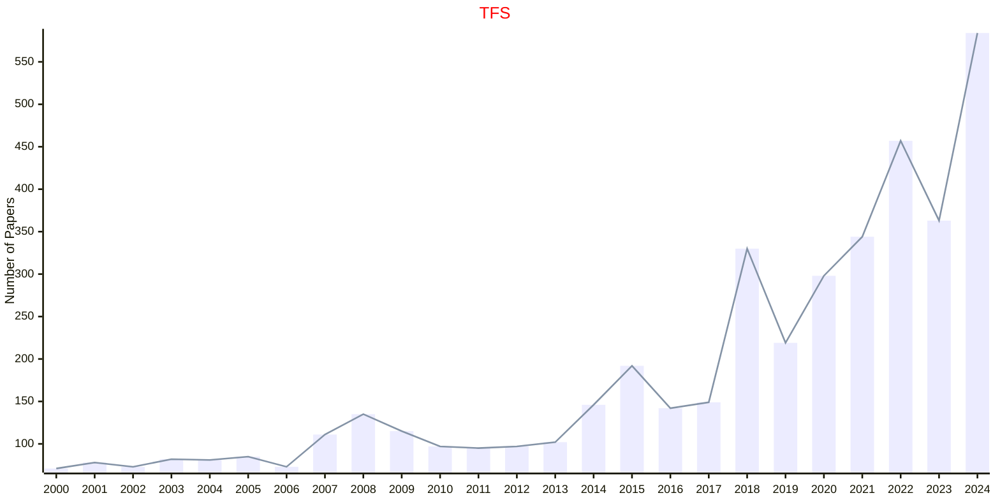
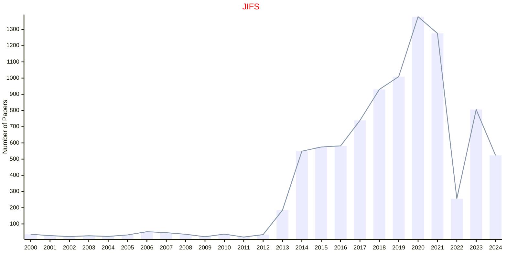
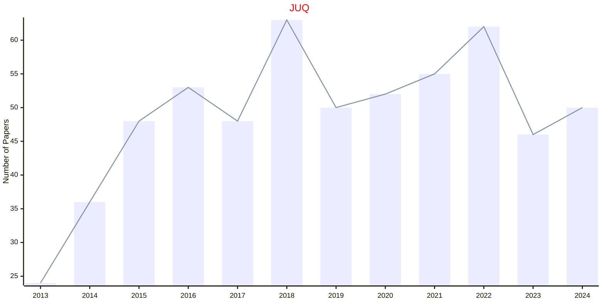
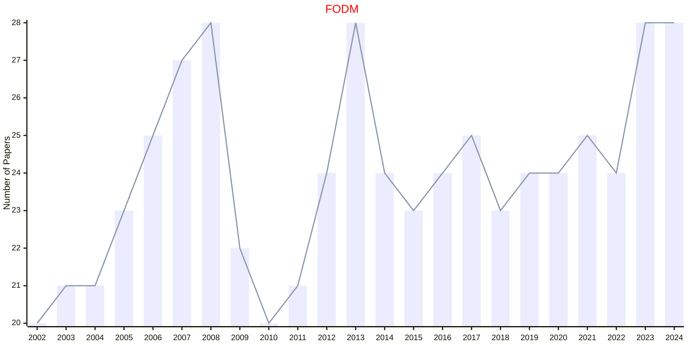
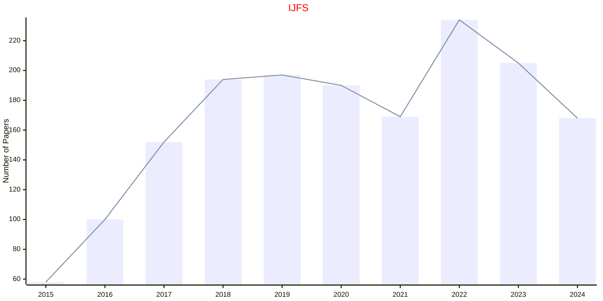
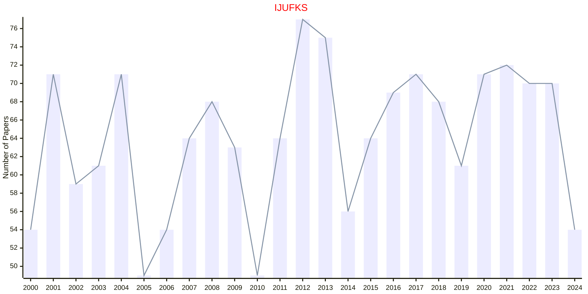

# Fuzzy and Uncertainty

## TFS

|Publishers|Full/Homepage|Abbr/About|Acronym/Issues|Period/DBLP|Top/Early|CCF|CAS|JCR|IF|Keywords/Google|
|-         |-            |-         |-             |-          |-        |-  |-  |-  |- |-              |
|[IEEE](https://ieeexplore.ieee.org/)|[IEEE Transactions on Fuzzy Systems](https://ieeexplore.ieee.org/xpl/RecentIssue.jsp?punumber=91)|[IEEE Trans. Fuzzy Syst.](https://ieeexplore.ieee.org/xpl/aboutJournal.jsp?punumber=91)|[TFS](https://ieeexplore.ieee.org/xpl/issues?punumber=91&isnumber=10336246)|1993 -|[True](https://ieeexplore.ieee.org/xpl/tocresult.jsp?isnumber=4358784)|B|1|Q1|10.8|[Fuzzy and Uncertainty](https://www.google.com/search?q=Fuzzy+and+Uncertainty)|

## JIFS

|Publishers|Full/Homepage|Abbr/About|Acronym/Issues|Period/DBLP|Top/Early|CCF|CAS|JCR|IF|Keywords/Google|
|-         |-            |-         |-             |-          |-        |-  |-  |-  |- |-              |
|[SAGE](https://www.sagepub.com/)|[Journal of Intelligent & Fuzzy Systems](https://journals.sagepub.com/home/ifs)|[J. Intell. Fuzzy Syst.](https://journals.sagepub.com/overview-metric/IFS?)|[JIFS](https://journals.sagepub.com/loi/ifs)|1993 -|False||4|Q4|1.2|[Fuzzy Systems](https://www.google.com/search?q=Fuzzy+Systems)|

## JUQ

|Publishers|Full/Homepage|Abbr/About|Acronym/Issues|Period/DBLP|Top/Early|CCF|CAS|JCR|IF|Keywords/Google|
|-         |-            |-         |-             |-          |-        |-  |-  |-  |- |-              |
|[SIAM](https://epubs.siam.org)|[SIAM/ASA Journal on Uncertainty Quantification](https://epubs.siam.org/journal/sjuqa3)|[SIAM/ASA J. Uncertainty Quantification](https://epubs.siam.org/journal/juq/about)|[JUQ](https://epubs.siam.org/loi/sjuqa3)|2013 -|False||3|Q2|2.2|[Fuzzy and Uncertainty](https://www.google.com/search?q=Fuzzy+and+Uncertainty)|

## FODM

|Publishers|Full/Homepage|Abbr/About|Acronym/Issues|Period/DBLP|Top/Early|CCF|CAS|JCR|IF|Keywords/Google|
|-         |-            |-         |-             |-          |-        |-  |-  |-  |- |-              |
|[SPRINGER](https://www.springer.com/)|[Fuzzy Optimization and Decision Making](https://www.springer.com/journal/10700)|[Fuzzy Optim. Decis. Mak.](https://www.springer.com/journal/10700/aims-and-scope)|[FODM](https://link.springer.com/journal/10700/volumes-and-issues)|2002 -|False||3|Q1|4.9|[Fuzzy and Uncertainty](https://www.google.com/search?q=Fuzzy+and+Uncertainty)|

## IJFS

|Publishers|Full/Homepage|Abbr/About|Acronym/Issues|Period/DBLP|Top/Early|CCF|CAS|JCR|IF|Keywords/Google|
|-         |-            |-         |-             |-          |-        |-  |-  |-  |- |-              |
|[SPRINGER](https://www.springer.com/)|[International Journal of Fuzzy Systems](https://www.springer.com/journal/40815)|[Int. J. Fuzzy Syst.](https://www.springer.com/journal/40815/aims-and-scope)|[IJFS](https://link.springer.com/journal/40815/volumes-and-issues)|2015 -|False||4|Q2|3.1|[Fuzzy and Uncertainty](https://www.google.com/search?q=Fuzzy+and+Uncertainty)|

## IJUFKS

|Publishers|Full/Homepage|Abbr/About|Acronym/Issues|Period/DBLP|Top/Early|CCF|CAS|JCR|IF|Keywords/Google|
|-         |-            |-         |-             |-          |-        |-  |-  |-  |- |-              |
|[WS](https://worldscientific.com/)|[International Journal of Uncertainty, Fuzziness and Knowledge-Based Systems](https://worldscientific.com/worldscinet/ijufks)|[Int. J. Uncertain. Fuzziness Knowl.-Based. Syst.](https://worldscientific.com/page/ijufks/aims-scope)|[IJUFKS](https://worldscientific.com/loi/ijufks)|1993 -|False||4|Q4|1.0|[Fuzzy Systems](https://www.google.com/search?q=Fuzzy+Systems); [Knowledge-Based Systems](https://www.google.com/search?q=Knowledge-Based+Systems)|

