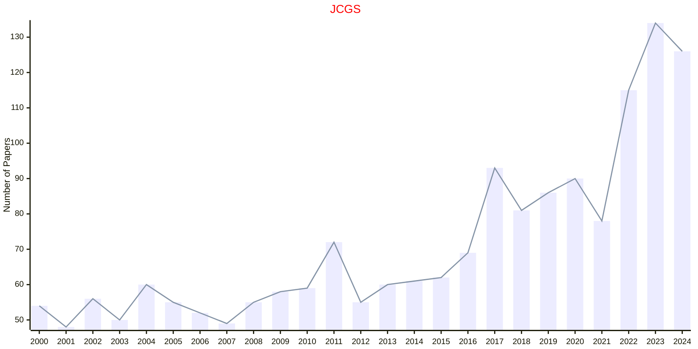

# Graphical Statistics

## JCGS

|Publishers|Full/Homepage|Abbr/About|Acronym/Issues|Period/DBLP|Top/Early|CCF|CAS|JCR|IF|Keywords/Google|
|-         |-            |-         |-             |-          |-        |-  |-  |-  |- |-              |
|[TAYLOR](https://www.tandfonline.com/)|[Journal of Computational and Graphical Statistics](https://www.tandfonline.com/journals/ucgs20)|[J. Comput. Graph. Stat.](https://www.tandfonline.com/journals/ucgs20/about-this-journal#aims-and-scope)|[JCGS](https://www.tandfonline.com/loi/ucgs20)|1992 -|False||3|Q1|2.2|[Applied Statistics](https://www.google.com/search?q=Applied+Statistics); [Computational Statistics](https://www.google.com/search?q=Computational+Statistics); [Graphical Statistics](https://www.google.com/search?q=Graphical+Statistics)|

