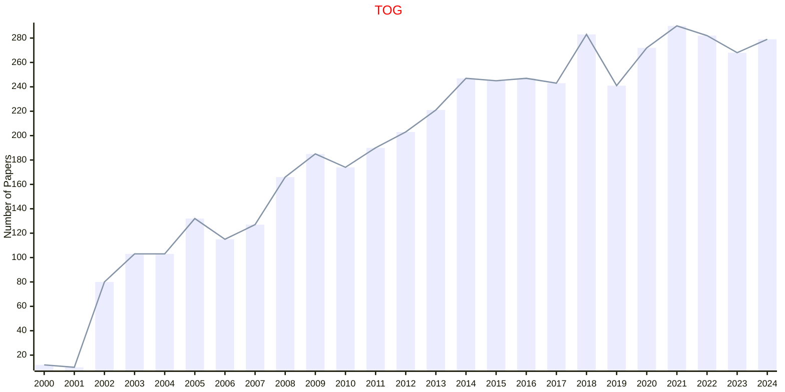
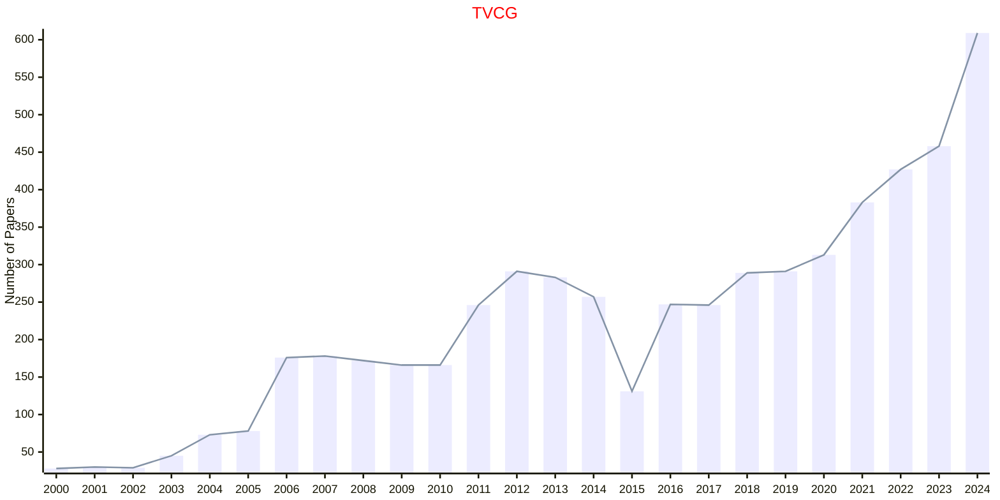

# Graphics

## TOG

|Publishers|Full/Homepage|Abbr/About|Acronym/Issues|Period/DBLP|Top/Early|CCF|CAS|JCR|IF|Keywords/Google|
|-         |-            |-         |-             |-          |-        |-  |-  |-  |- |-              |
|[ACM](https://www.acm.org/)|[ACM Transactions on Graphics](https://dl.acm.org/journal/tog)|[ACM Trans. Graph.](https://dl.acm.org/journal/tog/about)|[TOG](https://dl.acm.org/loi/tog)|[1982 -](https://dblp.org/db/journals/tog/index.html)|True|A|1|Q1|10.9|[Graphics](https://www.google.com/search?q=Graphics)|

## TVCG

|Publishers|Full/Homepage|Abbr/About|Acronym/Issues|Period/DBLP|Top/Early|CCF|CAS|JCR|IF|Keywords/Google|
|-         |-            |-         |-             |-          |-        |-  |-  |-  |- |-              |
|[IEEE](https://ieeexplore.ieee.org/)|[IEEE Transactions on Visualization and Computer Graphics](https://ieeexplore.ieee.org/xpl/RecentIssue.jsp?punumber=2945)|[IEEE Trans. Vis. Comput. Graph.](https://ieeexplore.ieee.org/xpl/aboutJournal.jsp?punumber=2945)|[TVCG](https://ieeexplore.ieee.org/xpl/issues?punumber=2945&isnumber=10237330)|1995 -|[True](https://ieeexplore.ieee.org/xpl/tocresult.jsp?isnumber=4359476)|A|2|Q1|6.4|[Graphics](https://www.google.com/search?q=Graphics)|

