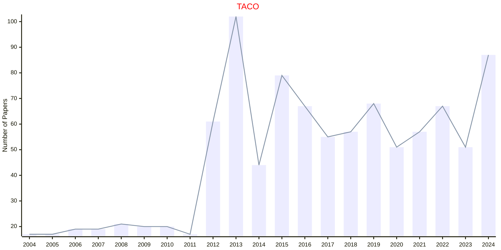
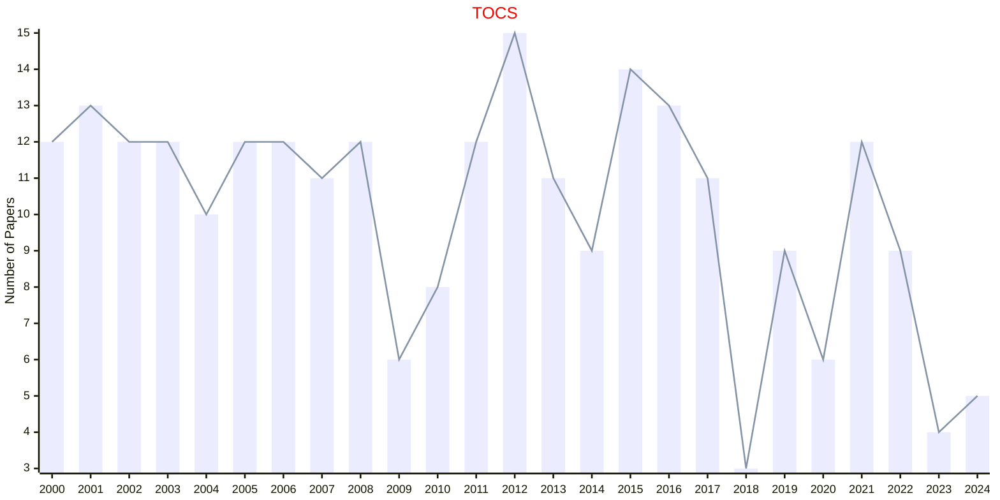
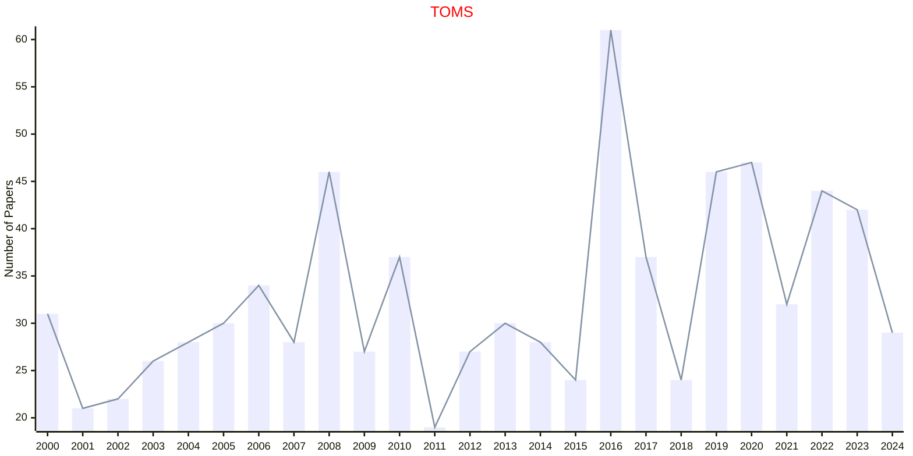
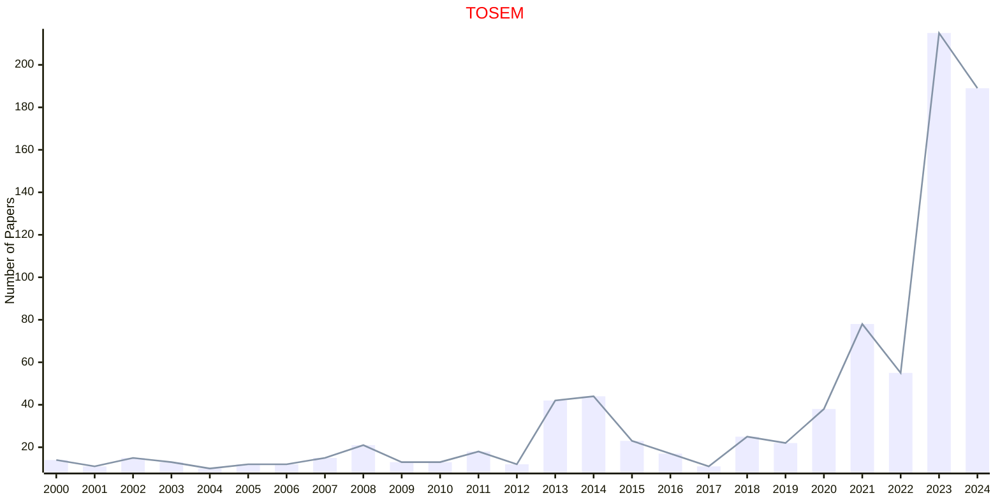
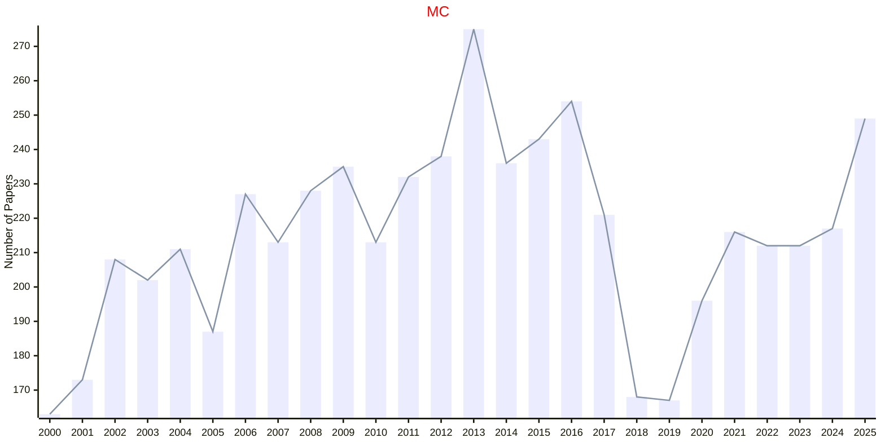
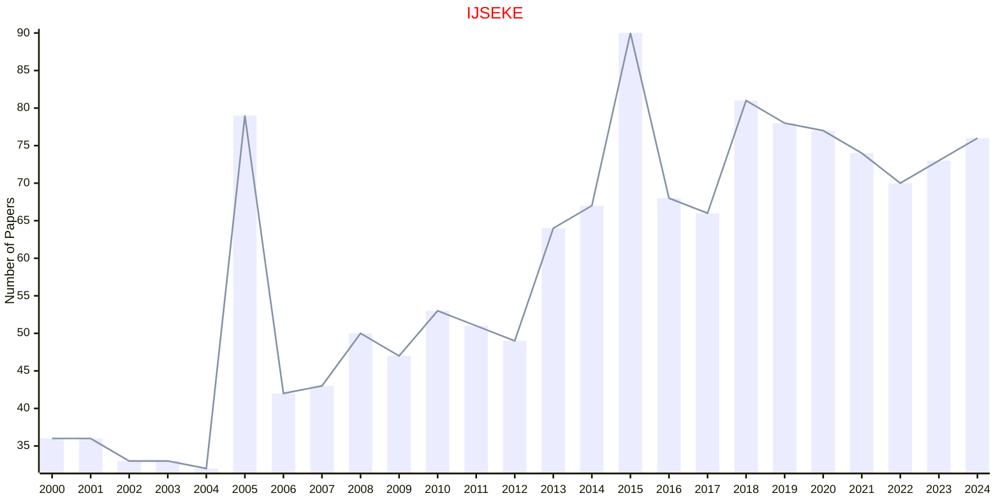

# Hardware and Software

## TACO

|Publishers|Full/Homepage|Abbr/About|Acronym/Issues|Period/DBLP|Top/Early|CCF|CAS|JCR|IF|Keywords/Google|
|-         |-            |-         |-             |-          |-        |-  |-  |-  |- |-              |
|[ACM](https://www.acm.org/)|[ACM Transactions on Architecture and Code Optimization](https://dl.acm.org/journal/taco)|[ACM Trans. Archit. Code Optim.](https://dl.acm.org/journal/taco/about)|[TACO](https://dl.acm.org/loi/taco)|[2004 -](https://dblp.org/db/journals/taco/index.html)|False|A|3|Q2|1.9|[Code Optimization](https://www.google.com/search?q=Code+Optimization); [Computer Architecture](https://www.google.com/search?q=Computer+Architecture)|

## TOCS

|Publishers|Full/Homepage|Abbr/About|Acronym/Issues|Period/DBLP|Top/Early|CCF|CAS|JCR|IF|Keywords/Google|
|-         |-            |-         |-             |-          |-        |-  |-  |-  |- |-              |
|[ACM](https://www.acm.org/)|[ACM Transactions on Computer Systems](https://dl.acm.org/journal/tocs)|[ACM Trans. Comput. Syst.](https://dl.acm.org/journal/tocs/about)|[TOCS](https://dl.acm.org/loi/tocs)|[1994 -](https://dblp.org/db/journals/tocs/index.html)|False|A|4|Q2|2.4|[Computer Systems](https://www.google.com/search?q=Computer+Systems)|

## TOMS

|Publishers|Full/Homepage|Abbr/About|Acronym/Issues|Period/DBLP|Top/Early|CCF|CAS|JCR|IF|Keywords/Google|
|-         |-            |-         |-             |-          |-        |-  |-  |-  |- |-              |
|[ACM](https://www.acm.org/)|[ACM Transactions on Mathematical Software](https://dl.acm.org/journal/toms)|[ACM Trans. Math. Softw.](https://dl.acm.org/journal/toms/about)|[TOMS](https://dl.acm.org/loi/toms)|[1975 -](https://dblp.org/db/journals/toms/index.html)|False|B|2|Q1|3.3|[Mathematical Software](https://www.google.com/search?q=Mathematical+Software)|

## TOSEM

|Publishers|Full/Homepage|Abbr/About|Acronym/Issues|Period/DBLP|Top/Early|CCF|CAS|JCR|IF|Keywords/Google|
|-         |-            |-         |-             |-          |-        |-  |-  |-  |- |-              |
|[ACM](https://www.acm.org/)|[ACM Transactions on Software Engineering and Methodology](https://dl.acm.org/journal/tosem)|[ACM Trans. Softw. Eng. Methodol.](https://dl.acm.org/journal/tosem/about)|[TOSEM](https://dl.acm.org/loi/tosem)|[1992 -](https://dblp.org/db/journals/tosem/index.html)|True|A|1|Q1|6.3|[Software Engineering](https://www.google.com/search?q=Software+Engineering)|

## MC

|Publishers|Full/Homepage|Abbr/About|Acronym/Issues|Period/DBLP|Top/Early|CCF|CAS|JCR|IF|Keywords/Google|
|-         |-            |-         |-             |-          |-        |-  |-  |-  |- |-              |
|[IEEE](https://ieeexplore.ieee.org/)|[Computer](https://ieeexplore.ieee.org/xpl/RecentIssue.jsp?punumber=2)|[Computer](https://ieeexplore.ieee.org/xpl/aboutJournal.jsp?punumber=2)|[MC](https://ieeexplore.ieee.org/xpl/issues?punumber=2&isnumber=10574404)|1970 -|[False](https://ieeexplore.ieee.org/xpl/tocresult.jsp?isnumber=5306045)||4|Q2|2.6|[Hardware and Software](https://www.google.com/search?q=Hardware+and+Software)|

## JOSS

|Publishers|Full/Homepage|Abbr/About|Acronym/Issues|Period/DBLP|Top/Early|CCF|CAS|JCR|IF|Keywords/Google|
|-         |-            |-         |-             |-          |-        |-  |-  |-  |- |-              |
|OPEN|[The Journal of Open Source Software](https://joss.theoj.org/)|[J. Open Source Softw.](https://joss.theoj.org/about)|[JOSS](https://joss.theoj.org/papers/published)|2016 -|False|||||[Software](https://www.google.com/search?q=Software)|

## JSS

|Publishers|Full/Homepage|Abbr/About|Acronym/Issues|Period/DBLP|Top/Early|CCF|CAS|JCR|IF|Keywords/Google|
|-         |-            |-         |-             |-          |-        |-  |-  |-  |- |-              |
|OPEN|[Journal of Statistical Software](https://www.jstatsoft.org/index)|[J. Stat. Softw.](https://www.jstatsoft.org/about)|[JSS](https://www.jstatsoft.org/issue/archive)|1997 -|False||2|Q1|10.3|[Software](https://www.google.com/search?q=Software)|

## IJSEKE

|Publishers|Full/Homepage|Abbr/About|Acronym/Issues|Period/DBLP|Top/Early|CCF|CAS|JCR|IF|Keywords/Google|
|-         |-            |-         |-             |-          |-        |-  |-  |-  |- |-              |
|[WS](https://worldscientific.com/)|[International Journal of Software Engineering and Knowledge Engineering](https://worldscientific.com/worldscinet/ijseke)|[Int. J. Soft. Eng. Knowl. Eng.](https://worldscientific.com/page/ijseke/aims-scope)|[IJSEKE](https://worldscientific.com/loi/ijseke)|1991 -|False|C|4|Q4|0.7|[Software Engineering](https://www.google.com/search?q=Software+Engineering)|

