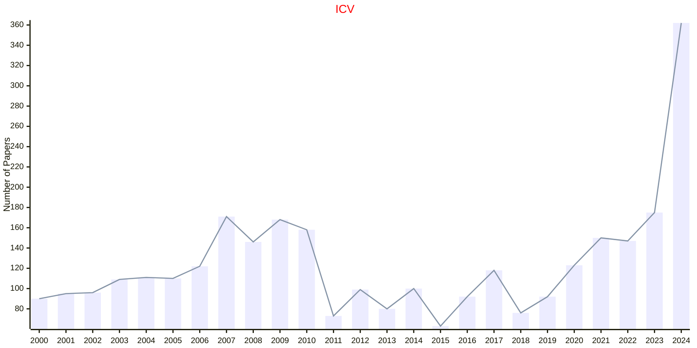
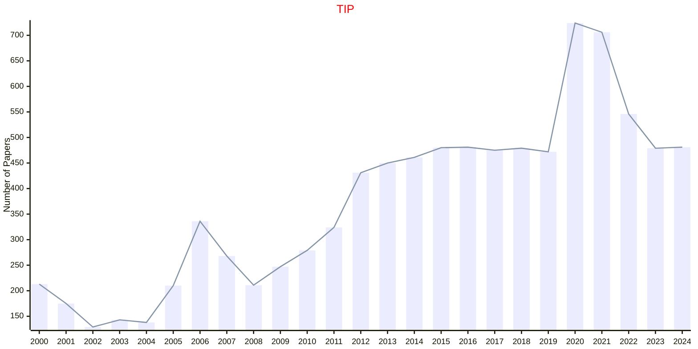
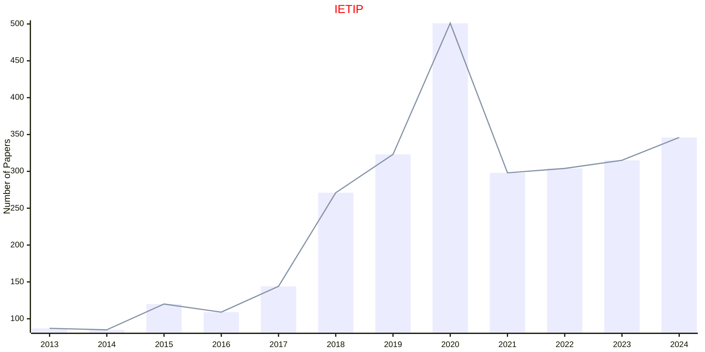

# Image Processing

## ICV

|Publishers|Full/Homepage|Abbr/About|Acronym/Issues|Period/DBLP|Top/Early|CCF|CAS|JCR|IF|Keywords/Google|
|-         |-            |-         |-             |-          |-        |-  |-  |-  |- |-              |
|[ELSEVIER](https://www.sciencedirect.com/)|[Image and Vision Computing](https://www.sciencedirect.com/journal/image-and-vision-computing)|[Image Vis. Comput.](https://www.sciencedirect.com/journal/image-and-vision-computing/about/aims-and-scope)|[ICV](https://www.sciencedirect.com/journal/image-and-vision-computing/issues)|1983 -|False|C|3|Q1|4.1|[Computer Vision](https://www.google.com/search?q=Computer+Vision); [Image Processing](https://www.google.com/search?q=Image+Processing)|

## TIP

|Publishers|Full/Homepage|Abbr/About|Acronym/Issues|Period/DBLP|Top/Early|CCF|CAS|JCR|IF|Keywords/Google|
|-         |-            |-         |-             |-          |-        |-  |-  |-  |- |-              |
|[IEEE](https://ieeexplore.ieee.org/)|[IEEE Transactions on Image Processing](https://ieeexplore.ieee.org/xpl/RecentIssue.jsp?punumber=83)|[IEEE Trans. Image Process.](https://ieeexplore.ieee.org/xpl/aboutJournal.jsp?punumber=83)|[TIP](https://ieeexplore.ieee.org/xpl/issues?punumber=83&isnumber=9991910)|1992 -|[True](https://ieeexplore.ieee.org/xpl/tocresult.jsp?isnumber=4358840)|A|1|Q1|13.7|[Image Processing](https://www.google.com/search?q=Image+Processing)|

## IETIP

|Publishers|Full/Homepage|Abbr/About|Acronym/Issues|Period/DBLP|Top/Early|CCF|CAS|JCR|IF|Keywords/Google|
|-         |-            |-         |-             |-          |-        |-  |-  |-  |- |-              |
|[WILEY](https://www.wiley.com/)|[IET Image Processing](https://ietresearch.onlinelibrary.wiley.com/journal/17519667)|[IET Image Process.](https://ietresearch.onlinelibrary.wiley.com/hub/journal/17519667/homepage/productinformation.html)|[IETIP](https://ietresearch.onlinelibrary.wiley.com/loi/17519667)|2013 -|False|C|4|Q3|2.0|[Image Processing](https://www.google.com/search?q=Image+Processing)|

