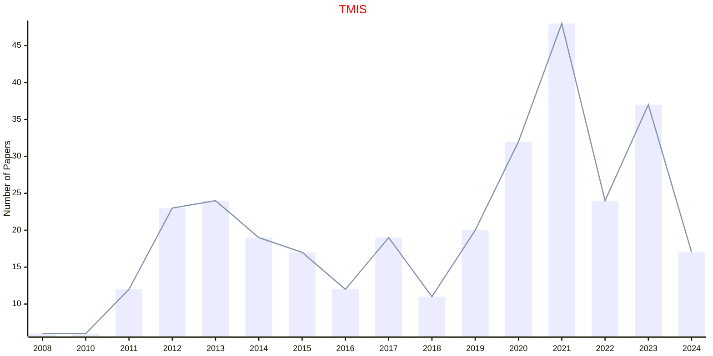
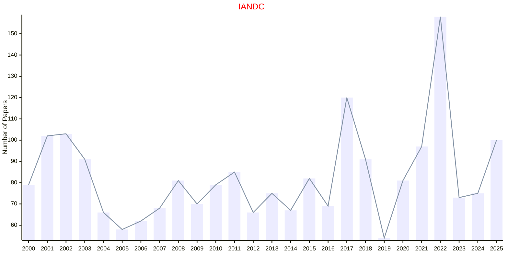
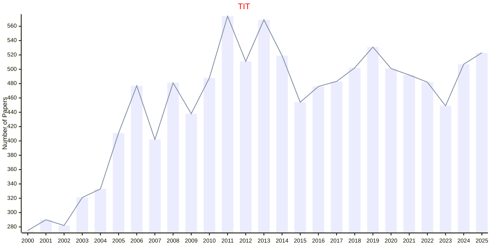
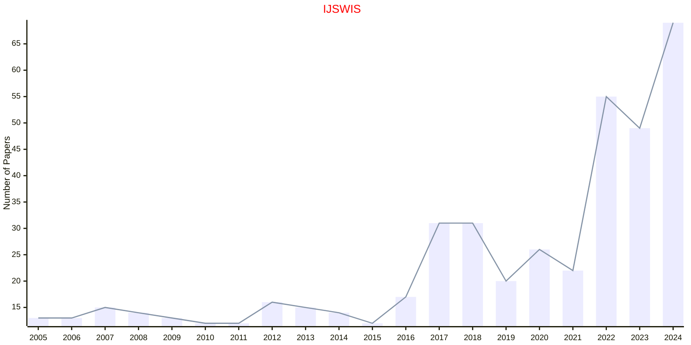
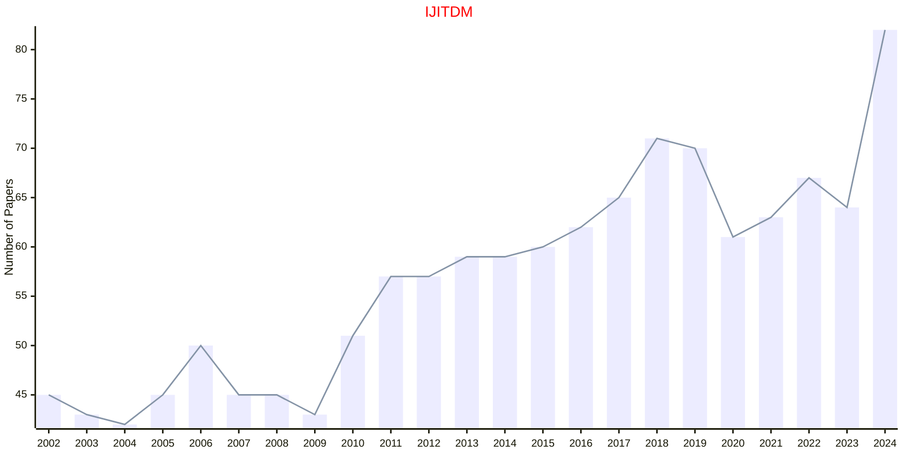

# Information

## TMIS

|Publishers|Full/Homepage|Abbr/About|Acronym/Issues|Period/DBLP|Top/Early|CCF|CAS|JCR|IF|Keywords/Google|
|-         |-            |-         |-             |-          |-        |-  |-  |-  |- |-              |
|[ACM](https://www.acm.org/)|[ACM Transactions on Management Information Systems](https://dl.acm.org/journal/tmis)|[ACM Trans. Manag. Inf. Sys.](https://dl.acm.org/journal/tmis/about)|[TMIS](https://dl.acm.org/loi/tmis)|[2010 -](https://dblp.org/db/journals/tmis/index.html)|False||4||3.2|[Information Systems](https://www.google.com/search?q=Information+Systems); [Information Technology](https://www.google.com/search?q=Information+Technology)|

## IANDC

|Publishers|Full/Homepage|Abbr/About|Acronym/Issues|Period/DBLP|Top/Early|CCF|CAS|JCR|IF|Keywords/Google|
|-         |-            |-         |-             |-          |-        |-  |-  |-  |- |-              |
|[ELSEVIER](https://www.sciencedirect.com/)|[Information and Computation](https://www.sciencedirect.com/journal/information-and-computation)|[Inf. Comput.](https://www.sciencedirect.com/journal/information-and-computation/about/aims-and-scope)|[IANDC](https://www.sciencedirect.com/journal/information-and-computation/issues)|1987 -|False|A|4|Q3|1.1|[Information Theory](https://www.google.com/search?q=Information+Theory); [Theoretical Computer Science](https://www.google.com/search?q=Theoretical+Computer+Science)|

## TIT

|Publishers|Full/Homepage|Abbr/About|Acronym/Issues|Period/DBLP|Top/Early|CCF|CAS|JCR|IF|Keywords/Google|
|-         |-            |-         |-             |-          |-        |-  |-  |-  |- |-              |
|[IEEE](https://ieeexplore.ieee.org/)|[IRE Transactions on Information Theory](https://ieeexplore.ieee.org/xpl/RecentIssue.jsp?punumber=18)|[IEEE Trans. Inf. Theory](https://ieeexplore.ieee.org/xpl/aboutJournal.jsp?punumber=18)|[TIT](https://ieeexplore.ieee.org/xpl/issues?punumber=18&isnumber=10225323)|1963 -|[False](https://ieeexplore.ieee.org/xpl/tocresult.jsp?isnumber=4667673)|||||[Information Theory](https://www.google.com/search?q=Information+Theory)|

## IJSWIS

|Publishers|Full/Homepage|Abbr/About|Acronym/Issues|Period/DBLP|Top/Early|CCF|CAS|JCR|IF|Keywords/Google|
|-         |-            |-         |-             |-          |-        |-  |-  |-  |- |-              |
|[IGI](https://www.igi-global.com/)|[International Journal on Semantic Web and Information Systems](https://www.igi-global.com/journal/international-journal-semantic-web-information/1092)|[Int. J. Semantic Web Inf. Syst.](https://www.igi-global.com/journal/international-journal-semantic-web-information/1092#description)|[IJSWIS](https://www.igi-global.com/journals/open-access/table-of-contents/international-journal-semantic-web-information/1092)|2005 -|False|C|2|Q1|3.9|[Information Systems](https://www.google.com/search?q=Information+Systems); [Semantic Web](https://www.google.com/search?q=Semantic+Web)|

## IJITDM

|Publishers|Full/Homepage|Abbr/About|Acronym/Issues|Period/DBLP|Top/Early|CCF|CAS|JCR|IF|Keywords/Google|
|-         |-            |-         |-             |-          |-        |-  |-  |-  |- |-              |
|[WS](https://worldscientific.com/)|[International Journal of Information Technology & Decision Making](https://worldscientific.com/worldscinet/ijitdm)|[Int. J. Inf. Tech. Decis.](https://worldscientific.com/page/ijitdm/aims-scope)|[IJITDM](https://worldscientific.com/loi/ijitdm)|2002 -|False||4|Q3|1.9|[Information Technology](https://www.google.com/search?q=Information+Technology)|

