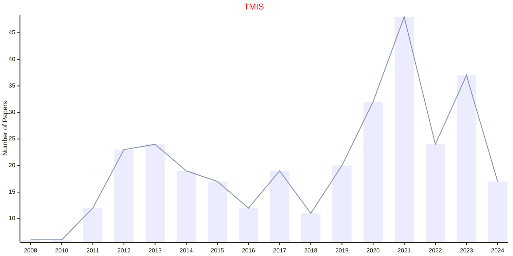
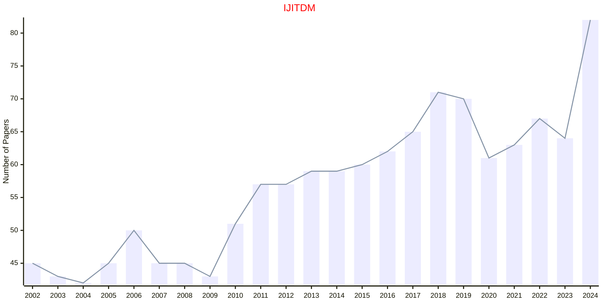

# Information Technology

## TMIS

|Publishers|Full/Homepage|Abbr/About|Acronym/Issues|Period/DBLP|Top/Early|CCF|CAS|JCR|IF|Keywords/Google|
|-         |-            |-         |-             |-          |-        |-  |-  |-  |- |-              |
|[ACM](https://www.acm.org/)|[ACM Transactions on Management Information Systems](https://dl.acm.org/journal/tmis)|[ACM Trans. Manag. Inf. Sys.](https://dl.acm.org/journal/tmis/about)|[TMIS](https://dl.acm.org/loi/tmis)|[2010 -](https://dblp.org/db/journals/tmis/index.html)|False||4||3.2|[Information Systems](https://www.google.com/search?q=Information+Systems); [Information Technology](https://www.google.com/search?q=Information+Technology)|

## IJITDM

|Publishers|Full/Homepage|Abbr/About|Acronym/Issues|Period/DBLP|Top/Early|CCF|CAS|JCR|IF|Keywords/Google|
|-         |-            |-         |-             |-          |-        |-  |-  |-  |- |-              |
|[WS](https://worldscientific.com/)|[International Journal of Information Technology & Decision Making](https://worldscientific.com/worldscinet/ijitdm)|[Int. J. Inf. Tech. Decis.](https://worldscientific.com/page/ijitdm/aims-scope)|[IJITDM](https://worldscientific.com/loi/ijitdm)|2002 -|False||4|Q3|1.9|[Information Technology](https://www.google.com/search?q=Information+Technology)|

