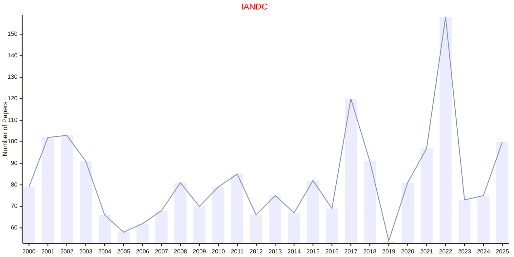
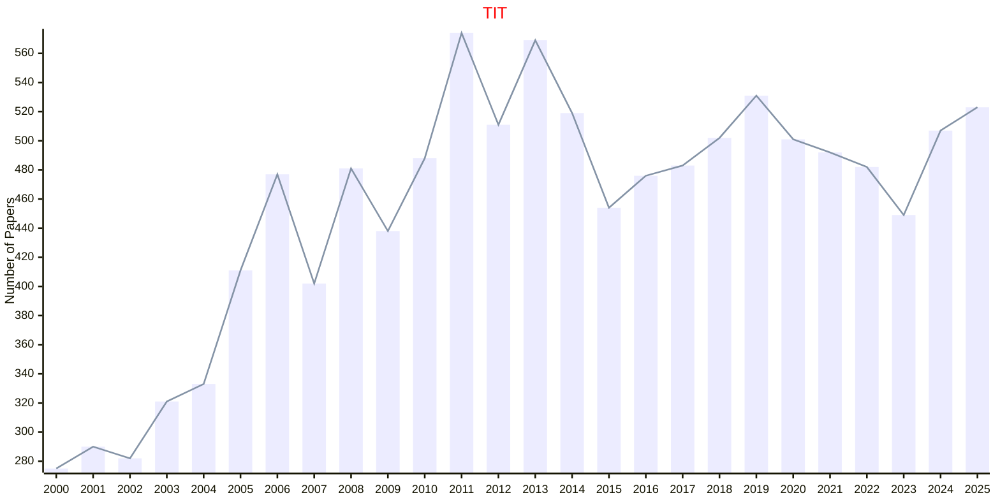

# Information Theory

## IANDC

|Publishers|Full/Homepage|Abbr/About|Acronym/Issues|Period/DBLP|Top/Early|CCF|CAS|JCR|IF|Keywords/Google|
|-         |-            |-         |-             |-          |-        |-  |-  |-  |- |-              |
|[ELSEVIER](https://www.sciencedirect.com/)|[Information and Computation](https://www.sciencedirect.com/journal/information-and-computation)|[Inf. Comput.](https://www.sciencedirect.com/journal/information-and-computation/about/aims-and-scope)|[IANDC](https://www.sciencedirect.com/journal/information-and-computation/issues)|1987 -|False|A|4|Q3|1.1|[Information Theory](https://www.google.com/search?q=Information+Theory); [Theoretical Computer Science](https://www.google.com/search?q=Theoretical+Computer+Science)|

## TIT

|Publishers|Full/Homepage|Abbr/About|Acronym/Issues|Period/DBLP|Top/Early|CCF|CAS|JCR|IF|Keywords/Google|
|-         |-            |-         |-             |-          |-        |-  |-  |-  |- |-              |
|[IEEE](https://ieeexplore.ieee.org/)|[IRE Transactions on Information Theory](https://ieeexplore.ieee.org/xpl/RecentIssue.jsp?punumber=18)|[IEEE Trans. Inf. Theory](https://ieeexplore.ieee.org/xpl/aboutJournal.jsp?punumber=18)|[TIT](https://ieeexplore.ieee.org/xpl/issues?punumber=18&isnumber=10225323)|1963 -|[False](https://ieeexplore.ieee.org/xpl/tocresult.jsp?isnumber=4667673)|||||[Information Theory](https://www.google.com/search?q=Information+Theory)|

