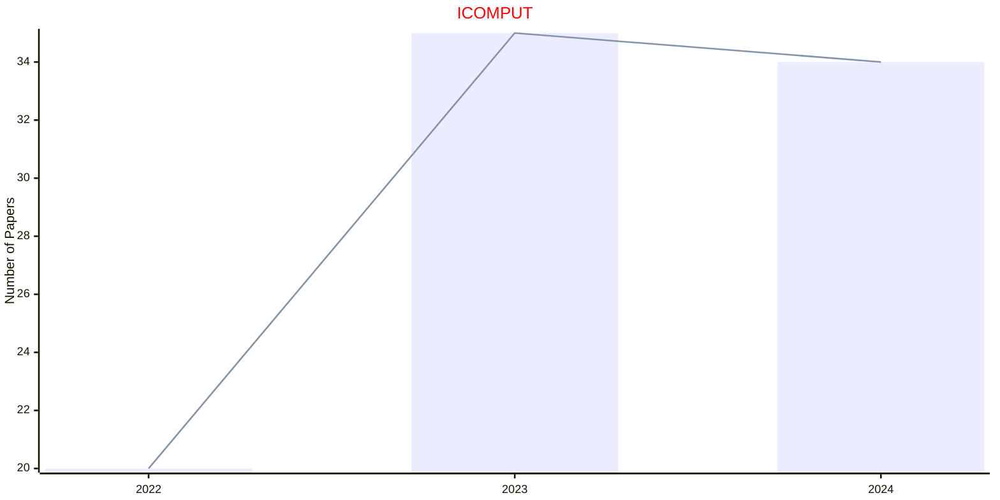

# Intelligent Computing

## ICOMPUT

|Publishers|Full/Homepage|Abbr/About|Acronym/Issues|Period/DBLP|Top/Early|CCF|CAS|JCR|IF|Keywords/Google|
|-         |-            |-         |-             |-          |-        |-  |-  |-  |- |-              |
|[AAAS](https://www.science.org/)|[Intelligent Computing](https://spj.science.org/journal/icomputing)|[Intell. Comput.](https://spj.science.org/page/icomputing/about)|[ICOMPUT](https://spj.science.org/loi/icomputing)|2022 -|False||||3.7|[Intelligent Computing](https://www.google.com/search?q=Intelligent+Computing)|

