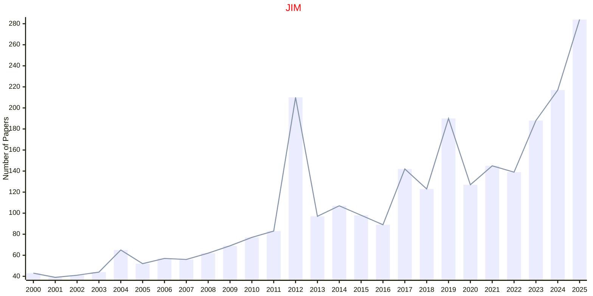

# Intelligent Manufacture

## JIM

|Publishers|Full/Homepage|Abbr/About|Acronym/Issues|Period/DBLP|Top/Early|CCF|CAS|JCR|IF|Keywords/Google|
|-         |-            |-         |-             |-          |-        |-  |-  |-  |- |-              |
|[SPRINGER](https://www.springer.com/)|[Journal of Intelligent Manufacturing](https://www.springer.com/journal/10845)|[J. Intell. Manuf.](https://www.springer.com/journal/10845/aims-and-scope)|[JIM](https://link.springer.com/journal/10845/volumes-and-issues)|1990 -|False||2|Q1|7.7|[Intelligent Manufacture](https://www.google.com/search?q=Intelligent+Manufacture)|

