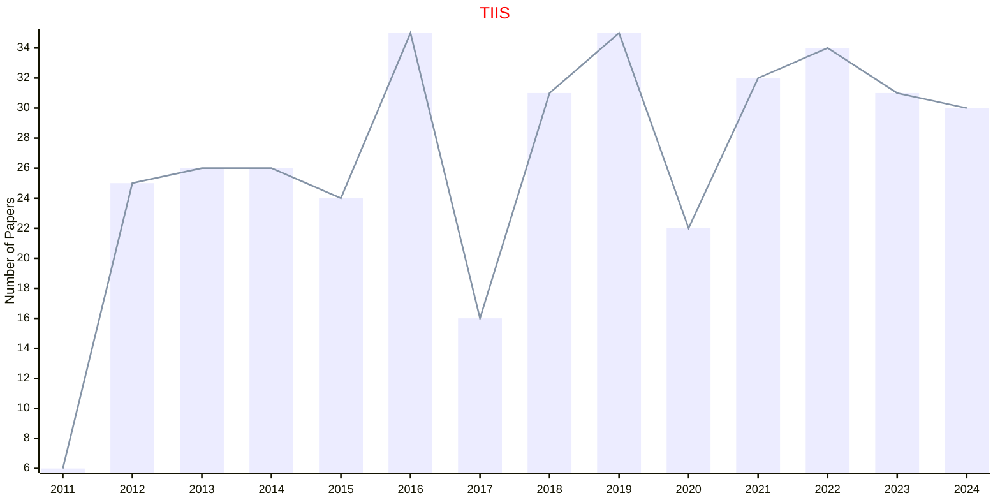
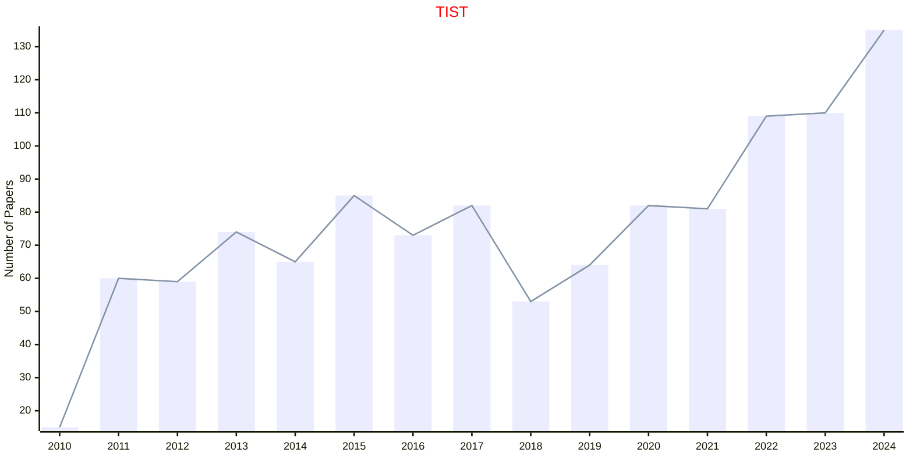
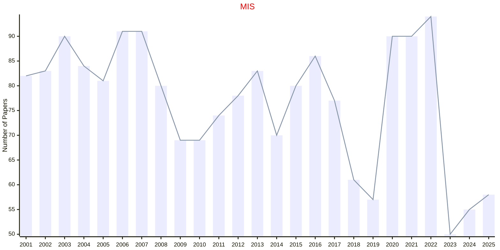
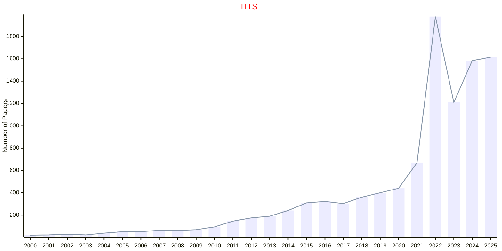
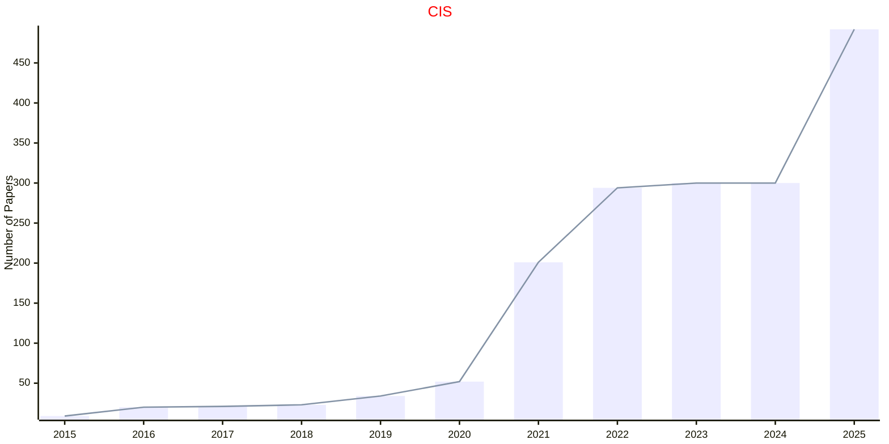
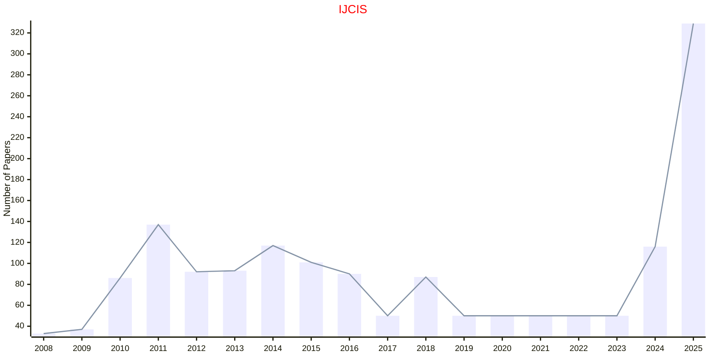
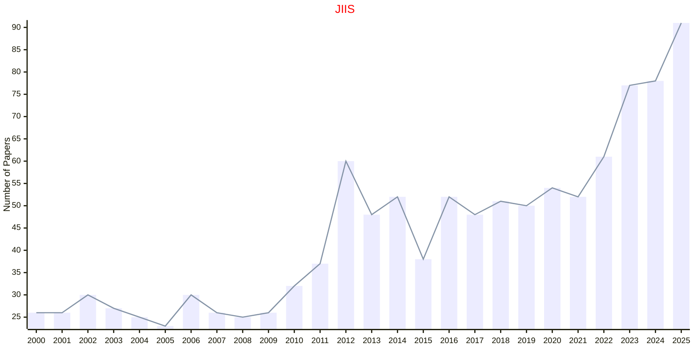
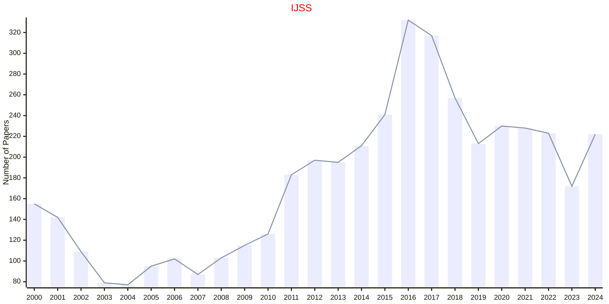
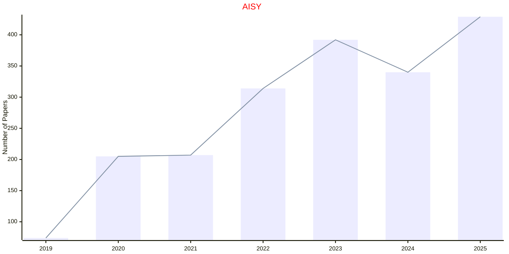
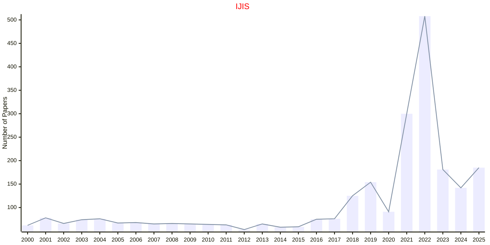

# Intelligent Systems

## TIIS

|Publishers|Full/Homepage|Abbr/About|Acronym/Issues|Period/DBLP|Top/Early|CCF|CAS|JCR|IF|Keywords/Google|
|-         |-            |-         |-             |-          |-        |-  |-  |-  |- |-              |
|[ACM](https://www.acm.org/)|[ACM Transactions on Interactive Intelligent Systems](https://dl.acm.org/journal/tiis)|[ACM Trans. Interact. Intell. Syst.](https://dl.acm.org/journal/tiis/about)|[TIIS](https://dl.acm.org/loi/tiis)|[2011 -](https://dblp.org/db/journals/tiis/index.html)|False|C|4|Q2|5.1|[Interactive Intelligent Systems](https://www.google.com/search?q=Interactive+Intelligent+Systems)|

## TIST

|Publishers|Full/Homepage|Abbr/About|Acronym/Issues|Period/DBLP|Top/Early|CCF|CAS|JCR|IF|Keywords/Google|
|-         |-            |-         |-             |-          |-        |-  |-  |-  |- |-              |
|[ACM](https://www.acm.org/)|[ACM Transactions on Intelligent Systems and Technology](https://dl.acm.org/journal/tist)|[ACM Trans. Intell. Syst. Technol.](https://dl.acm.org/journal/tist/about)|[TIST](https://dl.acm.org/loi/tist)|[2010 -](https://dblp.org/db/journals/tist/index.html)|False||3|Q1|8.4|[Intelligent Systems](https://www.google.com/search?q=Intelligent+Systems)|

## MIS

|Publishers|Full/Homepage|Abbr/About|Acronym/Issues|Period/DBLP|Top/Early|CCF|CAS|JCR|IF|Keywords/Google|
|-         |-            |-         |-             |-          |-        |-  |-  |-  |- |-              |
|[IEEE](https://ieeexplore.ieee.org/)|[IEEE Intelligent Systems](https://ieeexplore.ieee.org/xpl/RecentIssue.jsp?punumber=9670)|[IEEE Intell. Syst.](https://ieeexplore.ieee.org/xpl/aboutJournal.jsp?punumber=9670)|[MIS](https://ieeexplore.ieee.org/xpl/issues?punumber=9670&isnumber=10614835)|2001 -|[False](https://ieeexplore.ieee.org/xpl/tocresult.jsp?isnumber=5196652)||4|Q1|6.6|[Intelligent Systems](https://www.google.com/search?q=Intelligent+Systems)|

## TITS

|Publishers|Full/Homepage|Abbr/About|Acronym/Issues|Period/DBLP|Top/Early|CCF|CAS|JCR|IF|Keywords/Google|
|-         |-            |-         |-             |-          |-        |-  |-  |-  |- |-              |
|[IEEE](https://ieeexplore.ieee.org/)|[IEEE Transactions on Intelligent Transportation Systems](https://ieeexplore.ieee.org/xpl/RecentIssue.jsp?punumber=6979)|[IEEE Trans. Intell. Transp. Syst.](https://ieeexplore.ieee.org/xpl/aboutJournal.jsp?punumber=6979)|[TITS](https://ieeexplore.ieee.org/xpl/issues?punumber=6979&isnumber=10621861)|2000 -|[True](https://ieeexplore.ieee.org/xpl/tocresult.jsp?isnumber=4358928)|B|2|Q1|9.5|[Transportation Systems](https://www.google.com/search?q=Transportation+Systems)|

## CIS

|Publishers|Full/Homepage|Abbr/About|Acronym/Issues|Period/DBLP|Top/Early|CCF|CAS|JCR|IF|Keywords/Google|
|-         |-            |-         |-             |-          |-        |-  |-  |-  |- |-              |
|[SPRINGER](https://www.springer.com/)|[Complex & Intelligent Systems](https://www.springer.com/journal/40747)|[Complex Intell. Syst.](https://www.springer.com/journal/40747/aims-and-scope)|[CIS](https://link.springer.com/journal/40747/volumes-and-issues)|2015 -|False||3|Q2|5.1|[Intelligent Systems](https://www.google.com/search?q=Intelligent+Systems)|

## IJCIS

|Publishers|Full/Homepage|Abbr/About|Acronym/Issues|Period/DBLP|Top/Early|CCF|CAS|JCR|IF|Keywords/Google|
|-         |-            |-         |-             |-          |-        |-  |-  |-  |- |-              |
|[SPRINGER](https://www.springer.com/)|[International Journal of Computational Intelligence Systems](https://www.springer.com/journal/44196)|[Int. J. Comput. Intell. Syst.](https://www.springer.com/journal/44196/aims-and-scope)|[IJCIS](https://link.springer.com/journal/44196/volumes-and-issues)|2008 -|False||4|Q2|2.2|[Intelligent Systems](https://www.google.com/search?q=Intelligent+Systems)|

## JIIS

|Publishers|Full/Homepage|Abbr/About|Acronym/Issues|Period/DBLP|Top/Early|CCF|CAS|JCR|IF|Keywords/Google|
|-         |-            |-         |-             |-          |-        |-  |-  |-  |- |-              |
|[SPRINGER](https://www.springer.com/)|[Journal of Intelligent Information Systems](https://www.springer.com/journal/10844)|[J. Intell. Inf. Syst.](https://www.springer.com/journal/10844/aims-and-scope)|[JIIS](https://link.springer.com/journal/10844/volumes-and-issues)|1992 -|False|C|3|Q2|3.0|[Intelligent Systems](https://www.google.com/search?q=Intelligent+Systems)|

## IJSS

|Publishers|Full/Homepage|Abbr/About|Acronym/Issues|Period/DBLP|Top/Early|CCF|CAS|JCR|IF|Keywords/Google|
|-         |-            |-         |-             |-          |-        |-  |-  |-  |- |-              |
|[TAYLOR](https://www.tandfonline.com/)|[International Journal of Systems Science](https://www.tandfonline.com/journals/tsys20)|[Int. J. Syst. Sci.](https://www.tandfonline.com/journals/tsys20/about-this-journal#aims-and-scope)|[IJSS](https://www.tandfonline.com/loi/tsys20)|1970 -|False||4|Q1|3.6|[Intelligent Systems](https://www.google.com/search?q=Intelligent+Systems)|

## AISY

|Publishers|Full/Homepage|Abbr/About|Acronym/Issues|Period/DBLP|Top/Early|CCF|CAS|JCR|IF|Keywords/Google|
|-         |-            |-         |-             |-          |-        |-  |-  |-  |- |-              |
|[WILEY](https://www.wiley.com/)|[Advanced Intelligent Systems](https://advanced.onlinelibrary.wiley.com/journal/26404567)|[Adv. Intell. Syst.](https://advanced.onlinelibrary.wiley.com/hub/journal/26404567/productinformation.html)|[AISY](https://advanced.onlinelibrary.wiley.com/loi/26404567)|2019 -|False||3|Q1|7.7|[Intelligent Systems](https://www.google.com/search?q=Intelligent+Systems)|

## IJIS

|Publishers|Full/Homepage|Abbr/About|Acronym/Issues|Period/DBLP|Top/Early|CCF|CAS|JCR|IF|Keywords/Google|
|-         |-            |-         |-             |-          |-        |-  |-  |-  |- |-              |
|[WILEY](https://www.wiley.com/)|[International Journal of Intelligent Systems](https://onlinelibrary.wiley.com/journal/ijis)|[Int. J. Intell. Syst.](https://onlinelibrary.wiley.com/page/journal/ijis/homepage/productinformation.html)|[IJIS](https://onlinelibrary.wiley.com/loi/ijis)|1986 -|False|C|3|Q2|4.5|[Intelligent Systems](https://www.google.com/search?q=Intelligent+Systems)|

