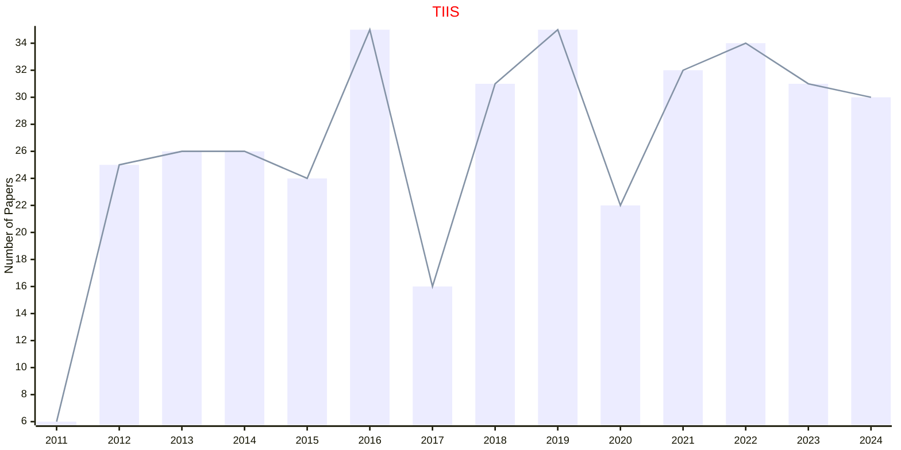

# Interactive Intelligent Systems

## TIIS

|Publishers|Full/Homepage|Abbr/About|Acronym/Issues|Period/DBLP|Top/Early|CCF|CAS|JCR|IF|Keywords/Google|
|-         |-            |-         |-             |-          |-        |-  |-  |-  |- |-              |
|[ACM](https://www.acm.org/)|[ACM Transactions on Interactive Intelligent Systems](https://dl.acm.org/journal/tiis)|[ACM Trans. Interact. Intell. Syst.](https://dl.acm.org/journal/tiis/about)|[TIIS](https://dl.acm.org/loi/tiis)|[2011 -](https://dblp.org/db/journals/tiis/index.html)|False|C|4|Q2|5.1|[Interactive Intelligent Systems](https://www.google.com/search?q=Interactive+Intelligent+Systems)|

