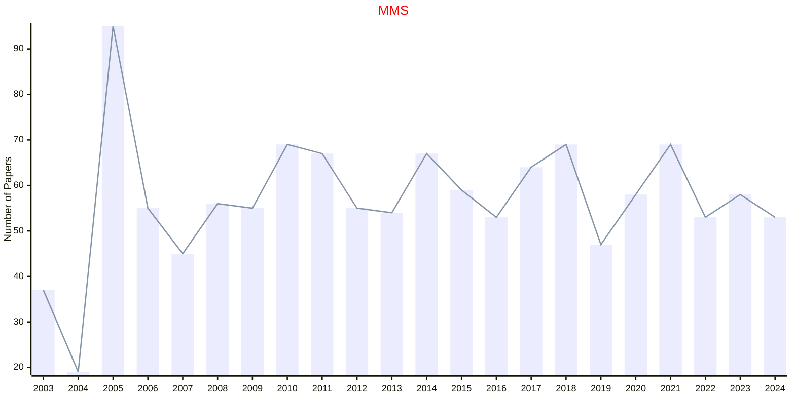

# Interdisciplinary

## MMS

|Publishers|Full/Homepage|Abbr/About|Acronym/Issues|Period/DBLP|Top/Early|CCF|CAS|JCR|IF|Keywords/Google|
|-         |-            |-         |-             |-          |-        |-  |-  |-  |- |-              |
|[SIAM](https://epubs.siam.org)|[Multiscale Modeling & Simulation](https://epubs.siam.org/journal/mmsubt)|[Multiscale Model. Simul.](https://epubs.siam.org/journal/mms/about)|[MMS](https://epubs.siam.org/loi/mmsubt)|2003 -|False||3|Q2|1.8|[Interdisciplinary](https://www.google.com/search?q=Interdisciplinary)|

