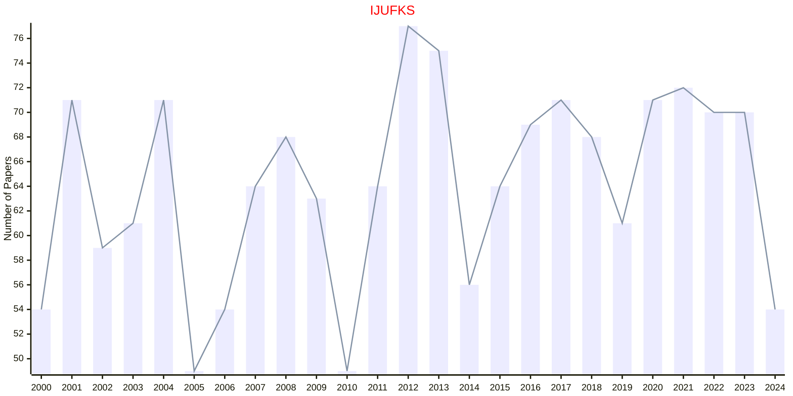

# Knowledge-Based Systems

## IJUFKS

|Publishers|Full/Homepage|Abbr/About|Acronym/Issues|Period/DBLP|Top/Early|CCF|CAS|JCR|IF|Keywords/Google|
|-         |-            |-         |-             |-          |-        |-  |-  |-  |- |-              |
|[WS](https://worldscientific.com/)|[International Journal of Uncertainty, Fuzziness and Knowledge-Based Systems](https://worldscientific.com/worldscinet/ijufks)|[Int. J. Uncertain. Fuzziness Knowl.-Based. Syst.](https://worldscientific.com/page/ijufks/aims-scope)|[IJUFKS](https://worldscientific.com/loi/ijufks)|1993 -|False||4|Q4|1.0|[Fuzzy Systems](https://www.google.com/search?q=Fuzzy+Systems); [Knowledge-Based Systems](https://www.google.com/search?q=Knowledge-Based+Systems)|

