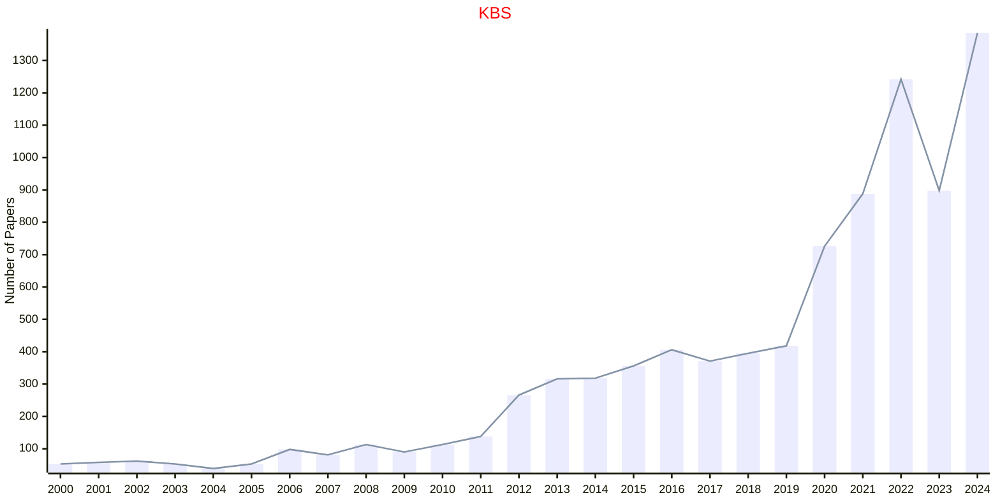

# Knowledge Based Systems

## KBS

|Publishers|Full/Homepage|Abbr/About|Acronym/Issues|Period/DBLP|Top/Early|CCF|CAS|JCR|IF|Keywords/Google|
|-         |-            |-         |-             |-          |-        |-  |-  |-  |- |-              |
|[ELSEVIER](https://www.sciencedirect.com/)|[Knowledge-Based Systems](https://www.sciencedirect.com/journal/knowledge-based-systems)|[Knowl. Based Syst.](https://www.sciencedirect.com/journal/knowledge-based-systems/about/aims-and-scope)|[KBS](https://www.sciencedirect.com/journal/knowledge-based-systems/issues)|1987 -|True|C|1|Q1|7.6|[Knowledge Based Systems](https://www.google.com/search?q=Knowledge+Based+Systems)|

