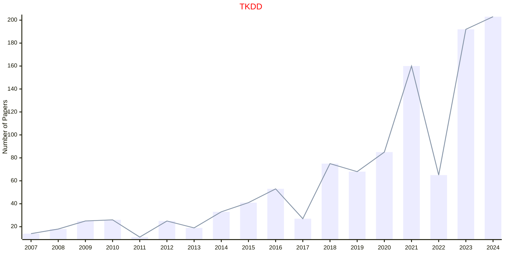
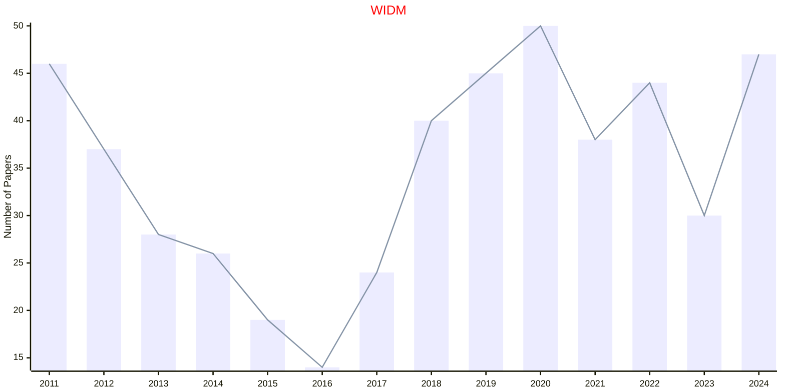

# Knowledge Discovery

## TKDD

|Publishers|Full/Homepage|Abbr/About|Acronym/Issues|Period/DBLP|Top/Early|CCF|CAS|JCR|IF|Keywords/Google|
|-         |-            |-         |-             |-          |-        |-  |-  |-  |- |-              |
|[ACM](https://www.acm.org/)|[ACM Transactions on Knowledge Discovery from Data](https://dl.acm.org/journal/tkdd)|[ACM Trans. knowl. Discov. Data](https://dl.acm.org/journal/tkdd/about)|[TKDD](https://dl.acm.org/loi/tkdd)|[2007 -](https://dblp.org/db/journals/tkdd/index.html)|False|B|3|Q1|4.9|[Data Mining](https://www.google.com/search?q=Data+Mining); [Knowledge Discovery](https://www.google.com/search?q=Knowledge+Discovery)|

## WIDM

|Publishers|Full/Homepage|Abbr/About|Acronym/Issues|Period/DBLP|Top/Early|CCF|CAS|JCR|IF|Keywords/Google|
|-         |-            |-         |-             |-          |-        |-  |-  |-  |- |-              |
|[WILEY](https://www.wiley.com/)|[WIREs Data Mining and Knowledge Discovery](https://onlinelibrary.wiley.com/journal/19424795)|[WIREs Data Mining Knowl. Discov.](https://wires.onlinelibrary.wiley.com/hub/journal/19424795/about/productinformation)|[WIDM](https://wires.onlinelibrary.wiley.com/loi/19424795)|2011 -|False|||||[Data Mining](https://www.google.com/search?q=Data+Mining); [Knowledge Discovery](https://www.google.com/search?q=Knowledge+Discovery)|

