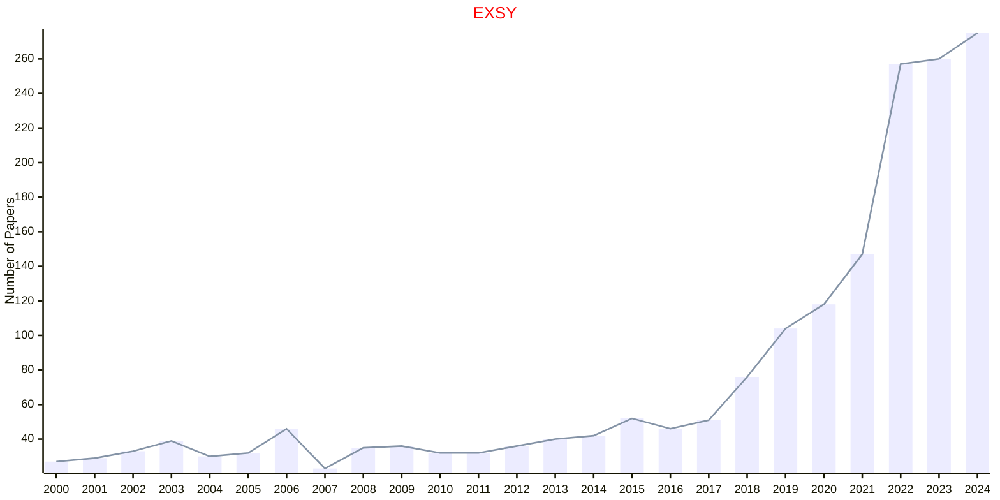

# Knowledge Engineering

## EXSY

|Publishers|Full/Homepage|Abbr/About|Acronym/Issues|Period/DBLP|Top/Early|CCF|CAS|JCR|IF|Keywords/Google|
|-         |-            |-         |-             |-          |-        |-  |-  |-  |- |-              |
|[WILEY](https://www.wiley.com/)|[Expert Systems](https://onlinelibrary.wiley.com/journal/14680394)|[Expert Syst.](https://onlinelibrary.wiley.com/page/journal/14680394/homepage/productinformation.html)|[EXSY](https://onlinelibrary.wiley.com/loi/14680394)|1984 -|False|C|4|Q2|2.7|[Knowledge Engineering](https://www.google.com/search?q=Knowledge+Engineering)|

