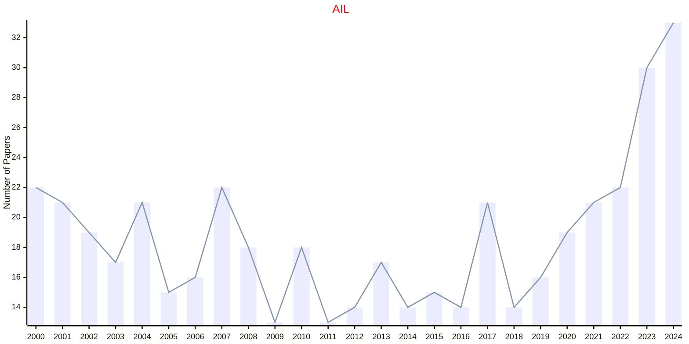

# Law

## AIL

|Publishers|Full/Homepage|Abbr/About|Acronym/Issues|Period/DBLP|Top/Early|CCF|CAS|JCR|IF|Keywords/Google|
|-         |-            |-         |-             |-          |-        |-  |-  |-  |- |-              |
|[SPRINGER](https://www.springer.com/)|[Artificial Intelligence and Law](https://www.springer.com/journal/10506)|[Artif. Intell. Law](https://www.springer.com/journal/10506/aims-and-scope)|[AIL](https://link.springer.com/journal/10506/volumes-and-issues)|1992 -|False||2|Q2|3.6|[Law](https://www.google.com/search?q=Law)|

