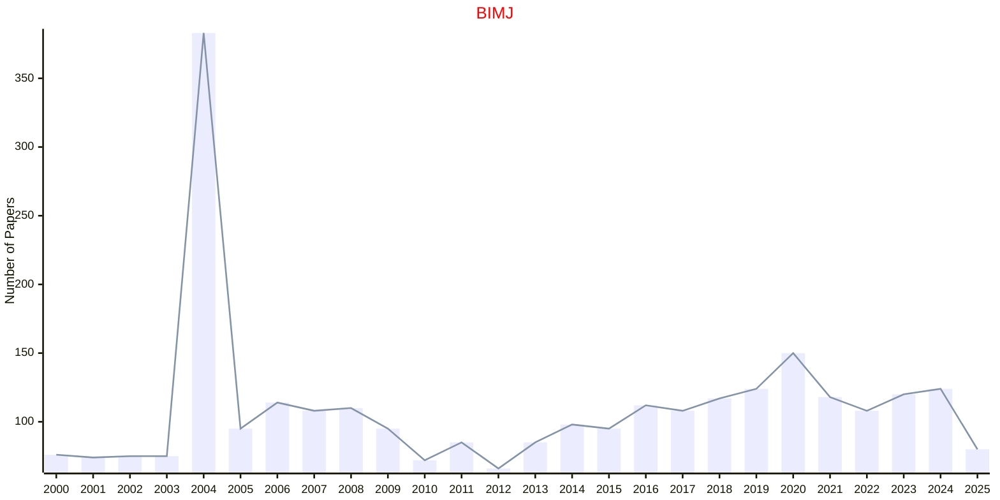

# Life Sciences

## BIMJ

|Publishers|Full/Homepage|Abbr/About|Acronym/Issues|Period/DBLP|Top/Early|CCF|CAS|JCR|IF|Keywords/Google|
|-         |-            |-         |-             |-          |-        |-  |-  |-  |- |-              |
|[WILEY](https://www.wiley.com/)|[Biometrical Journal](https://onlinelibrary.wiley.com/journal/15214036)|[Bio. J.](https://onlinelibrary.wiley.com/page/journal/15214036/homepage/productinformation.html)|[BIMJ](https://onlinelibrary.wiley.com/loi/15214036)|1959 -|False||3|Q1|2.0|[Life Sciences](https://www.google.com/search?q=Life+Sciences); [Statistical Methods](https://www.google.com/search?q=Statistical+Methods)|

