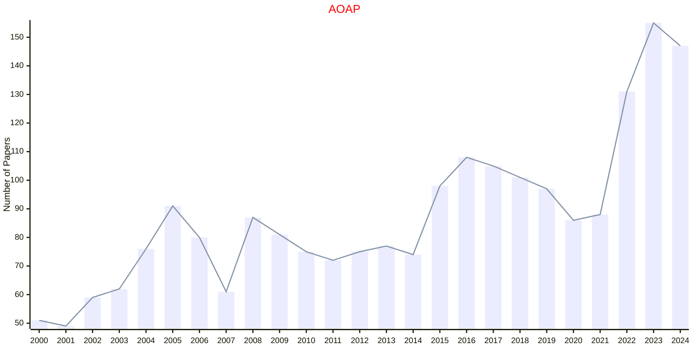

# MCMC

## AOAP

|Publishers|Full/Homepage|Abbr/About|Acronym/Issues|Period/DBLP|Top/Early|CCF|CAS|JCR|IF|Keywords/Google|
|-         |-            |-         |-             |-          |-        |-  |-  |-  |- |-              |
|[EUCLID](https://projecteuclid.org)|[Annals of Applied Probability](https://imstat.org/journals-and-publications/annals-of-applied-probability)|[Ann. Appl. Probab.](https://imstat.org/journals-and-publications/annals-of-applied-probability)|[AOAP](https://projecteuclid.org/journals/annals-of-applied-probability/issues)|1991 -|False||2|Q1|2.1|[Applied Probability](https://www.google.com/search?q=Applied+Probability); [MCMC](https://www.google.com/search?q=MCMC); [Variational Inference](https://www.google.com/search?q=Variational+Inference)|

