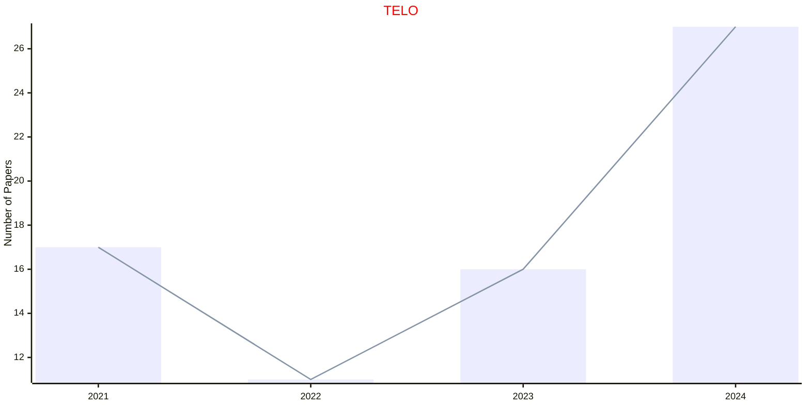
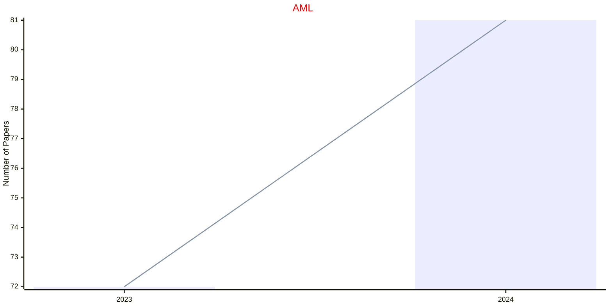
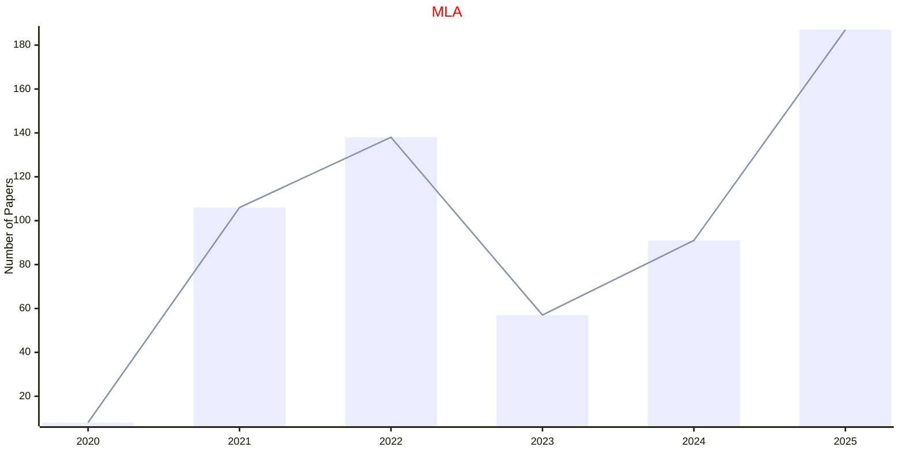
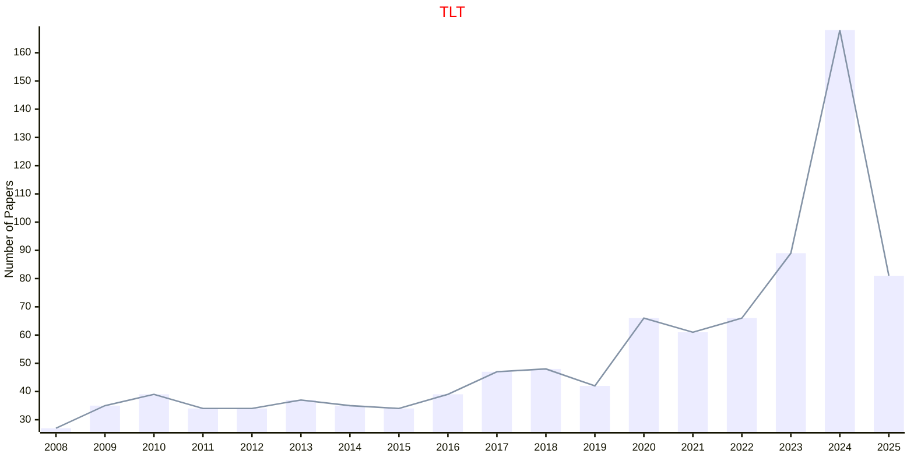
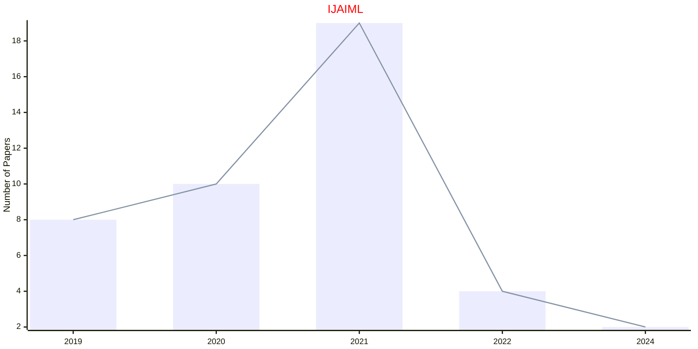
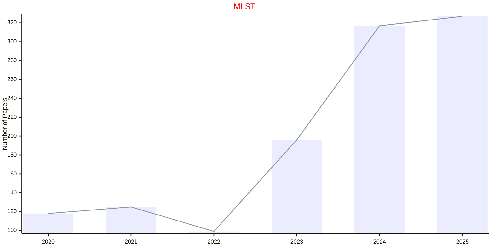
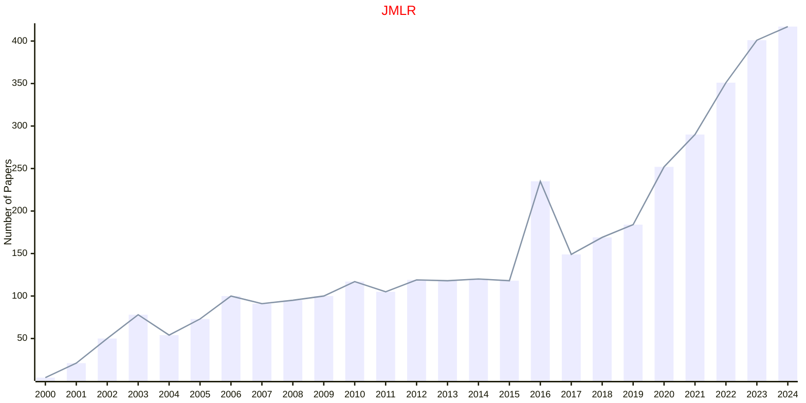
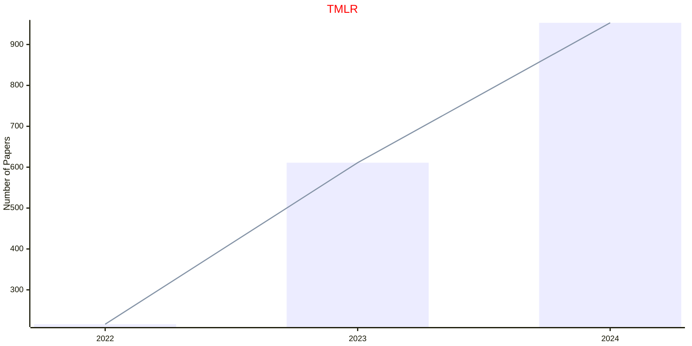
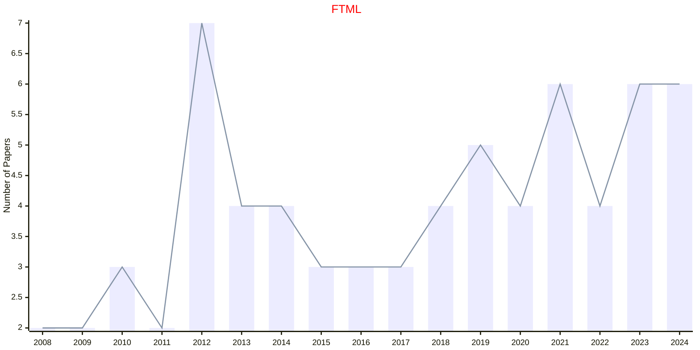
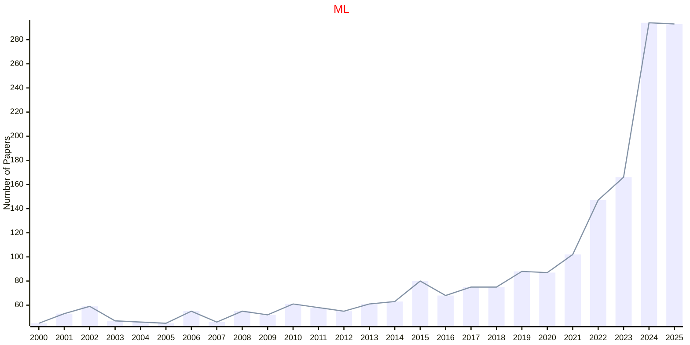

# Machine Learning

## TELO

|Publishers|Full/Homepage|Abbr/About|Acronym/Issues|Period/DBLP|Top/Early|CCF|CAS|JCR|IF|Keywords/Google|
|-         |-            |-         |-             |-          |-        |-  |-  |-  |- |-              |
|[ACM](https://www.acm.org/)|[ACM Transactions on Evolutionary Learning and Optimization](https://dlnext.acm.org/journal/telo)|[ACM Trans. Evol. Learn. Optim.](https://dlnext.acm.org/journal/telo/about)|[TELO](https://dl.acm.org/loi/telo)|[2021 -](https://dblp.org/db/journals/telo/index.html)|False|||||[Evolutionary Computation](https://www.google.com/search?q=Evolutionary+Computation); [Machine Learning](https://www.google.com/search?q=Machine+Learning)|

## AML

|Publishers|Full/Homepage|Abbr/About|Acronym/Issues|Period/DBLP|Top/Early|CCF|CAS|JCR|IF|Keywords/Google|
|-         |-            |-         |-             |-          |-        |-  |-  |-  |- |-              |
|[AIP](https://pubs.aip.org/)|[APL Machine Learning](https://pubs.aip.org/aip/aml)|[APL Mach. Learn.](https://pubs.aip.org/aip/aml/pages/about)|[AML](https://pubs.aip.org/aip/aml/issue)|2023 -|False|||||[Machine Learning](https://www.google.com/search?q=Machine+Learning)|

## MLA

|Publishers|Full/Homepage|Abbr/About|Acronym/Issues|Period/DBLP|Top/Early|CCF|CAS|JCR|IF|Keywords/Google|
|-         |-            |-         |-             |-          |-        |-  |-  |-  |- |-              |
|[ELSEVIER](https://www.sciencedirect.com/)|[Machine Learning with Applications](https://www.sciencedirect.com/journal/machine-learning-with-applications)|[Mach. Learn. Appl.](https://www.sciencedirect.com/journal/machine-learning-with-applications/about/aims-and-scope)|[MLA](https://www.sciencedirect.com/journal/machine-learning-with-applications/issues)|2020 -|False||||6.8|[Machine Learning](https://www.google.com/search?q=Machine+Learning)|

## TLT

|Publishers|Full/Homepage|Abbr/About|Acronym/Issues|Period/DBLP|Top/Early|CCF|CAS|JCR|IF|Keywords/Google|
|-         |-            |-         |-             |-          |-        |-  |-  |-  |- |-              |
|[IEEE](https://ieeexplore.ieee.org/)|[IEEE Transactions on Learning Technologies](https://ieeexplore.ieee.org/xpl/RecentIssue.jsp?punumber=4620076)|[IEEE Trans. Learn. Technol.](https://ieeexplore.ieee.org/xpl/aboutJournal.jsp?punumber=4620076)|[TLT](https://ieeexplore.ieee.org/xpl/issues?punumber=4620076&isnumber=10376229)|2008 -|[False](https://ieeexplore.ieee.org/xpl/tocresult.jsp?isnumber=4620077)||3|Q1|5.5|[Machine Learning](https://www.google.com/search?q=Machine+Learning)|

## IJAIML

|Publishers|Full/Homepage|Abbr/About|Acronym/Issues|Period/DBLP|Top/Early|CCF|CAS|JCR|IF|Keywords/Google|
|-         |-            |-         |-             |-          |-        |-  |-  |-  |- |-              |
|[IGI](https://www.igi-global.com/)|[International Journal of Artificial Intelligence and Machine Learning](https://www.igi-global.com/journal/international-journal-artificial-intelligence-machine/225011)|[Int. J. Artif. Intell. Mach. Learn.](https://www.igi-global.com/journal/international-journal-artificial-intelligence-machine/225011#description)|[IJAIML](https://www.igi-global.com/journals/open-access/table-of-contents/international-journal-artificial-intelligence-machine/225011)|2019 -|False|||||[Artificial Intelligence](https://www.google.com/search?q=Artificial+Intelligence); [Machine Learning](https://www.google.com/search?q=Machine+Learning)|

## MLST

|Publishers|Full/Homepage|Abbr/About|Acronym/Issues|Period/DBLP|Top/Early|CCF|CAS|JCR|IF|Keywords/Google|
|-         |-            |-         |-             |-          |-        |-  |-  |-  |- |-              |
|[IOP](https://ioppublishing.org/)|[Machine Learning: Science and Technology](https://iopscience.iop.org/journal/2632-2153)|[Mach. Learn.: Sci. Technol.](https://publishingsupport.iopscience.iop.org/journals/machine-learning-science-and-technology/about-machine-learning-science-technology/)|[MLST](https://iopscience.iop.org/journal/2632-2153)|2020 -|False||2|Q1|6.1|[Machine Learning](https://www.google.com/search?q=Machine+Learning)|

## JMLR

|Publishers|Full/Homepage|Abbr/About|Acronym/Issues|Period/DBLP|Top/Early|CCF|CAS|JCR|IF|Keywords/Google|
|-         |-            |-         |-             |-          |-        |-  |-  |-  |- |-              |
|[MIT](https://direct.mit.edu/)|[Journal of Machine Learning Research](https://www.jmlr.org/)|J. Mach. Learn. Res.|JMLR||False|A|4|Q1|8.8|[Machine Learning](https://www.google.com/search?q=Machine+Learning)|

## TMLR

|Publishers|Full/Homepage|Abbr/About|Acronym/Issues|Period/DBLP|Top/Early|CCF|CAS|JCR|IF|Keywords/Google|
|-         |-            |-         |-             |-          |-        |-  |-  |-  |- |-              |
|[MIT](https://direct.mit.edu/)|[Transactions on Machine Learning Research](https://www.jmlr.org/tmlr/index.html)|Trans. Mach. Learn. Res.|[TMLR](https://www.jmlr.org/tmlr/papers/)|2022 -|False|||||[Machine Learning](https://www.google.com/search?q=Machine+Learning)|

## FTML

|Publishers|Full/Homepage|Abbr/About|Acronym/Issues|Period/DBLP|Top/Early|CCF|CAS|JCR|IF|Keywords/Google|
|-         |-            |-         |-             |-          |-        |-  |-  |-  |- |-              |
|[NOW](https://www.nowpublishers.com/)|[Foundations and Trends in Machine Learning](https://www.nowpublishers.com/MAL)|[Found. Trends Mach. Learn.](https://www.nowpublishers.com/Journal/EditorialAims/MAL)|[FTML](https://www.nowpublishers.com/MAL)|2008 -|True||1||89.0|[Machine Learning](https://www.google.com/search?q=Machine+Learning)|

## ML

|Publishers|Full/Homepage|Abbr/About|Acronym/Issues|Period/DBLP|Top/Early|CCF|CAS|JCR|IF|Keywords/Google|
|-         |-            |-         |-             |-          |-        |-  |-  |-  |- |-              |
|[SPRINGER](https://www.springer.com/)|[Machine Learning](https://www.springer.com/journal/10994)|[Mach. Learn.](https://www.springer.com/journal/10994/aims-and-scope)|[ML](https://link.springer.com/journal/10994/volumes-and-issues)|1986 -|False|B|4|Q2|6.6|[Machine Learning](https://www.google.com/search?q=Machine+Learning)|

