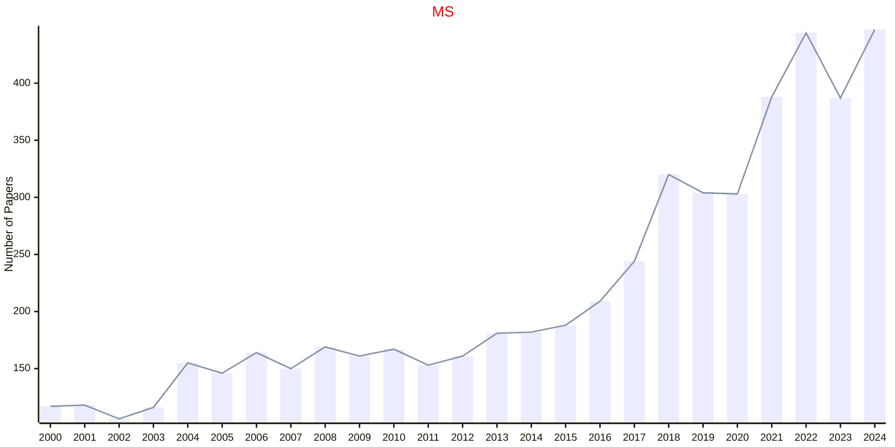
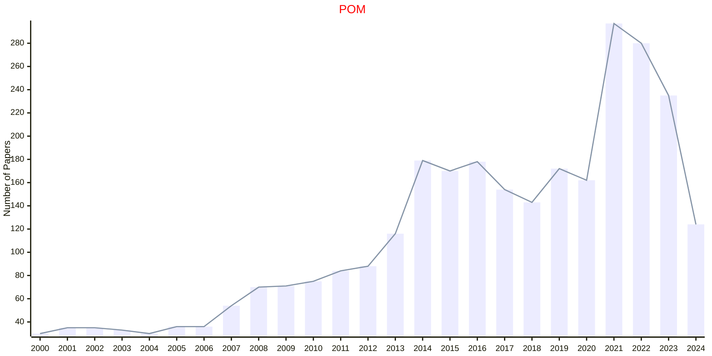
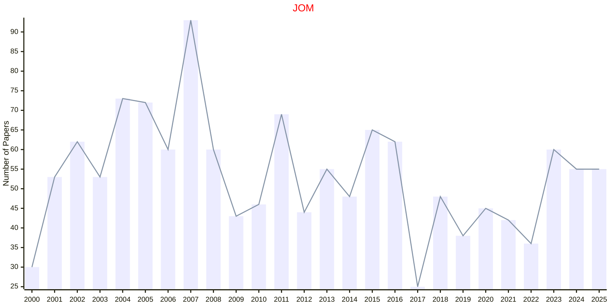

# Management

## MS

|Publishers|Full/Homepage|Abbr/About|Acronym/Issues|Period/DBLP|Top/Early|CCF|CAS|JCR|IF|Keywords/Google|
|-         |-            |-         |-             |-          |-        |-  |-  |-  |- |-              |
|[INFORMS](https://pubsonline.informs.org/)|[Management Science](https://pubsonline.informs.org/journal/mnsc)|[Manag. Sci.](https://pubsonline.informs.org/page/mnsc/editorial-statement)|[MS](https://pubsonline.informs.org/loi/mnsc)|1954 -|False||2|Q1|6.6|[Management](https://www.google.com/search?q=Management)|

## POM

|Publishers|Full/Homepage|Abbr/About|Acronym/Issues|Period/DBLP|Top/Early|CCF|CAS|JCR|IF|Keywords/Google|
|-         |-            |-         |-             |-          |-        |-  |-  |-  |- |-              |
|[SAGE](https://www.sagepub.com/)|[Production and Operations Management](https://journals.sagepub.com/home/paoa)|[Product. Oper. Manag.](https://journals.sagepub.com/overview-metric/PAO?)|[POM](https://journals.sagepub.com/loi/paoa)|1992 -|False||3|Q1|6.4|[Management](https://www.google.com/search?q=Management); [Operations](https://www.google.com/search?q=Operations)|

## JOM

|Publishers|Full/Homepage|Abbr/About|Acronym/Issues|Period/DBLP|Top/Early|CCF|CAS|JCR|IF|Keywords/Google|
|-         |-            |-         |-             |-          |-        |-  |-  |-  |- |-              |
|[WILEY](https://www.wiley.com/)|[Journal of Operations Management](https://onlinelibrary.wiley.com/journal/18731317)|[J. Oper. Manag.](https://onlinelibrary.wiley.com/page/journal/18731317/homepage/overview)|[JOM](https://onlinelibrary.wiley.com/loi/18731317)|1980 -|False||2|Q1|11.4|[Management](https://www.google.com/search?q=Management); [Operations](https://www.google.com/search?q=Operations)|

