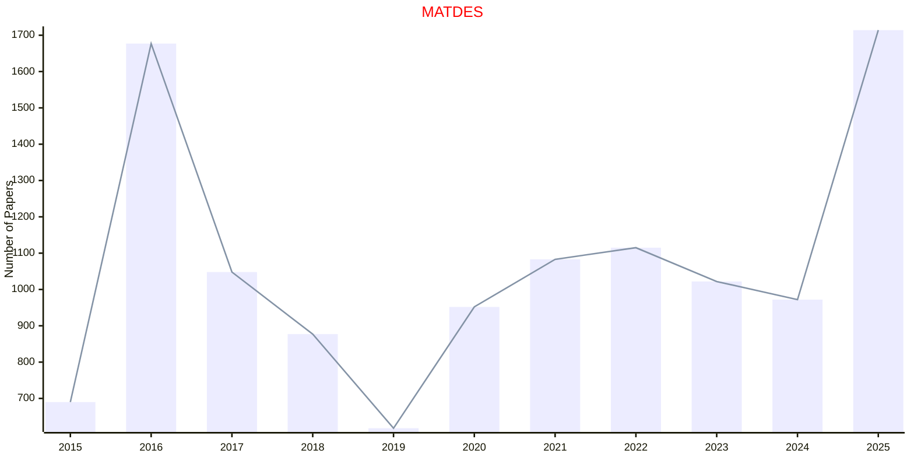
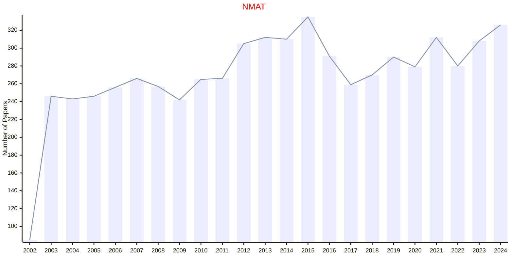

# Materials

## MATDES

|Publishers|Full/Homepage|Abbr/About|Acronym/Issues|Period/DBLP|Top/Early|CCF|CAS|JCR|IF|Keywords/Google|
|-         |-            |-         |-             |-          |-        |-  |-  |-  |- |-              |
|[ELSEVIER](https://www.sciencedirect.com/)|[Materials & Design](https://www.sciencedirect.com/journal/materials-and-design)|[Mater. Des.](https://www.sciencedirect.com/journal/materials-and-design/about/aims-and-scope)|[MATDES](https://www.sciencedirect.com/journal/materials-and-design/issues)|2015 -|False||2|Q1|8.9|[Materials](https://www.google.com/search?q=Materials)|

## NMAT

|Publishers|Full/Homepage|Abbr/About|Acronym/Issues|Period/DBLP|Top/Early|CCF|CAS|JCR|IF|Keywords/Google|
|-         |-            |-         |-             |-          |-        |-  |-  |-  |- |-              |
|[NATURE](https://www.nature.com/)|[Nature Materials](https://www.nature.com/nmat)|[Nat. Mater.](https://www.nature.com/nmat/aims)|[NMAT](https://www.nature.com/nmat/volumes)|2002 -|True||1|Q1|46.8|[Materials](https://www.google.com/search?q=Materials)|

