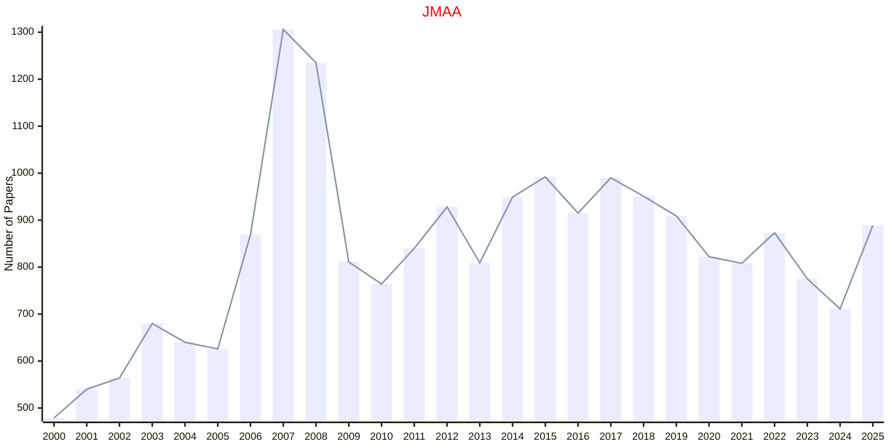
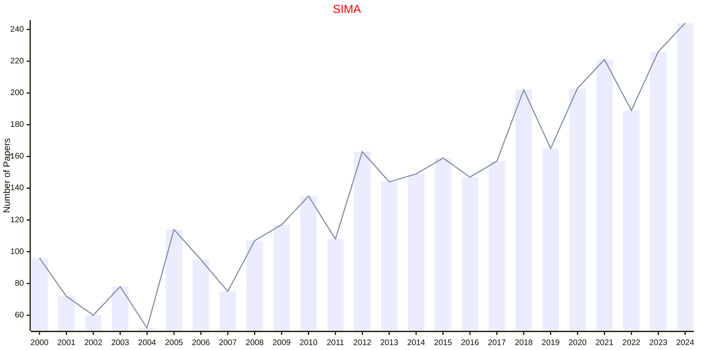

# Mathematical Analysis

## JMAA

|Publishers|Full/Homepage|Abbr/About|Acronym/Issues|Period/DBLP|Top/Early|CCF|CAS|JCR|IF|Keywords/Google|
|-         |-            |-         |-             |-          |-        |-  |-  |-  |- |-              |
|[ELSEVIER](https://www.sciencedirect.com/)|[Journal of Mathematical Analysis and Applications](https://www.sciencedirect.com/journal/journal-of-mathematical-analysis-and-applications)|[J. Math. Anal. Appl.](https://www.sciencedirect.com/journal/journal-of-mathematical-analysis-and-applications/about/aims-and-scope)|[JMAA](https://www.sciencedirect.com/journal/journal-of-mathematical-analysis-and-applications/issues)|1960 -|False||3|Q1|1.2|[Mathematical Analysis](https://www.google.com/search?q=Mathematical+Analysis)|

## SIMA

|Publishers|Full/Homepage|Abbr/About|Acronym/Issues|Period/DBLP|Top/Early|CCF|CAS|JCR|IF|Keywords/Google|
|-         |-            |-         |-             |-          |-        |-  |-  |-  |- |-              |
|[SIAM](https://epubs.siam.org)|[SIAM Journal on Mathematical Analysis](https://epubs.siam.org/journal/sjmaah)|[SIAM J. Math. Anal.](https://epubs.siam.org/journal/sima/about)|[SIMA](https://epubs.siam.org/loi/sjmaah)|1970 -|True||1|Q1|2.1|[Mathematical Analysis](https://www.google.com/search?q=Mathematical+Analysis)|

