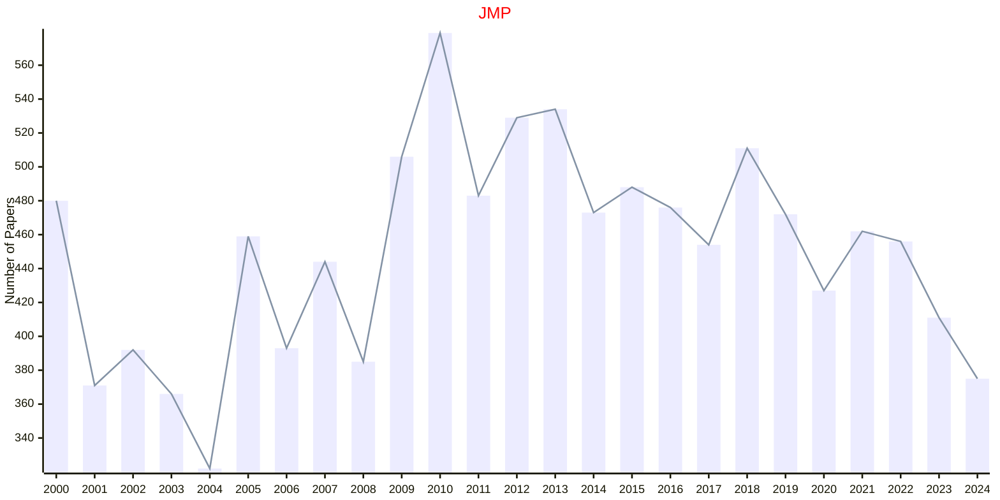

# Mathematical Physics

## JMP

|Publishers|Full/Homepage|Abbr/About|Acronym/Issues|Period/DBLP|Top/Early|CCF|CAS|JCR|IF|Keywords/Google|
|-         |-            |-         |-             |-          |-        |-  |-  |-  |- |-              |
|[AIP](https://pubs.aip.org/)|[Journal of Mathematical Physics](https://pubs.aip.org/aip/jmp)|[J. Math. Phys.](https://pubs.aip.org/aip/jmp/pages/about)|[JMP](https://pubs.aip.org/aip/jmp/issue)|1960 -|False||3|Q3|1.4|[Mathematical Physics](https://www.google.com/search?q=Mathematical+Physics)|

