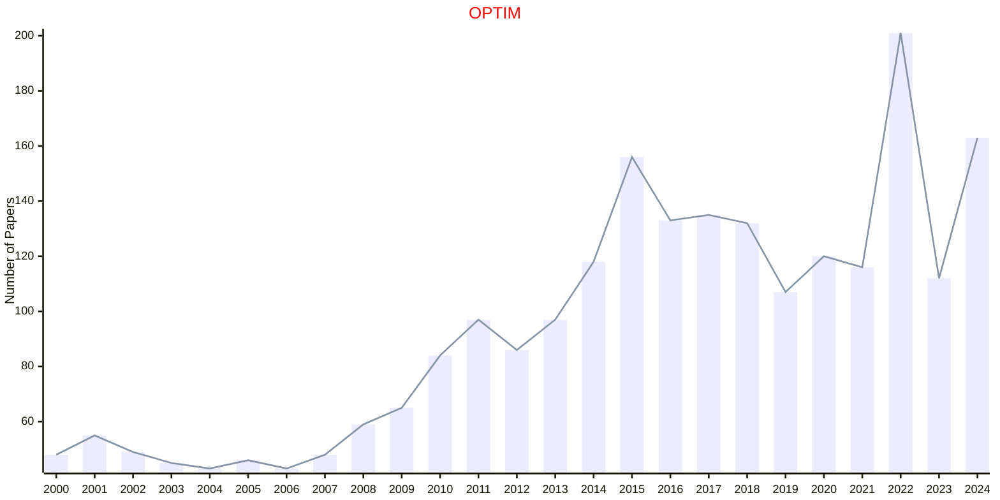

# Mathematical Programming

## OPTIM

|Publishers|Full/Homepage|Abbr/About|Acronym/Issues|Period/DBLP|Top/Early|CCF|CAS|JCR|IF|Keywords/Google|
|-         |-            |-         |-             |-          |-        |-  |-  |-  |- |-              |
|[TAYLOR](https://www.tandfonline.com/)|[Optimization](https://www.tandfonline.com/journals/gopt20)|[Optim.](https://www.tandfonline.com/journals/gopt20/about-this-journal#aims-and-scope)|[OPTIM](https://www.tandfonline.com/loi/gopt20)|1977 -|False||3|Q1|2.0|[Mathematical Programming](https://www.google.com/search?q=Mathematical+Programming); [Operations](https://www.google.com/search?q=Operations)|

