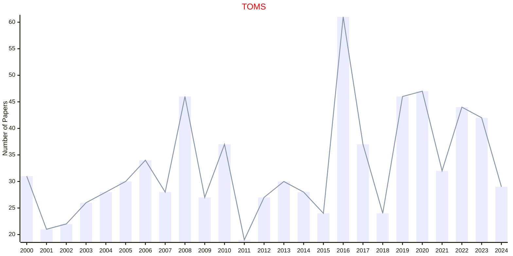

# Mathematical Software

## TOMS

|Publishers|Full/Homepage|Abbr/About|Acronym/Issues|Period/DBLP|Top/Early|CCF|CAS|JCR|IF|Keywords/Google|
|-         |-            |-         |-             |-          |-        |-  |-  |-  |- |-              |
|[ACM](https://www.acm.org/)|[ACM Transactions on Mathematical Software](https://dl.acm.org/journal/toms)|[ACM Trans. Math. Softw.](https://dl.acm.org/journal/toms/about)|[TOMS](https://dl.acm.org/loi/toms)|[1975 -](https://dblp.org/db/journals/toms/index.html)|False|B|2|Q1|3.3|[Mathematical Software](https://www.google.com/search?q=Mathematical+Software)|

