# Mathematics

## BAMS

|Publishers|Full/Homepage|Abbr/About|Acronym/Issues|Period/DBLP|Top/Early|CCF|CAS|JCR|IF|Keywords/Google|
|-         |-            |-         |-             |-          |-        |-  |-  |-  |- |-              |
|[AMS](https://www.ams.org/)|[Bulletin of the American Mathematical Society](https://www.ams.org/journals/bull)|[Bull. Am. Math. Soc.](https://www.ams.org/publications/journals/journalsframework/aboutbull)|[BAMS](https://www.ams.org/journals/bull/all_issues.html?active=allissues)|1891 -|False||2|Q1|2.1|[Mathematics](https://www.google.com/search?q=Mathematics)|

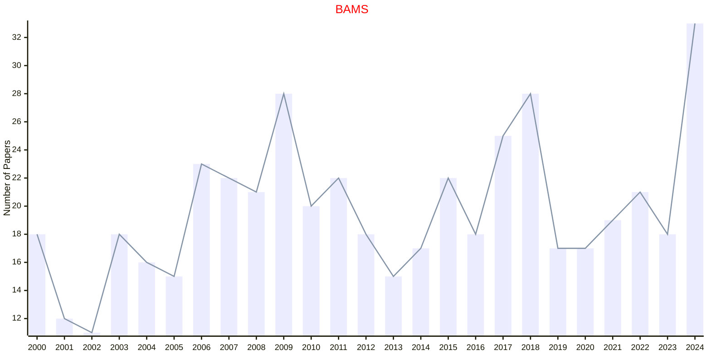

## JAMS

|Publishers|Full/Homepage|Abbr/About|Acronym/Issues|Period/DBLP|Top/Early|CCF|CAS|JCR|IF|Keywords/Google|
|-         |-            |-         |-             |-          |-        |-  |-  |-  |- |-              |
|[AMS](https://www.ams.org/)|[Journal of the American Mathematical Society](https://www.ams.org/journals/jams)|[J. Am. Math. Soc.](https://www.ams.org/publications/journals/journalsframework/aboutjams)|[JAMS](https://www.ams.org/journals/jams/all_issues.html?active=allissues)|1988 -|True||1|Q1|4.1|[Mathematics](https://www.google.com/search?q=Mathematics)|

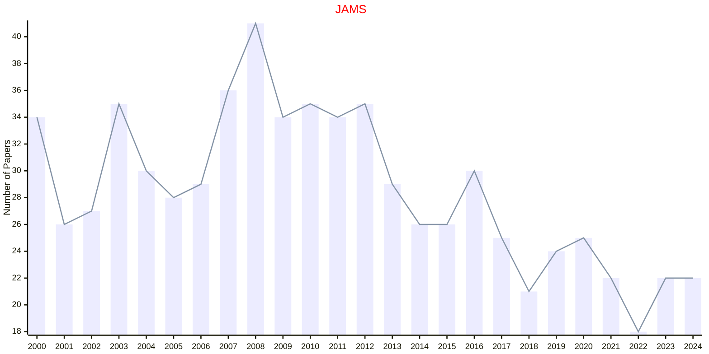

## CMA

|Publishers|Full/Homepage|Abbr/About|Acronym/Issues|Period/DBLP|Top/Early|CCF|CAS|JCR|IF|Keywords/Google|
|-         |-            |-         |-             |-          |-        |-  |-  |-  |- |-              |
|[ELSEVIER](https://www.sciencedirect.com/)|[Computers & Mathematics with Applications](https://www.sciencedirect.com/journal/computers-and-mathematics-with-applications)|[Comput. Meth. Appl.](https://www.sciencedirect.com/journal/computers-and-mathematics-with-applications/about/aims-and-scope)|[CMA](https://www.sciencedirect.com/journal/computers-and-mathematics-with-applications/issues)|1975 -|False||2|Q1|2.5|[Applied Mathematics](https://www.google.com/search?q=Applied+Mathematics)|

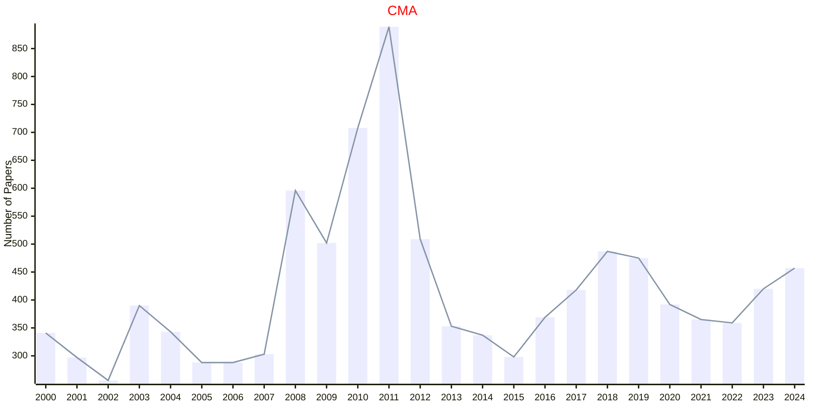

## JAIM

|Publishers|Full/Homepage|Abbr/About|Acronym/Issues|Period/DBLP|Top/Early|CCF|CAS|JCR|IF|Keywords/Google|
|-         |-            |-         |-             |-          |-        |-  |-  |-  |- |-              |
|[ELSEVIER](https://www.sciencedirect.com/)|[Advances in Mathematics](https://www.sciencedirect.com/journal/advances-in-mathematics)|[Adv. Math.](https://www.sciencedirect.com/journal/advances-in-mathematics/about/aims-and-scope)|[JAIM](https://www.sciencedirect.com/journal/advances-in-mathematics/issues)|1961 -|True||1|Q1|1.7|[Mathematics](https://www.google.com/search?q=Mathematics)|

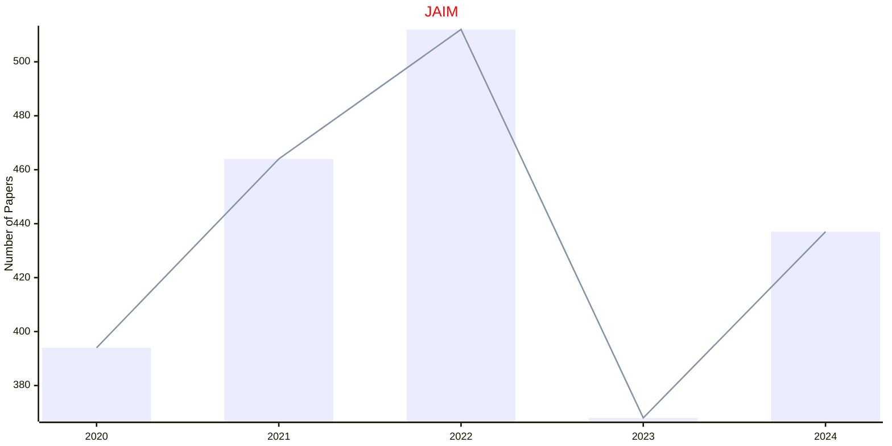

## JDE

|Publishers|Full/Homepage|Abbr/About|Acronym/Issues|Period/DBLP|Top/Early|CCF|CAS|JCR|IF|Keywords/Google|
|-         |-            |-         |-             |-          |-        |-  |-  |-  |- |-              |
|[ELSEVIER](https://www.sciencedirect.com/)|[Journal of Differential Equations](https://www.sciencedirect.com/journal/journal-of-differential-equations)|[J. Diff. Equ.](https://www.sciencedirect.com/journal/journal-of-differential-equations/about/aims-and-scope)|[JDE](https://www.sciencedirect.com/journal/journal-of-differential-equations/issues)|1965 -|True||1|Q1|2.5|[Differential Equations](https://www.google.com/search?q=Differential+Equations)|

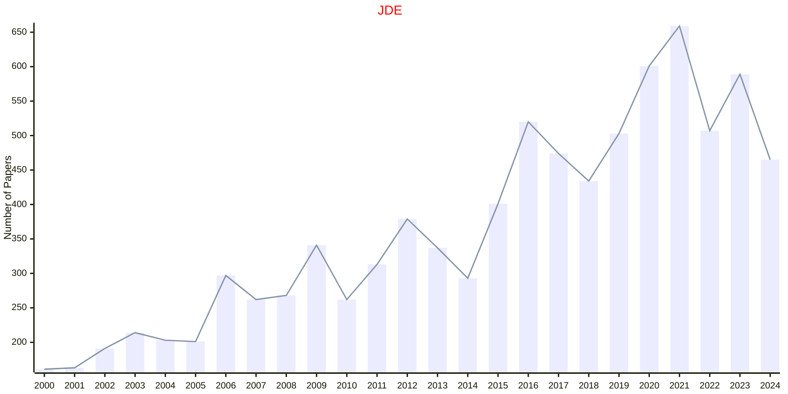

## JMAA

|Publishers|Full/Homepage|Abbr/About|Acronym/Issues|Period/DBLP|Top/Early|CCF|CAS|JCR|IF|Keywords/Google|
|-         |-            |-         |-             |-          |-        |-  |-  |-  |- |-              |
|[ELSEVIER](https://www.sciencedirect.com/)|[Journal of Mathematical Analysis and Applications](https://www.sciencedirect.com/journal/journal-of-mathematical-analysis-and-applications)|[J. Math. Anal. Appl.](https://www.sciencedirect.com/journal/journal-of-mathematical-analysis-and-applications/about/aims-and-scope)|[JMAA](https://www.sciencedirect.com/journal/journal-of-mathematical-analysis-and-applications/issues)|1960 -|False||3|Q1|1.2|[Mathematical Analysis](https://www.google.com/search?q=Mathematical+Analysis)|

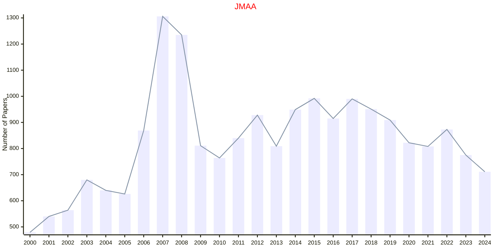

## ANNALS

|Publishers|Full/Homepage|Abbr/About|Acronym/Issues|Period/DBLP|Top/Early|CCF|CAS|JCR|IF|Keywords/Google|
|-         |-            |-         |-             |-          |-        |-  |-  |-  |- |-              |
|[PRINCETON](https://press.princeton.edu/)|[Annals of Mathematics](https://annals.math.princeton.edu/)|[Ann. Math.](https://annals.math.princeton.edu/about)|[ANNALS](https://annals.math.princeton.edu/)|1966 -|True||1|Q1|6.3|[Mathematics](https://www.google.com/search?q=Mathematics)|

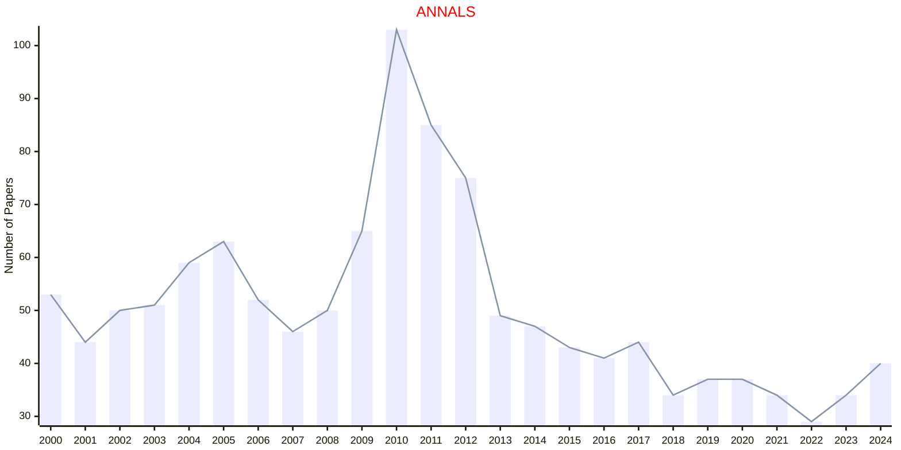

## SIADS

|Publishers|Full/Homepage|Abbr/About|Acronym/Issues|Period/DBLP|Top/Early|CCF|CAS|JCR|IF|Keywords/Google|
|-         |-            |-         |-             |-          |-        |-  |-  |-  |- |-              |
|[SIAM](https://epubs.siam.org)|[SIAM Journal on Applied Dynamical Systems](https://epubs.siam.org/journal/sjaday)|[SIAM J. Appl. Dyn. Syst.](https://epubs.siam.org/journal/siads/about)|[SIADS](https://epubs.siam.org/loi/sjaday)|2002 -|False||4|Q1|2.3|[Mathematics](https://www.google.com/search?q=Mathematics)|

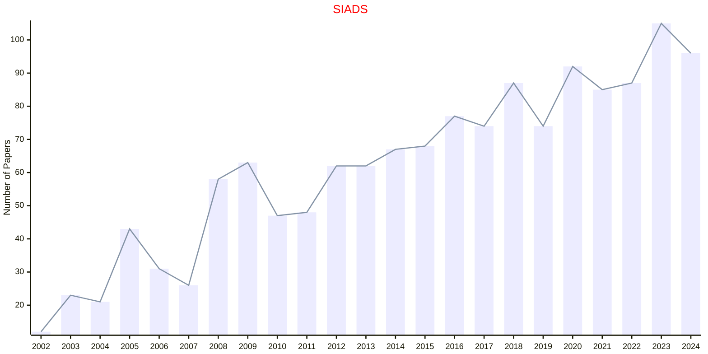

## SIAGA

|Publishers|Full/Homepage|Abbr/About|Acronym/Issues|Period/DBLP|Top/Early|CCF|CAS|JCR|IF|Keywords/Google|
|-         |-            |-         |-             |-          |-        |-  |-  |-  |- |-              |
|[SIAM](https://epubs.siam.org)|[SIAM Journal on Applied Algebra and Geometry](https://epubs.siam.org/journal/siaga)|[SIAM J. Appl. Algebra Geom.](https://epubs.siam.org/journal/siaga/about)|[SIAGA](https://epubs.siam.org/loi/sjaabq)|2017 -|False||2|Q2|1.7|[Applied Algebra](https://www.google.com/search?q=Applied+Algebra); [Applied Geometry](https://www.google.com/search?q=Applied+Geometry)|

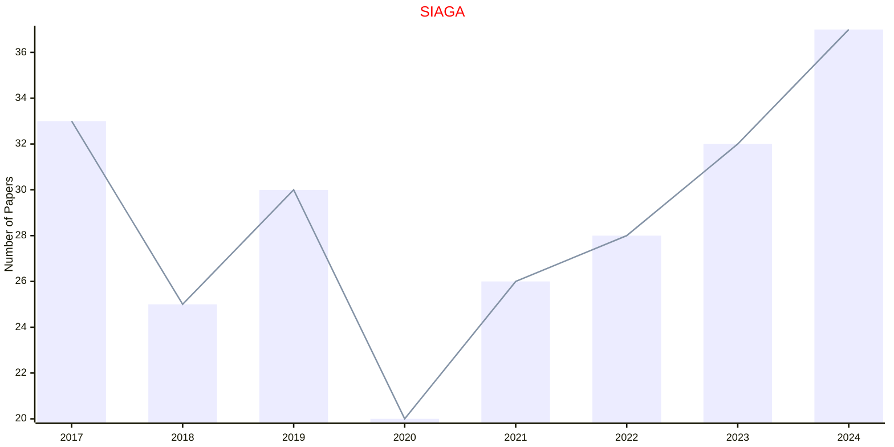

## SIAP

|Publishers|Full/Homepage|Abbr/About|Acronym/Issues|Period/DBLP|Top/Early|CCF|CAS|JCR|IF|Keywords/Google|
|-         |-            |-         |-             |-          |-        |-  |-  |-  |- |-              |
|[SIAM](https://epubs.siam.org)|[SIAM Journal on Applied Mathematics](https://epubs.siam.org/journal/smjmap)|[SIAM J. Appl. Math.](https://epubs.siam.org/journal/siap/about)|[SIAP](https://epubs.siam.org/loi/smjmap)|1953 -|False||4|Q1|2.1|[Applied Mathematics](https://www.google.com/search?q=Applied+Mathematics)|

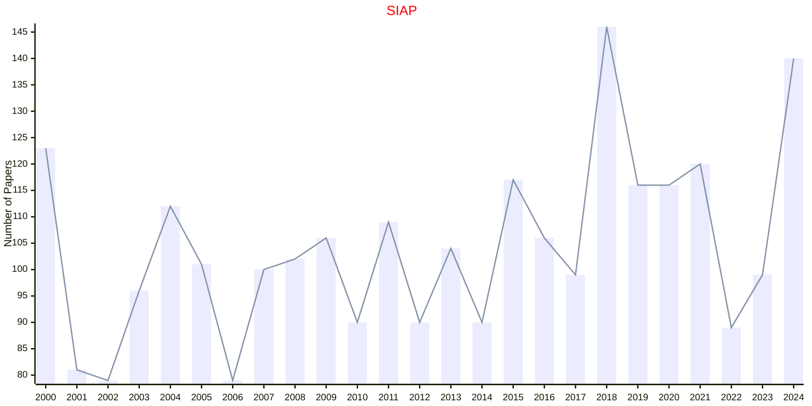

## SICOMP

|Publishers|Full/Homepage|Abbr/About|Acronym/Issues|Period/DBLP|Top/Early|CCF|CAS|JCR|IF|Keywords/Google|
|-         |-            |-         |-             |-          |-        |-  |-  |-  |- |-              |
|[SIAM](https://epubs.siam.org)|[SIAM Journal on Computing](https://epubs.siam.org/journal/smjcat)|[SIAM J. Comput.](https://epubs.siam.org/journal/sicomp/about)|[SICOMP](https://epubs.siam.org/loi/smjcat)|1972 -|False|A|3|Q2|2.1|[Computational Science](https://www.google.com/search?q=Computational+Science); [Mathematics](https://www.google.com/search?q=Mathematics)|

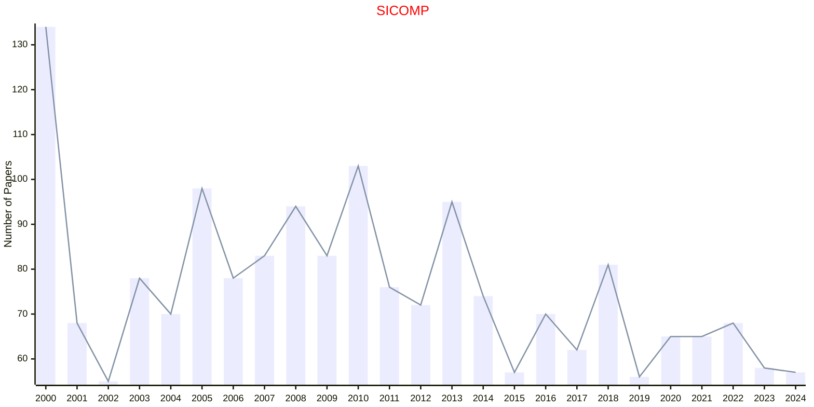

## SIDMA

|Publishers|Full/Homepage|Abbr/About|Acronym/Issues|Period/DBLP|Top/Early|CCF|CAS|JCR|IF|Keywords/Google|
|-         |-            |-         |-             |-          |-        |-  |-  |-  |- |-              |
|[SIAM](https://epubs.siam.org)|[SIAM Journal on Discrete Mathematics](https://epubs.siam.org/journal/sjdmec)|[SIAM J. Discret. Math.](https://epubs.siam.org/journal/sidma/about)|[SIDMA](https://epubs.siam.org/loi/sjdmec)|1988 -|False|C|2|Q2|1.0|[Mathematics](https://www.google.com/search?q=Mathematics)|

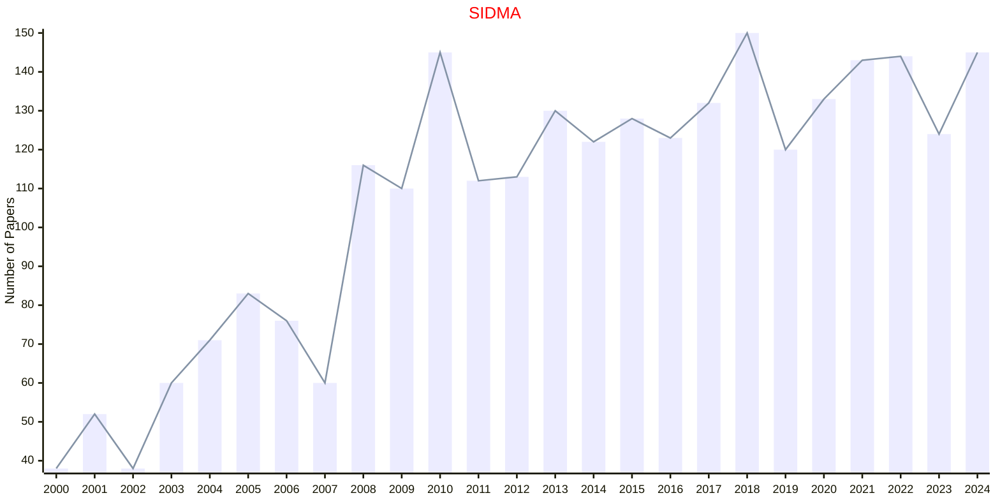

## SIFIN

|Publishers|Full/Homepage|Abbr/About|Acronym/Issues|Period/DBLP|Top/Early|CCF|CAS|JCR|IF|Keywords/Google|
|-         |-            |-         |-             |-          |-        |-  |-  |-  |- |-              |
|[SIAM](https://epubs.siam.org)|[SIAM Journal on Financial Mathematics](https://epubs.siam.org/journal/sjfmbj)|[SIAM J. Financ. Math.](https://epubs.siam.org/journal/sifin/about)|[SIFIN](https://epubs.siam.org/loi/sjfmbj)|2010 -|False||3|Q2|1.7|[Financial Mathematics](https://www.google.com/search?q=Financial+Mathematics)|

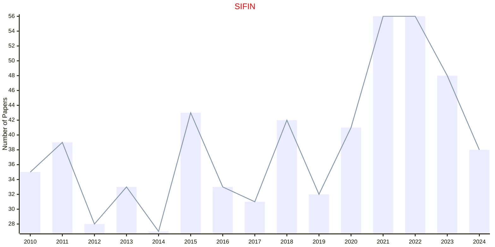

## SIIMS

|Publishers|Full/Homepage|Abbr/About|Acronym/Issues|Period/DBLP|Top/Early|CCF|CAS|JCR|IF|Keywords/Google|
|-         |-            |-         |-             |-          |-        |-  |-  |-  |- |-              |
|[SIAM](https://epubs.siam.org)|[SIAM Journal on Imaging Sciences](https://epubs.siam.org/journal/sjisbi)|[SIAM J. Imaging Sci.](https://epubs.siam.org/journal/siims/about)|[SIIMS](https://epubs.siam.org/loi/sjisbi)|2008 -|False|B|3|Q1|2.8|[Imaging Sciences](https://www.google.com/search?q=Imaging+Sciences)|

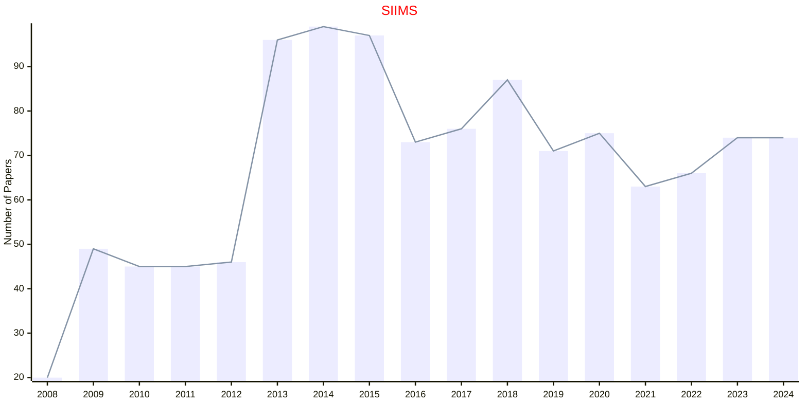

## SIMA

|Publishers|Full/Homepage|Abbr/About|Acronym/Issues|Period/DBLP|Top/Early|CCF|CAS|JCR|IF|Keywords/Google|
|-         |-            |-         |-             |-          |-        |-  |-  |-  |- |-              |
|[SIAM](https://epubs.siam.org)|[SIAM Journal on Mathematical Analysis](https://epubs.siam.org/journal/sjmaah)|[SIAM J. Math. Anal.](https://epubs.siam.org/journal/sima/about)|[SIMA](https://epubs.siam.org/loi/sjmaah)|1970 -|True||1|Q1|2.1|[Mathematical Analysis](https://www.google.com/search?q=Mathematical+Analysis)|

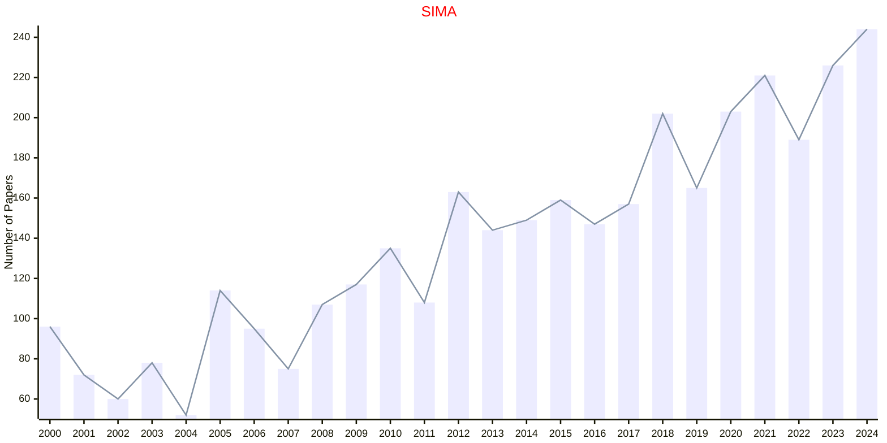

## SIMAX

|Publishers|Full/Homepage|Abbr/About|Acronym/Issues|Period/DBLP|Top/Early|CCF|CAS|JCR|IF|Keywords/Google|
|-         |-            |-         |-             |-          |-        |-  |-  |-  |- |-              |
|[SIAM](https://epubs.siam.org)|[SIAM Journal on Matrix Analysis and Applications](https://epubs.siam.org/journal/sjmael)|[SIAM J. Matrix Anal. Appl.](https://epubs.siam.org/journal/simax/about)|[SIMAX](https://epubs.siam.org/loi/sjmael)|1980 -|False||2|Q2|2.0|[Matrix Analysis](https://www.google.com/search?q=Matrix+Analysis)|

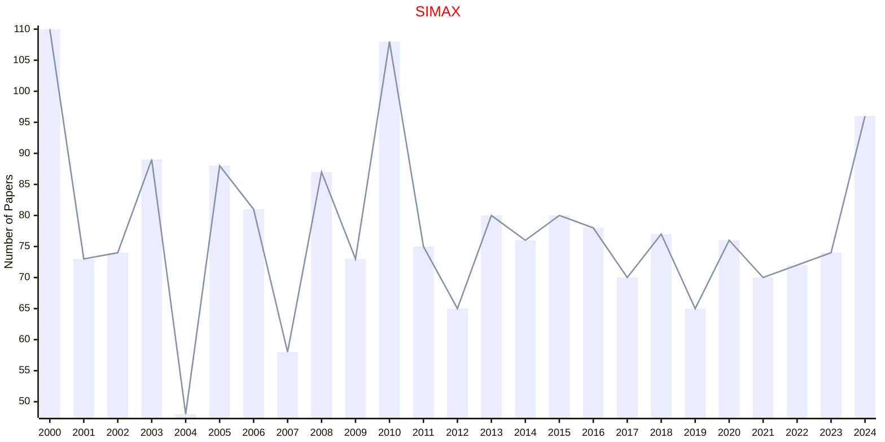

## SIMODS

|Publishers|Full/Homepage|Abbr/About|Acronym/Issues|Period/DBLP|Top/Early|CCF|CAS|JCR|IF|Keywords/Google|
|-         |-            |-         |-             |-          |-        |-  |-  |-  |- |-              |
|[SIAM](https://epubs.siam.org)|[SIAM Journal on Mathematics of Data Science](https://epubs.siam.org/journal/sjmdaq)|[SIAM J. Math. Data Sci.](https://epubs.siam.org/journal/simods/about)|[SIMODS](https://epubs.siam.org/loi/sjmdaq)|2019 -|False||3|Q1|3.5|[Data Science](https://www.google.com/search?q=Data+Science)|

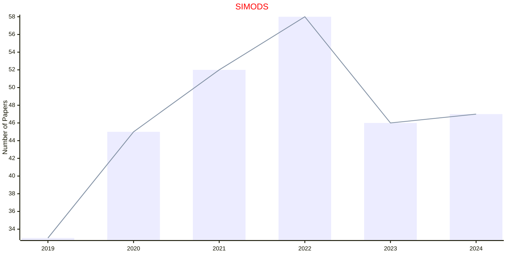

## SIREV

|Publishers|Full/Homepage|Abbr/About|Acronym/Issues|Period/DBLP|Top/Early|CCF|CAS|JCR|IF|Keywords/Google|
|-         |-            |-         |-             |-          |-        |-  |-  |-  |- |-              |
|[SIAM](https://epubs.siam.org)|[SIAM Review](https://epubs.siam.org/journal/siread)|[SIAM Rev.](https://epubs.siam.org/journal/sirev/about)|[SIREV](https://epubs.siam.org/loi/siread)|1959 -|True||1|Q1|11.1|[Mathematics](https://www.google.com/search?q=Mathematics); [Review](https://www.google.com/search?q=Review)|

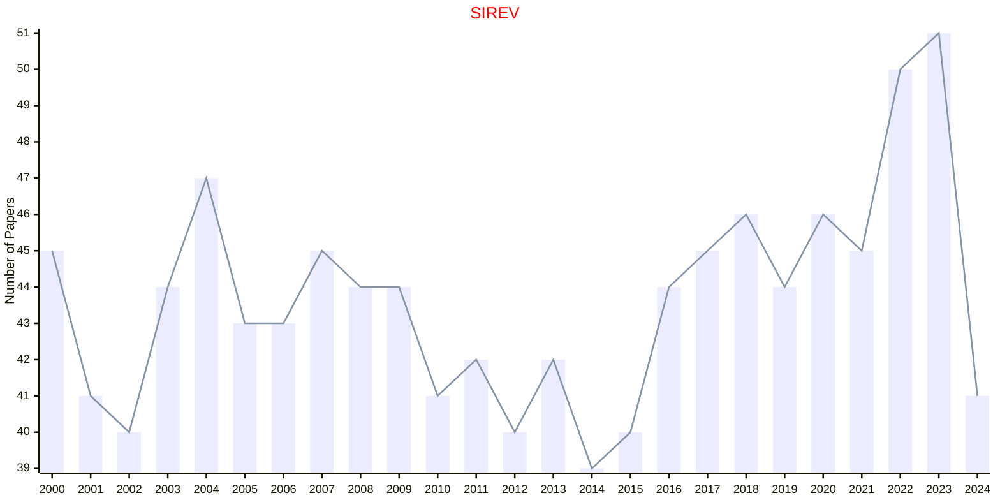

## MMAS

|Publishers|Full/Homepage|Abbr/About|Acronym/Issues|Period/DBLP|Top/Early|CCF|CAS|JCR|IF|Keywords/Google|
|-         |-            |-         |-             |-          |-        |-  |-  |-  |- |-              |
|[WILEY](https://www.wiley.com/)|[Mathematical Methods in the Applied Sciences](https://onlinelibrary.wiley.com/journal/10991476)|[Math. Meth. Appl. Sci.](https://onlinelibrary.wiley.com/page/journal/10991476/homepage/productinformation.html)|[MMAS](https://onlinelibrary.wiley.com/loi/10991476)|1979 -|False||4|Q1|1.9|[Applied Mathematics](https://www.google.com/search?q=Applied+Mathematics)|

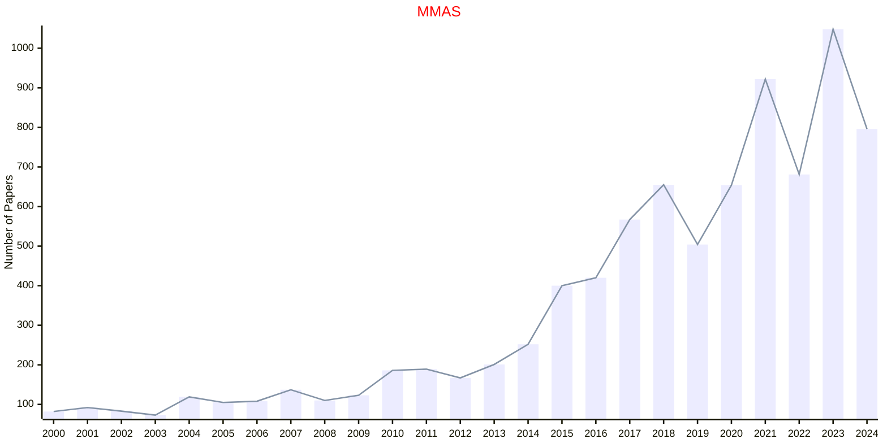

## IJDSMS

|Publishers|Full/Homepage|Abbr/About|Acronym/Issues|Period/DBLP|Top/Early|CCF|CAS|JCR|IF|Keywords/Google|
|-         |-            |-         |-             |-          |-        |-  |-  |-  |- |-              |
|[WS](https://worldscientific.com/)|[International Journal of Data Science in the Mathematical Sciences](https://worldscientific.com/worldscinet/ijdsms)|[Int. J. Data Sci. Math. Sci.](https://worldscientific.com/page/ijdsms/aims-scope)|[IJDSMS](https://worldscientific.com/loi/ijdsms)|2023 -|False|||||[Data Science](https://www.google.com/search?q=Data+Science); [Mathematics](https://www.google.com/search?q=Mathematics)|

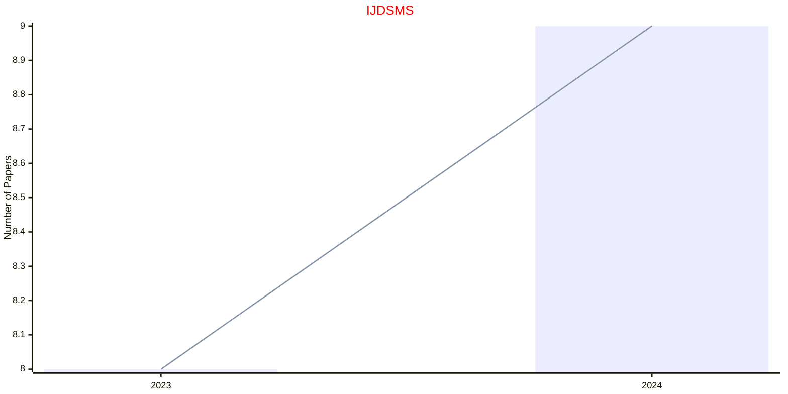

