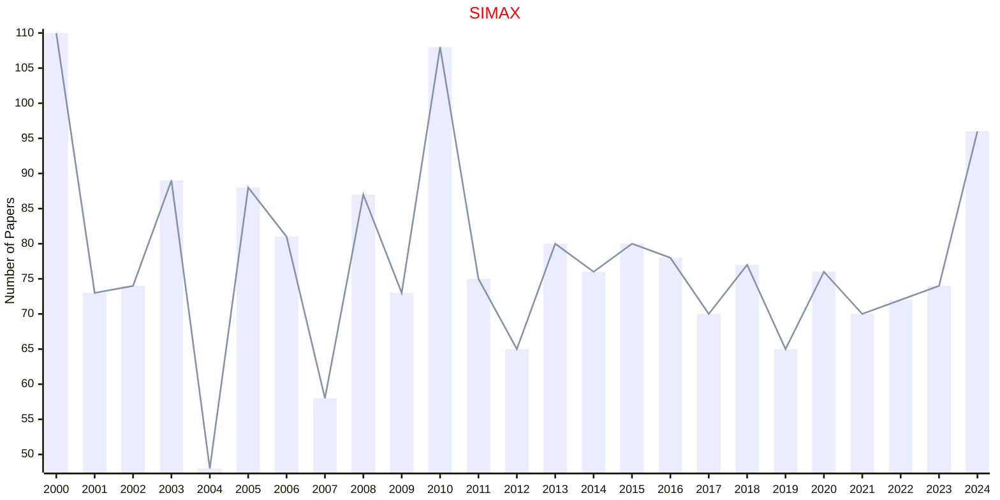

# Matrix Analysis

## SIMAX

|Publishers|Full/Homepage|Abbr/About|Acronym/Issues|Period/DBLP|Top/Early|CCF|CAS|JCR|IF|Keywords/Google|
|-         |-            |-         |-             |-          |-        |-  |-  |-  |- |-              |
|[SIAM](https://epubs.siam.org)|[SIAM Journal on Matrix Analysis and Applications](https://epubs.siam.org/journal/sjmael)|[SIAM J. Matrix Anal. Appl.](https://epubs.siam.org/journal/simax/about)|[SIMAX](https://epubs.siam.org/loi/sjmael)|1980 -|False||2|Q2|2.0|[Matrix Analysis](https://www.google.com/search?q=Matrix+Analysis)|

