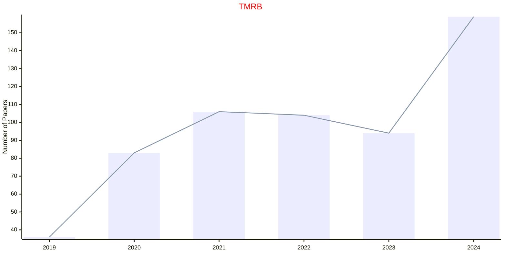

# Medical Robotics

## TMRB

|Publishers|Full/Homepage|Abbr/About|Acronym/Issues|Period/DBLP|Top/Early|CCF|CAS|JCR|IF|Keywords/Google|
|-         |-            |-         |-             |-          |-        |-  |-  |-  |- |-              |
|[IEEE](https://ieeexplore.ieee.org/)|[IEEE Transactions on Medical Robotics and Bionics](https://ieeexplore.ieee.org/xpl/RecentIssue.jsp?punumber=8253409)|[IEEE Tran. Med. Robot. Bionics](https://ieeexplore.ieee.org/xpl/aboutJournal.jsp?punumber=8253409)|[TMRB](https://ieeexplore.ieee.org/xpl/issues?punumber=8253409&isnumber=10908098)|2019 -|[False](https://ieeexplore.ieee.org/xpl/tocresult.jsp?isnumber=8627956)||3||4.2|[Medical Robotics](https://www.google.com/search?q=Medical+Robotics)|

