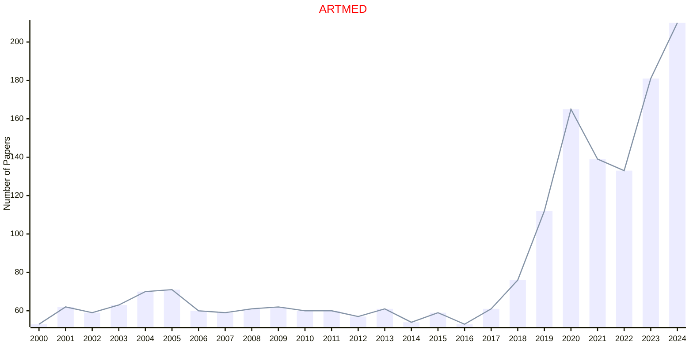
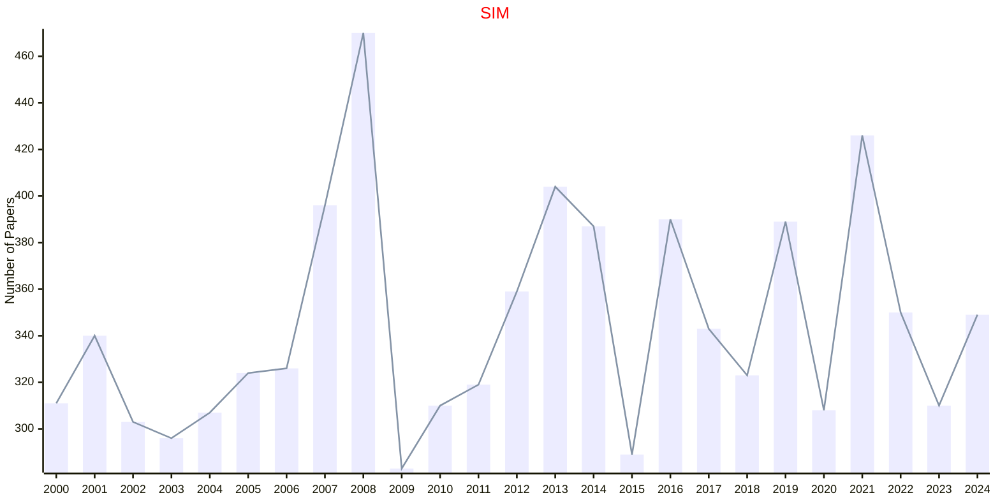

# Medicine

## ARTMED

|Publishers|Full/Homepage|Abbr/About|Acronym/Issues|Period/DBLP|Top/Early|CCF|CAS|JCR|IF|Keywords/Google|
|-         |-            |-         |-             |-          |-        |-  |-  |-  |- |-              |
|[ELSEVIER](https://www.sciencedirect.com/)|[Artificial Intelligence in Medicine](https://www.sciencedirect.com/journal/artificial-intelligence-in-medicine)|[Artif. Intell. Med.](https://www.sciencedirect.com/journal/artificial-intelligence-in-medicine/about/aims-and-scope)|[ARTMED](https://www.sciencedirect.com/journal/artificial-intelligence-in-medicine/issues)|1989 -|True|C|2|Q1|6.9|[Artificial Intelligence](https://www.google.com/search?q=Artificial+Intelligence); [Medicine](https://www.google.com/search?q=Medicine)|

## SIM

|Publishers|Full/Homepage|Abbr/About|Acronym/Issues|Period/DBLP|Top/Early|CCF|CAS|JCR|IF|Keywords/Google|
|-         |-            |-         |-             |-          |-        |-  |-  |-  |- |-              |
|[WILEY](https://www.wiley.com/)|[Statistics in Medicine](https://onlinelibrary.wiley.com/journal/10970258)|[Stat. Med.](https://onlinelibrary.wiley.com/page/journal/10970258/homepage/productinformation.html)|[SIM](https://onlinelibrary.wiley.com/loi/10970258)|1982 -|False||3|Q1|2.6|[Medicine](https://www.google.com/search?q=Medicine); [Statistics](https://www.google.com/search?q=Statistics)|

