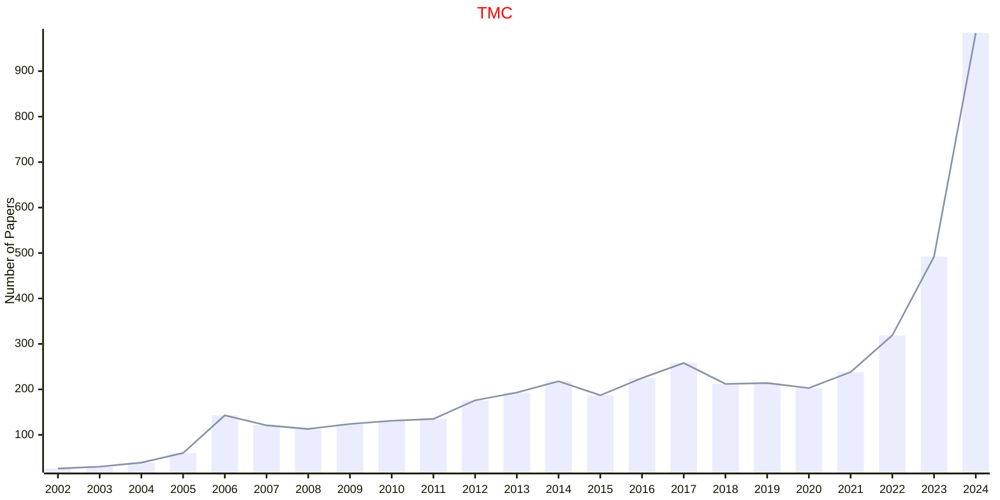

# Mobile Computing

## TMC

|Publishers|Full/Homepage|Abbr/About|Acronym/Issues|Period/DBLP|Top/Early|CCF|CAS|JCR|IF|Keywords/Google|
|-         |-            |-         |-             |-          |-        |-  |-  |-  |- |-              |
|[IEEE](https://ieeexplore.ieee.org/)|[IEEE Transactions on Mobile Computing](https://ieeexplore.ieee.org/xpl/RecentIssue.jsp?punumber=7755)|[IEEE Trans. Mobile Comput.](https://ieeexplore.ieee.org/xpl/aboutJournal.jsp?punumber=7755)|[TMC](https://ieeexplore.ieee.org/xpl/issues?punumber=7755&isnumber=10627925)|2002 -|[True](https://ieeexplore.ieee.org/xpl/tocresult.jsp?isnumber=4358975)|A|1|Q1|8.1|[Mobile Computing](https://www.google.com/search?q=Mobile+Computing)|

