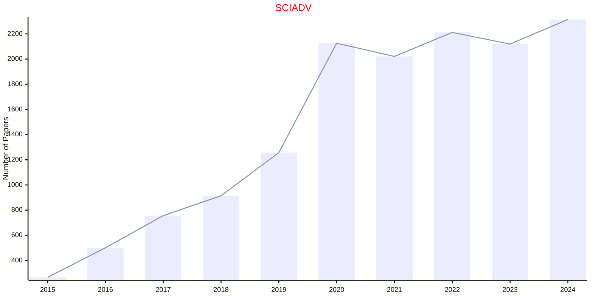
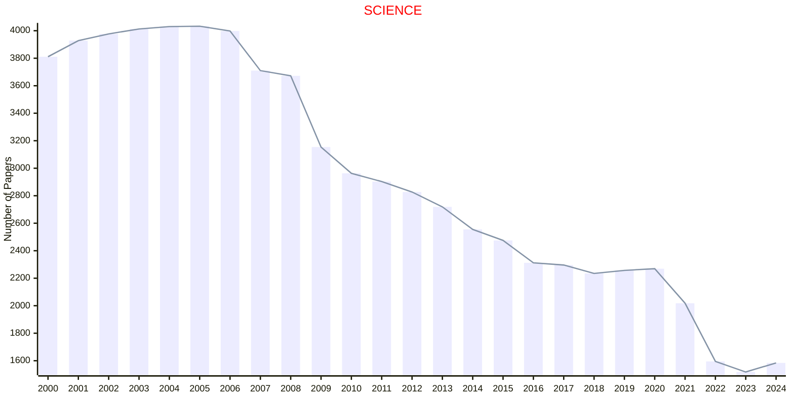
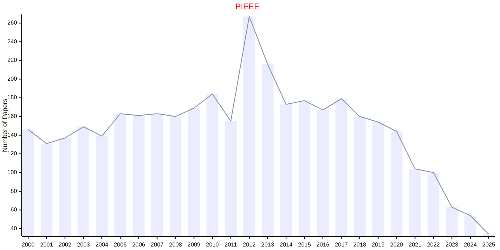
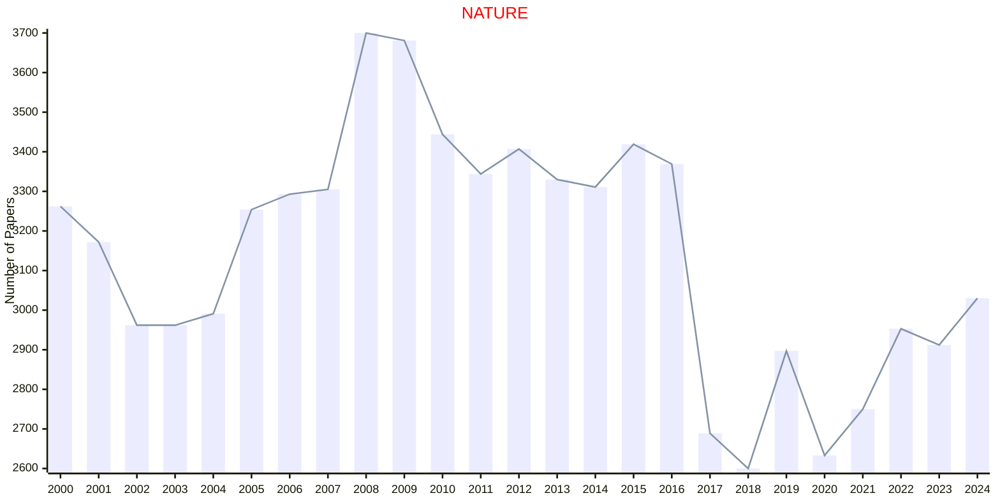
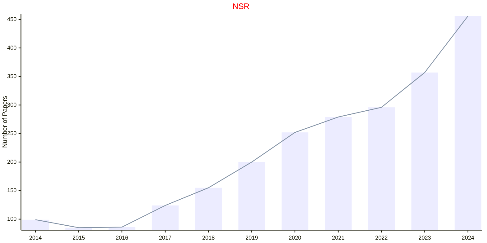
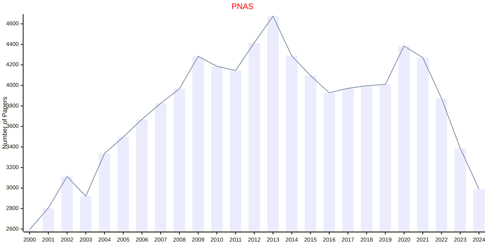
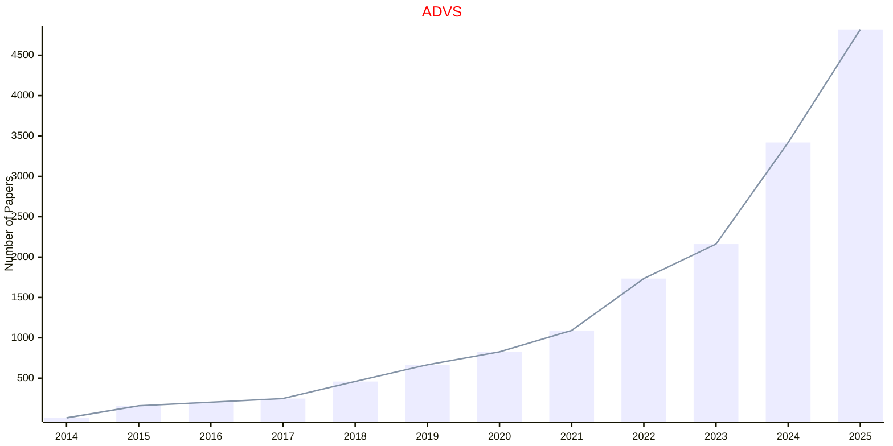
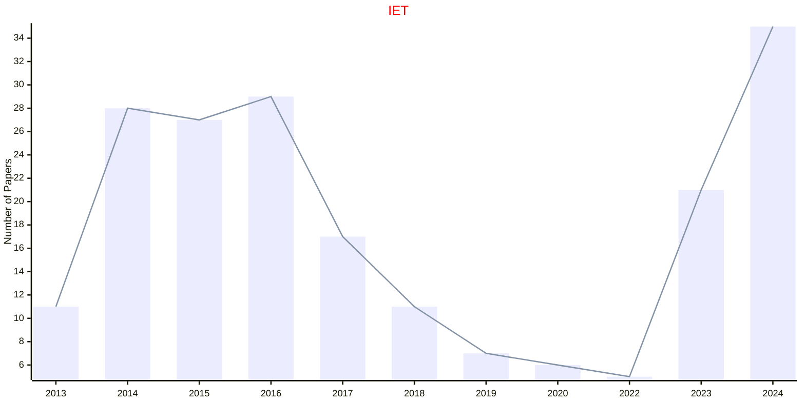

# Multidisciplinary

## SCIADV

|Publishers|Full/Homepage|Abbr/About|Acronym/Issues|Period/DBLP|Top/Early|CCF|CAS|JCR|IF|Keywords/Google|
|-         |-            |-         |-             |-          |-        |-  |-  |-  |- |-              |
|[AAAS](https://www.science.org/)|[Science Advances](https://www.science.org/journal/sciadv)|[Sci. Adv.](https://www.science.org/content/page/science-advances-mission-and-scope)|[SCIADV](https://www.science.org/loi/sciadv)|2015 -|True||1|Q1|14.1|[Multidisciplinary](https://www.google.com/search?q=Multidisciplinary)|

## SCIENCE

|Publishers|Full/Homepage|Abbr/About|Acronym/Issues|Period/DBLP|Top/Early|CCF|CAS|JCR|IF|Keywords/Google|
|-         |-            |-         |-             |-          |-        |-  |-  |-  |- |-              |
|[AAAS](https://www.science.org/)|[Science](https://www.science.org/journal/science)|[Science](https://www.science.org/content/page/about-science-aaas)|[SCIENCE](https://www.science.org/loi/science)|1880 -|True||1|Q1|49.7|[Multidisciplinary](https://www.google.com/search?q=Multidisciplinary)|

## BCAS

|Publishers|Full/Homepage|Abbr/About|Acronym/Issues|Period/DBLP|Top/Early|CCF|CAS|JCR|IF|Keywords/Google|
|-         |-            |-         |-             |-          |-        |-  |-  |-  |- |-              |
|[EDP](https://www.edpsciences.org/)|[Bulletin of the Chinese Academy of Sciences](https://bcas.edpsciences.org/)|[Bull. Chinese Acad. Sci.](https://bcas.edpsciences.org/about-the-journal/aims-and-scope)|[BCAS](https://bcas.edpsciences.org/component/issues)|1986 -|False|||||[Multidisciplinary](https://www.google.com/search?q=Multidisciplinary)|

## PIEEE

|Publishers|Full/Homepage|Abbr/About|Acronym/Issues|Period/DBLP|Top/Early|CCF|CAS|JCR|IF|Keywords/Google|
|-         |-            |-         |-             |-          |-        |-  |-  |-  |- |-              |
|[IEEE](https://ieeexplore.ieee.org/)|[Proceedings of the IEEE](https://ieeexplore.ieee.org/xpl/RecentIssue.jsp?punumber=5)|[Proc. IEEE](https://ieeexplore.ieee.org/xpl/aboutJournal.jsp?punumber=5)|[PIEEE](https://ieeexplore.ieee.org/xpl/issues?punumber=5&isnumber=10193795)|1963 -|[True](https://ieeexplore.ieee.org/xpl/tocresult.jsp?isnumber=4357935)|A|1|Q1|25.0|[Multidisciplinary](https://www.google.com/search?q=Multidisciplinary)|

## NATURE

|Publishers|Full/Homepage|Abbr/About|Acronym/Issues|Period/DBLP|Top/Early|CCF|CAS|JCR|IF|Keywords/Google|
|-         |-            |-         |-             |-          |-        |-  |-  |-  |- |-              |
|[NATURE](https://www.nature.com/)|[Nature](https://www.nature.com/nature)|Nature|[NATURE](https://www.nature.com/nature/volumes)|1869 -|True||1|Q1|55.0|[Multidisciplinary](https://www.google.com/search?q=Multidisciplinary)|

## NSR

|Publishers|Full/Homepage|Abbr/About|Acronym/Issues|Period/DBLP|Top/Early|CCF|CAS|JCR|IF|Keywords/Google|
|-         |-            |-         |-             |-          |-        |-  |-  |-  |- |-              |
|[OXFORD](https://academic.oup.com/)|[National Science Review](https://academic.oup.com/nsr)|[Nat. Sci. Rev.](https://academic.oup.com/nsr/pages/about)|[NSR](https://academic.oup.com/nsr/issue)|2014 -|True||1|Q1|17.7|[Multidisciplinary](https://www.google.com/search?q=Multidisciplinary)|

## PNAS

|Publishers|Full/Homepage|Abbr/About|Acronym/Issues|Period/DBLP|Top/Early|CCF|CAS|JCR|IF|Keywords/Google|
|-         |-            |-         |-             |-          |-        |-  |-  |-  |- |-              |
|[PNAS](https://www.pnas.org/)|[Proceedings of the National Academy of Sciences of the United States of America](https://www.pnas.org)|[Proc. Natl. Acad. Sci. USA](https://www.pnas.org/)|[PNAS](https://www.pnas.org/loi/pnas)|1915 -|True||1|Q1|10.6|[Multidisciplinary](https://www.google.com/search?q=Multidisciplinary)|

## ADVS

|Publishers|Full/Homepage|Abbr/About|Acronym/Issues|Period/DBLP|Top/Early|CCF|CAS|JCR|IF|Keywords/Google|
|-         |-            |-         |-             |-          |-        |-  |-  |-  |- |-              |
|[WILEY](https://www.wiley.com/)|[Advanced Science](https://advanced.onlinelibrary.wiley.com/journal/21983844)|[Adv. Sci.](https://advanced.onlinelibrary.wiley.com/hub/journal/21983844/productinformation.html)|[ADVS](https://advanced.onlinelibrary.wiley.com/loi/21983844)|2014 -|True||1|Q1|15.6|[Multidisciplinary](https://www.google.com/search?q=Multidisciplinary)|

## IET

|Publishers|Full/Homepage|Abbr/About|Acronym/Issues|Period/DBLP|Top/Early|CCF|CAS|JCR|IF|Keywords/Google|
|-         |-            |-         |-             |-          |-        |-  |-  |-  |- |-              |
|[WS](https://worldscientific.com/)|[Innovation and Emerging Technologies](https://worldscientific.com/worldscinet/iet)|[Innov. Emerg. Technol.](https://worldscientific.com/page/iet/aims-scope)|[IET](https://worldscientific.com/loi/iet)|2013 -|False||4||1.1|[Multidisciplinary](https://www.google.com/search?q=Multidisciplinary)|

## arXiv

|Publishers|Full/Homepage|Abbr/About|Acronym/Issues|Period/DBLP|Top/Early|CCF|CAS|JCR|IF|Keywords/Google|
|-         |-            |-         |-             |-          |-        |-  |-  |-  |- |-              |
|[arXiv](https://www.cornell.edu/)|[arXiv](https://arxiv.org/)|[arXiv](https://info.arxiv.org/about/index.html)|[arXiv](https://arxiv.org/list/cs/pastweek?skip=0&show=2000)|1991 -|False|||||[Multidisciplinary](https://www.google.com/search?q=Multidisciplinary)|

