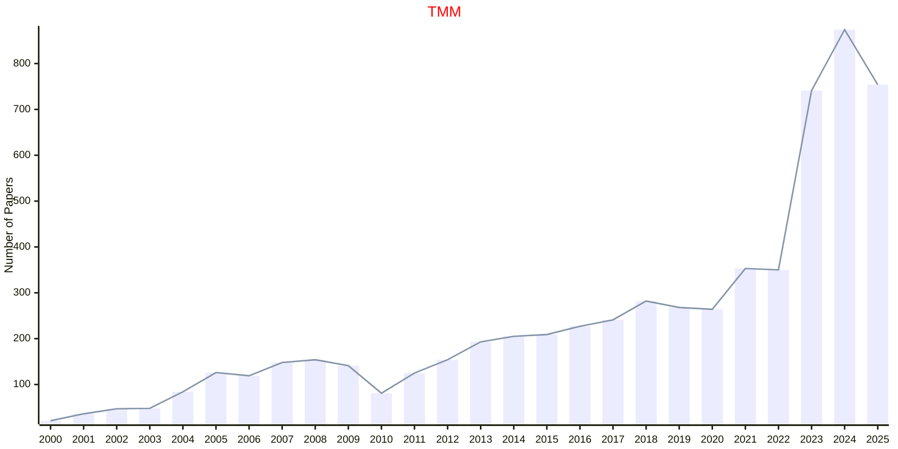

# Multimedia

## TMM

|Publishers|Full/Homepage|Abbr/About|Acronym/Issues|Period/DBLP|Top/Early|CCF|CAS|JCR|IF|Keywords/Google|
|-         |-            |-         |-             |-          |-        |-  |-  |-  |- |-              |
|[IEEE](https://ieeexplore.ieee.org/)|[IEEE Transactions on Multimedia](https://ieeexplore.ieee.org/xpl/RecentIssue.jsp?punumber=6046)|[IEEE Trans. Multimed.](https://ieeexplore.ieee.org/xpl/aboutJournal.jsp?punumber=6046)|[TMM](https://ieeexplore.ieee.org/xpl/issues?punumber=6046&isnumber=10384483)|1999 -|[True](https://ieeexplore.ieee.org/xpl/tocresult.jsp?isnumber=4456689)|B|1|Q1|9.0|[Multimedia](https://www.google.com/search?q=Multimedia)|

