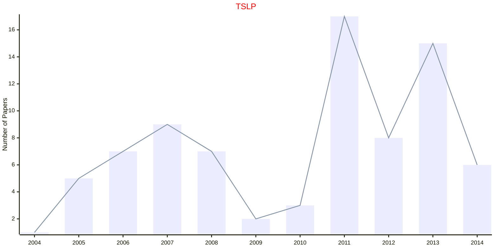
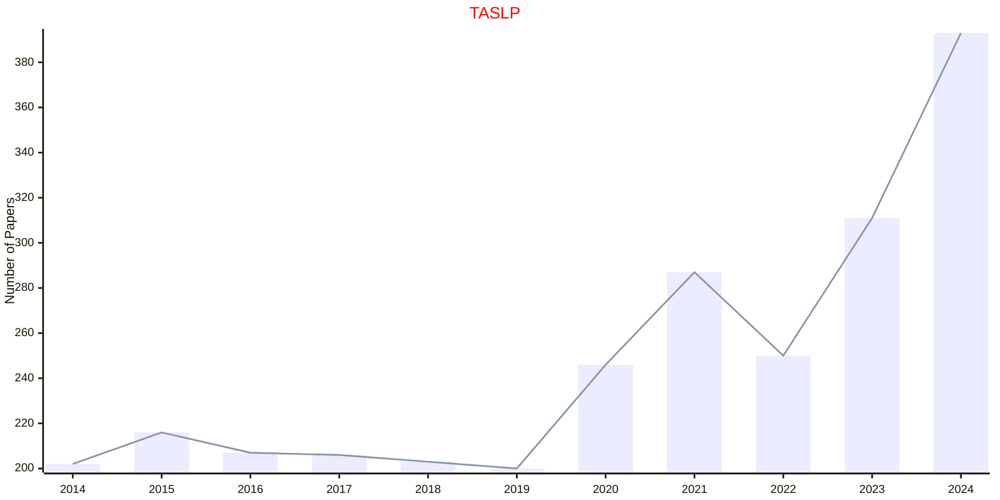

# Natural Language Processing

## TSLP

|Publishers|Full/Homepage|Abbr/About|Acronym/Issues|Period/DBLP|Top/Early|CCF|CAS|JCR|IF|Keywords/Google|
|-         |-            |-         |-             |-          |-        |-  |-  |-  |- |-              |
|[ACM](https://www.acm.org/)|[ACM Transactions on Speech and Language Processing](https://dl.acm.org/journal/tslp)|[ACM Trans. Speech Lang. Process.](https://dl.acm.org/journal/tslp)|[TSLP](https://dl.acm.org/loi/tslp)|[2004 - 2013](https://dblp.org/db/journals/tslp/index.html)|False|B||||[Natural Language Processing](https://www.google.com/search?q=Natural+Language+Processing)|

## TASLP

|Publishers|Full/Homepage|Abbr/About|Acronym/Issues|Period/DBLP|Top/Early|CCF|CAS|JCR|IF|Keywords/Google|
|-         |-            |-         |-             |-          |-        |-  |-  |-  |- |-              |
|[IEEE](https://ieeexplore.ieee.org/)|[IEEE/ACM Transactions on Audio, Speech, and Language Processing](https://ieeexplore.ieee.org/xpl/RecentIssue.jsp?punumber=6570655)|[IEEE/ACM Trans. Audio Speech Lang. Process.](https://ieeexplore.ieee.org/xpl/aboutJournal.jsp?punumber=6570655)|[TASLP](https://ieeexplore.ieee.org/xpl/issues?punumber=6570655&isnumber=10304349)|2014 - 2024|False||2|Q1|6.1|[Natural Language Processing](https://www.google.com/search?q=Natural+Language+Processing)|

## TASLPRO

|Publishers|Full/Homepage|Abbr/About|Acronym/Issues|Period/DBLP|Top/Early|CCF|CAS|JCR|IF|Keywords/Google|
|-         |-            |-         |-             |-          |-        |-  |-  |-  |- |-              |
|[IEEE](https://ieeexplore.ieee.org/)|[IEEE Transactions on Audio, Speech, and Language Processing](https://ieeexplore.ieee.org/xpl/RecentIssue.jsp?punumber=10723155)|[IEEE Trans. Audio Speech Lang. Process.](https://ieeexplore.ieee.org/xpl/RecentIssue.jsp?punumber=10723155)|[TASLPRO](https://ieeexplore.ieee.org/xpl/issues?punumber=10723155&isnumber=10835842)|2025 -|[False](https://ieeexplore.ieee.org/xpl/tocresult.jsp?isnumber=10818373)|B||||[Natural Language Processing](https://www.google.com/search?q=Natural+Language+Processing)|

