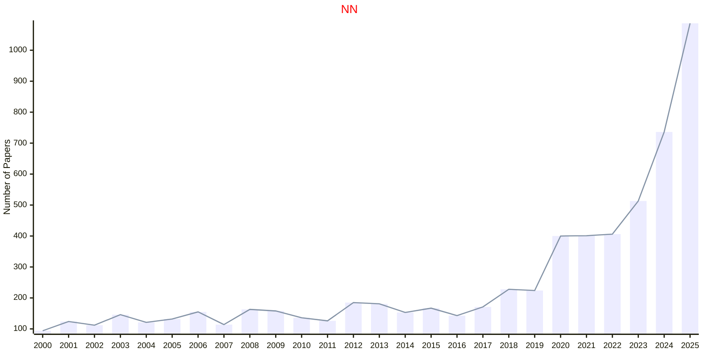
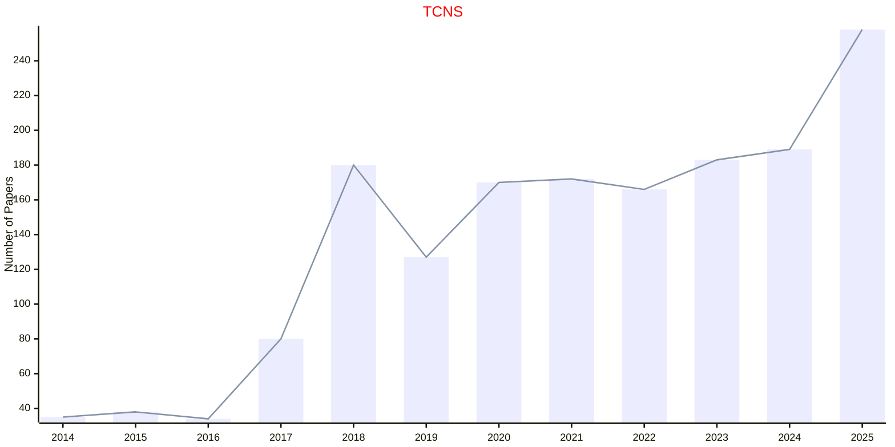
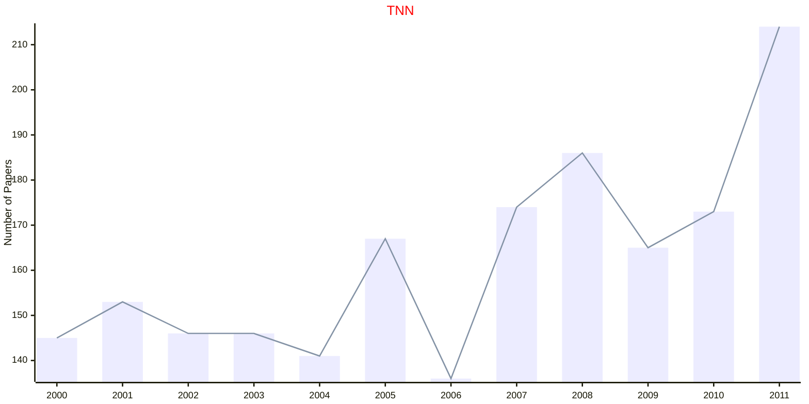
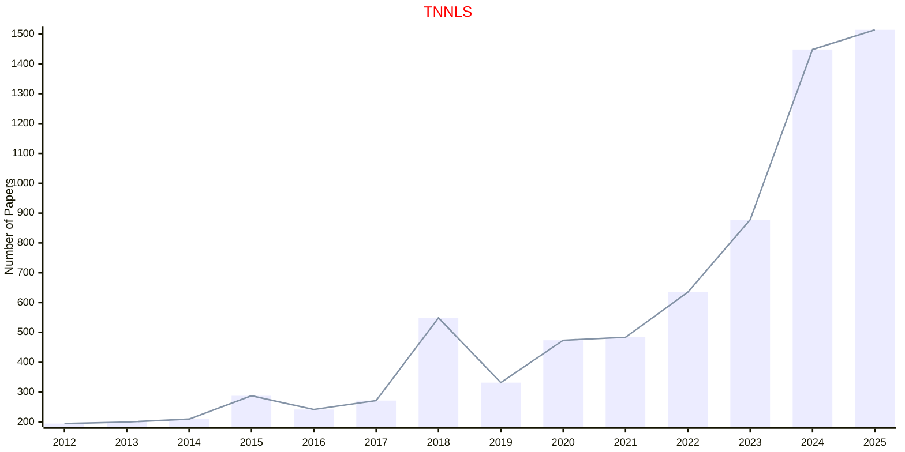
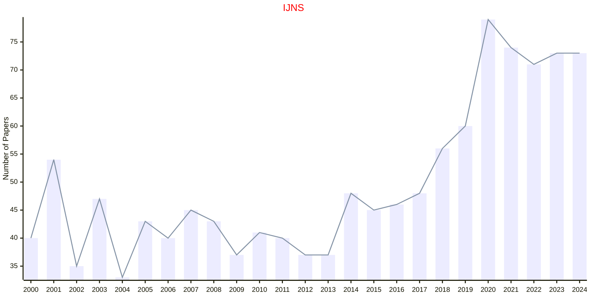

# Neural Networks

## NN

|Publishers|Full/Homepage|Abbr/About|Acronym/Issues|Period/DBLP|Top/Early|CCF|CAS|JCR|IF|Keywords/Google|
|-         |-            |-         |-             |-          |-        |-  |-  |-  |- |-              |
|[ELSEVIER](https://www.sciencedirect.com/)|[Neural Networks](https://www.sciencedirect.com/journal/neural-networks)|[Neural Netw.](https://www.sciencedirect.com/journal/neural-networks/about/aims-and-scope)|[NN](https://www.sciencedirect.com/journal/neural-networks/issues)|1988 -|True|B|2|Q1|7.5|[Neural Networks](https://www.google.com/search?q=Neural+Networks)|

## TCNS

|Publishers|Full/Homepage|Abbr/About|Acronym/Issues|Period/DBLP|Top/Early|CCF|CAS|JCR|IF|Keywords/Google|
|-         |-            |-         |-             |-          |-        |-  |-  |-  |- |-              |
|[IEEE](https://ieeexplore.ieee.org/)|[IEEE Transactions on Control of Network Systems](https://ieeexplore.ieee.org/xpl/RecentIssue.jsp?punumber=6509490)|[IEEE Trans. Control Netw. Syst.](https://ieeexplore.ieee.org/xpl/aboutJournal.jsp?punumber=6509490)|[TCNS](https://ieeexplore.ieee.org/xpl/issues?punumber=6509490&isnumber=10564798)|2014 -|[False](https://ieeexplore.ieee.org/xpl/tocresult.jsp?isnumber=6730648)||3|Q1|4.7|[Neural Networks](https://www.google.com/search?q=Neural+Networks)|

## TNN

|Publishers|Full/Homepage|Abbr/About|Acronym/Issues|Period/DBLP|Top/Early|CCF|CAS|JCR|IF|Keywords/Google|
|-         |-            |-         |-             |-          |-        |-  |-  |-  |- |-              |
|[IEEE](https://ieeexplore.ieee.org/)|[IEEE Transactions on Neural Networks](https://ieeexplore.ieee.org/xpl/RecentIssue.jsp?punumber=72)|[IEEE Trans. Neural Netw.](https://ieeexplore.ieee.org/xpl/aboutJournal.jsp?punumber=72)|[TNN](https://ieeexplore.ieee.org/xpl/issues?punumber=72&isnumber=6099844)|1990 - 2011|False|||||[Neural Networks](https://www.google.com/search?q=Neural+Networks)|

## TNNLS

|Publishers|Full/Homepage|Abbr/About|Acronym/Issues|Period/DBLP|Top/Early|CCF|CAS|JCR|IF|Keywords/Google|
|-         |-            |-         |-             |-          |-        |-  |-  |-  |- |-              |
|[IEEE](https://ieeexplore.ieee.org/)|[IEEE Transactions on Neural Networks and Learning Systems](https://ieeexplore.ieee.org/xpl/RecentIssue.jsp?punumber=5962385)|[IEEE Trans. Neural Netw. Learn. Syst.](https://ieeexplore.ieee.org/xpl/aboutJournal.jsp?punumber=5962385)|[TNNLS](https://ieeexplore.ieee.org/xpl/issues?punumber=5962385&isnumber=10237282)|2012 -|[True](https://ieeexplore.ieee.org/xpl/tocresult.jsp?isnumber=6104215)|B|1|Q1|11.1|[Neural Networks](https://www.google.com/search?q=Neural+Networks)|

## NCNS

|Publishers|Full/Homepage|Abbr/About|Acronym/Issues|Period/DBLP|Top/Early|CCF|CAS|JCR|IF|Keywords/Google|
|-         |-            |-         |-             |-          |-        |-  |-  |-  |- |-              |
|[TAYLOR](https://www.tandfonline.com/)|[Network: Computation in Neural Systems](https://www.tandfonline.com/journals/inet20)|[Netw. Comput. Neural Syst.](https://www.tandfonline.com/journals/inet20/about-this-journal#aims-and-scope)|NCNS|1990 -|False||4|Q3|1.5|[Theoretical Neuroscience](https://www.google.com/search?q=Theoretical+Neuroscience)|

## IJNS

|Publishers|Full/Homepage|Abbr/About|Acronym/Issues|Period/DBLP|Top/Early|CCF|CAS|JCR|IF|Keywords/Google|
|-         |-            |-         |-             |-          |-        |-  |-  |-  |- |-              |
|[WS](https://worldscientific.com/)|[International Journal of Neural Systems](https://worldscientific.com/worldscinet/ijns)|[Int. J. Neural Syst.](https://worldscientific.com/page/ijns/aims-scope)|[IJNS](https://worldscientific.com/loi/ijns)|1989 -|True|C|1|Q1|5.4|[Neural Networks](https://www.google.com/search?q=Neural+Networks)|

