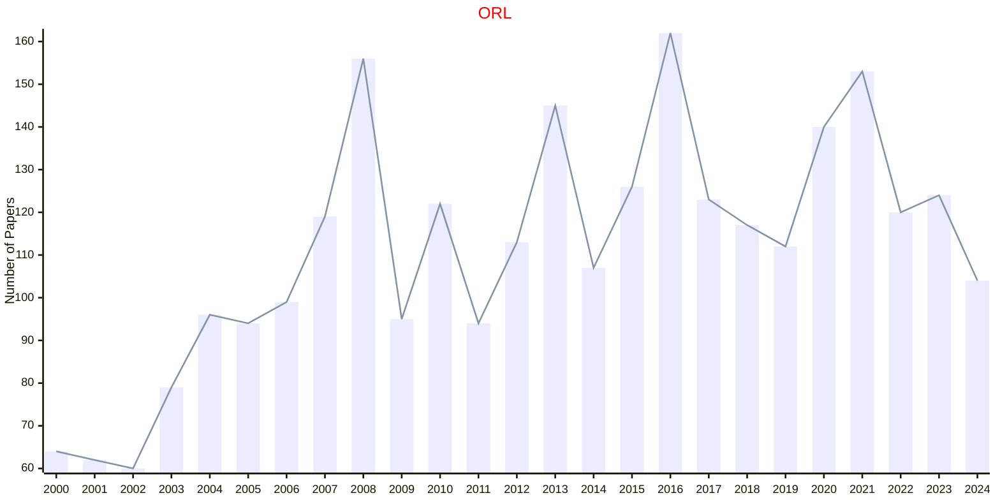
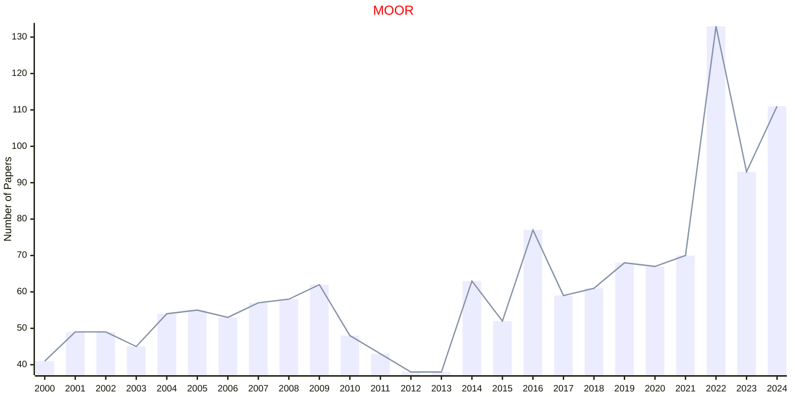
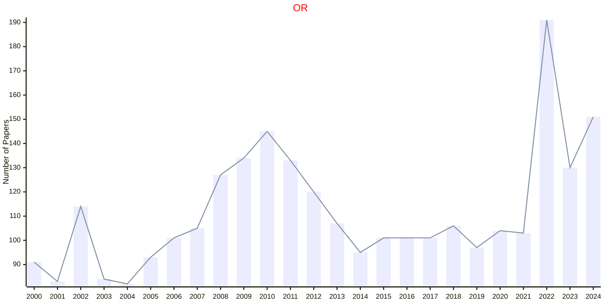
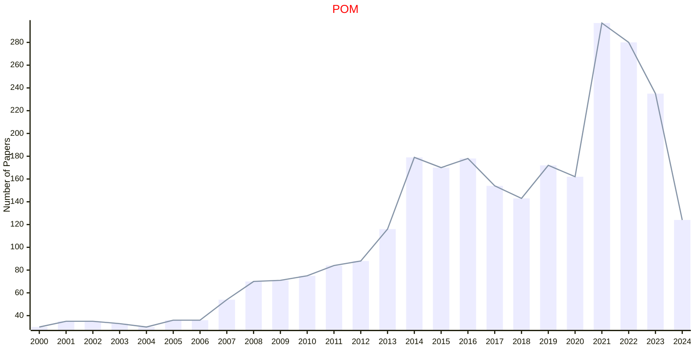
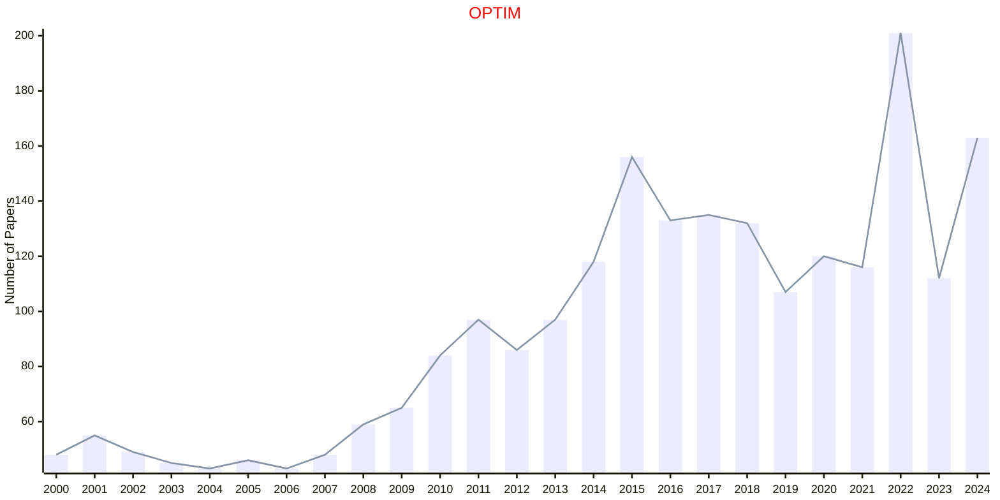
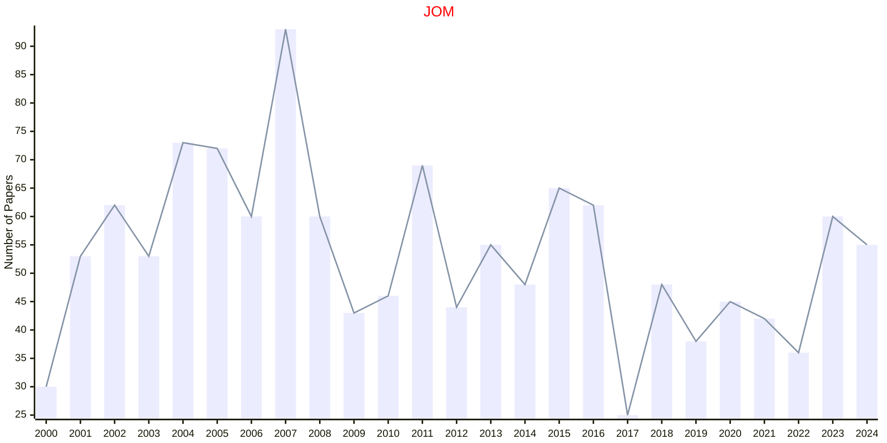

# Operations

## ORL

|Publishers|Full/Homepage|Abbr/About|Acronym/Issues|Period/DBLP|Top/Early|CCF|CAS|JCR|IF|Keywords/Google|
|-         |-            |-         |-             |-          |-        |-  |-  |-  |- |-              |
|[ELSEVIER](https://www.sciencedirect.com/)|[Operations Research Letters](https://www.sciencedirect.com/journal/operations-research-letters)|[Oper. Res. Lett.](https://www.sciencedirect.com/journal/operations-research-letters/about/aims-and-scope)|[ORL](https://www.sciencedirect.com/journal/operations-research-letters/issues)|1981 -|False||4|Q4|1.0|[Operations](https://www.google.com/search?q=Operations)|

## MOOR

|Publishers|Full/Homepage|Abbr/About|Acronym/Issues|Period/DBLP|Top/Early|CCF|CAS|JCR|IF|Keywords/Google|
|-         |-            |-         |-             |-          |-        |-  |-  |-  |- |-              |
|[INFORMS](https://pubsonline.informs.org/)|[Mathematics of Operations Research](https://pubsonline.informs.org/journal/moor)|[Math. Oper. Res.](https://pubsonline.informs.org/page/moor/editorial-statement)|[MOOR](https://pubsonline.informs.org/loi/moor)|1976 -|False||4|Q1|2.0|[Operations](https://www.google.com/search?q=Operations)|

## OR

|Publishers|Full/Homepage|Abbr/About|Acronym/Issues|Period/DBLP|Top/Early|CCF|CAS|JCR|IF|Keywords/Google|
|-         |-            |-         |-             |-          |-        |-  |-  |-  |- |-              |
|[INFORMS](https://pubsonline.informs.org/)|[Operations Research](https://pubsonline.informs.org/journal/opre)|[Oper. Res.](https://pubsonline.informs.org/page/opre/editorial-statement)|[OR](https://pubsonline.informs.org/loi/opre)|1952 -|False||4|Q2|3.3|[Operations](https://www.google.com/search?q=Operations)|

## POM

|Publishers|Full/Homepage|Abbr/About|Acronym/Issues|Period/DBLP|Top/Early|CCF|CAS|JCR|IF|Keywords/Google|
|-         |-            |-         |-             |-          |-        |-  |-  |-  |- |-              |
|[SAGE](https://www.sagepub.com/)|[Production and Operations Management](https://journals.sagepub.com/home/paoa)|[Product. Oper. Manag.](https://journals.sagepub.com/overview-metric/PAO?)|[POM](https://journals.sagepub.com/loi/paoa)|1992 -|False||3|Q1|6.4|[Management](https://www.google.com/search?q=Management); [Operations](https://www.google.com/search?q=Operations)|

## OPTIM

|Publishers|Full/Homepage|Abbr/About|Acronym/Issues|Period/DBLP|Top/Early|CCF|CAS|JCR|IF|Keywords/Google|
|-         |-            |-         |-             |-          |-        |-  |-  |-  |- |-              |
|[TAYLOR](https://www.tandfonline.com/)|[Optimization](https://www.tandfonline.com/journals/gopt20)|[Optim.](https://www.tandfonline.com/journals/gopt20/about-this-journal#aims-and-scope)|[OPTIM](https://www.tandfonline.com/loi/gopt20)|1977 -|False||3|Q1|2.0|[Mathematical Programming](https://www.google.com/search?q=Mathematical+Programming); [Operations](https://www.google.com/search?q=Operations)|

## JOM

|Publishers|Full/Homepage|Abbr/About|Acronym/Issues|Period/DBLP|Top/Early|CCF|CAS|JCR|IF|Keywords/Google|
|-         |-            |-         |-             |-          |-        |-  |-  |-  |- |-              |
|[WILEY](https://www.wiley.com/)|[Journal of Operations Management](https://onlinelibrary.wiley.com/journal/18731317)|[J. Oper. Manag.](https://onlinelibrary.wiley.com/page/journal/18731317/homepage/overview)|[JOM](https://onlinelibrary.wiley.com/loi/18731317)|1980 -|False||2|Q1|11.4|[Management](https://www.google.com/search?q=Management); [Operations](https://www.google.com/search?q=Operations)|

