# Optimization

## DISOPT

|Publishers|Full/Homepage|Abbr/About|Acronym/Issues|Period/DBLP|Top/Early|CCF|CAS|JCR|IF|Keywords/Google|
|-         |-            |-         |-             |-          |-        |-  |-  |-  |- |-              |
|[ELSEVIER](https://www.sciencedirect.com/)|[Discrete Optimization](https://www.sciencedirect.com/journal/discrete-optimization)|[Discret. Optim.](https://www.sciencedirect.com/journal/discrete-optimization/about/aims-and-scope)|[DISOPT](https://www.sciencedirect.com/journal/discrete-optimization/issues)|2004 -|False||4|Q2|1.2|[Discrete Optimization](https://www.google.com/search?q=Discrete+Optimization)|

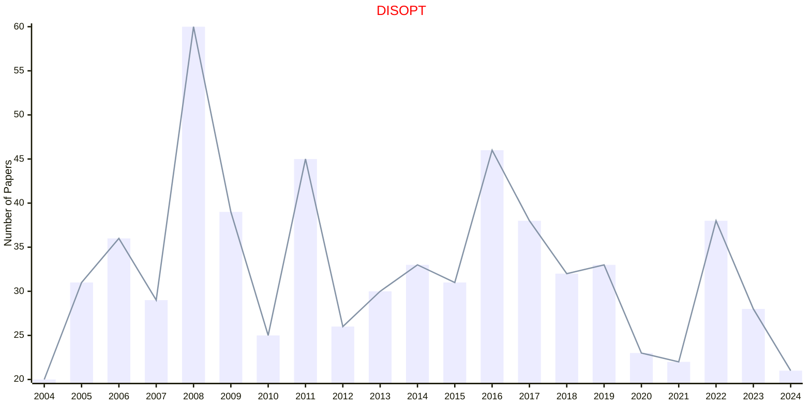

## IJOO

|Publishers|Full/Homepage|Abbr/About|Acronym/Issues|Period/DBLP|Top/Early|CCF|CAS|JCR|IF|Keywords/Google|
|-         |-            |-         |-             |-          |-        |-  |-  |-  |- |-              |
|[INFORMS](https://pubsonline.informs.org/)|[INFORMS Journal on Optimization](https://pubsonline.informs.org/journal/ijoo)|[INFORMS J. Optim.](https://pubsonline.informs.org/page/ijoo/editorial-statement)|[IJOO](https://pubsonline.informs.org/loi/ijoo)|2019 -|False|||||[Optimization](https://www.google.com/search?q=Optimization)|

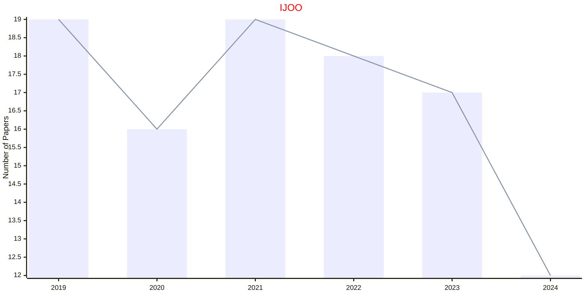

## FTOPT

|Publishers|Full/Homepage|Abbr/About|Acronym/Issues|Period/DBLP|Top/Early|CCF|CAS|JCR|IF|Keywords/Google|
|-         |-            |-         |-             |-          |-        |-  |-  |-  |- |-              |
|[NOW](https://www.nowpublishers.com/)|[Foundations and Trends in Optimization](https://www.nowpublishers.com/OPT)|[Found. Trends Optim.](https://www.nowpublishers.com/Journal/EditorialAims/OPT)|[FTOPT](https://www.nowpublishers.com/OPT)|2014 -|False|||||[Optimization](https://www.google.com/search?q=Optimization)|

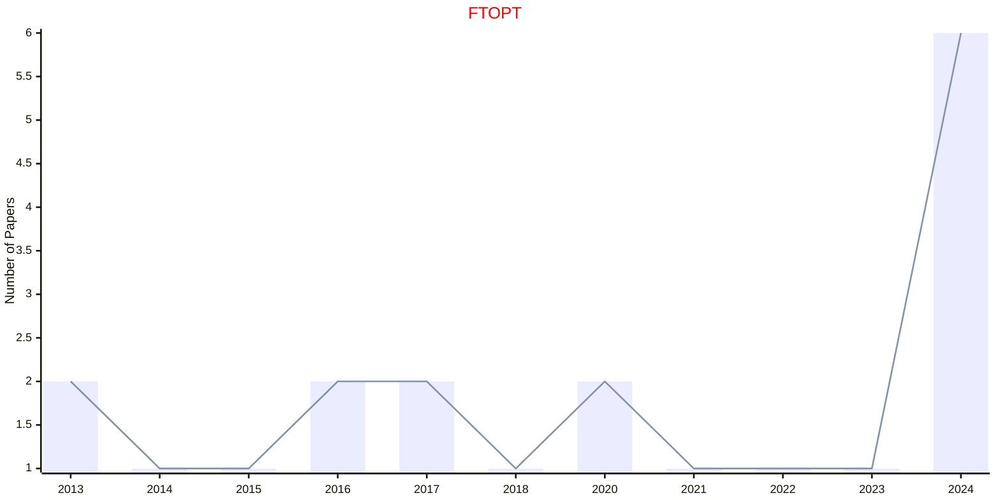

## SIOPT

|Publishers|Full/Homepage|Abbr/About|Acronym/Issues|Period/DBLP|Top/Early|CCF|CAS|JCR|IF|Keywords/Google|
|-         |-            |-         |-             |-          |-        |-  |-  |-  |- |-              |
|[SIAM](https://epubs.siam.org)|[SIAM Journal on Optimization](https://epubs.siam.org/journal/sjope8)|[SIAM J. Optim.](https://epubs.siam.org/journal/siopt/about)|[SIOPT](https://epubs.siam.org/loi/sjope8)|1991 -|True||2|Q1|3.1|[Optimization](https://www.google.com/search?q=Optimization)|

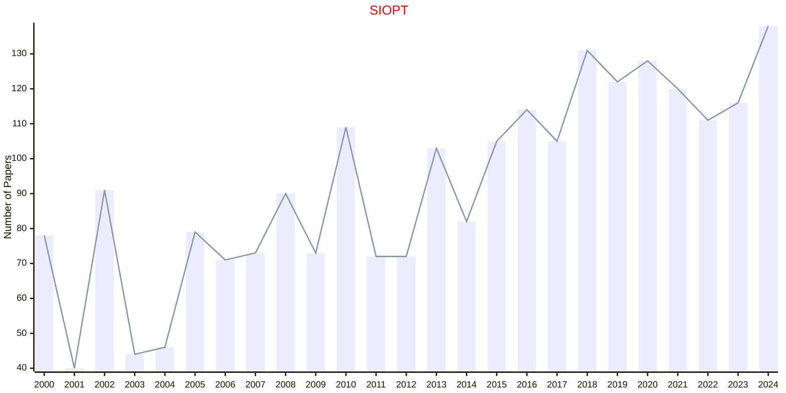

## COAP

|Publishers|Full/Homepage|Abbr/About|Acronym/Issues|Period/DBLP|Top/Early|CCF|CAS|JCR|IF|Keywords/Google|
|-         |-            |-         |-             |-          |-        |-  |-  |-  |- |-              |
|[SPRINGER](https://www.springer.com/)|[Computational Optimization and Applications](https://www.springer.com/journal/10589)|[Comput. Optim. Appl.](https://www.springer.com/journal/10589/aims-and-scope)|[COAP](https://link.springer.com/journal/10589/volumes-and-issues)|1993 -|False||3|Q1|2.2|[Optimization](https://www.google.com/search?q=Optimization)|

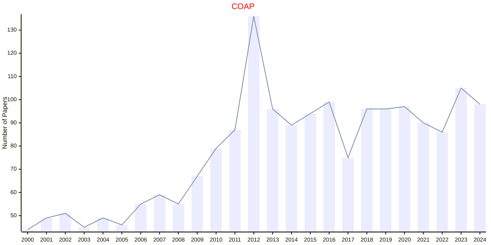

## Constr

|Publishers|Full/Homepage|Abbr/About|Acronym/Issues|Period/DBLP|Top/Early|CCF|CAS|JCR|IF|Keywords/Google|
|-         |-            |-         |-             |-          |-        |-  |-  |-  |- |-              |
|[SPRINGER](https://www.springer.com/)|[Constraints](https://www.springer.com/journal/10601)|[Constraints](https://www.springer.com/journal/10601/aims-and-scope)|[Constr](https://link.springer.com/journal/10601/volumes-and-issues)|1996 -|False||4|Q3|1.3|[Constraint Optimization](https://www.google.com/search?q=Constraint+Optimization); [Constraint Programming](https://www.google.com/search?q=Constraint+Programming)|

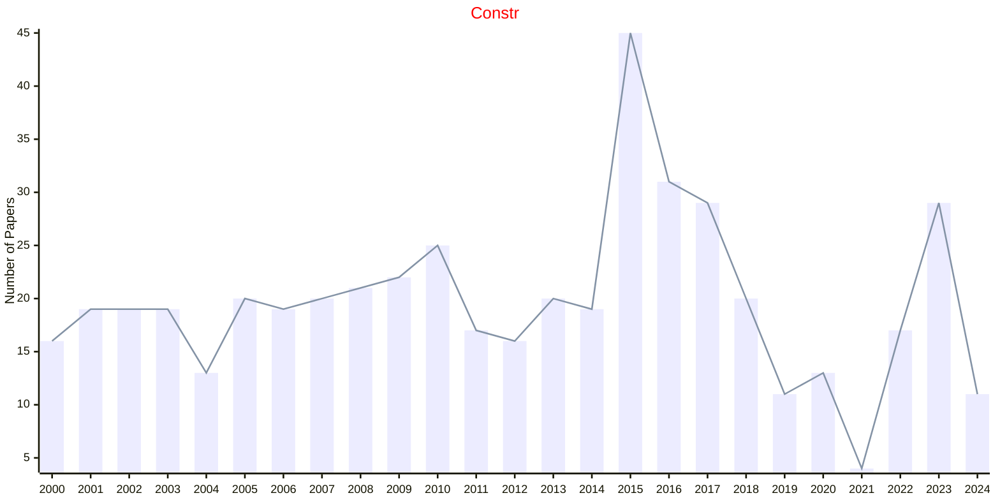

## JCO

|Publishers|Full/Homepage|Abbr/About|Acronym/Issues|Period/DBLP|Top/Early|CCF|CAS|JCR|IF|Keywords/Google|
|-         |-            |-         |-             |-          |-        |-  |-  |-  |- |-              |
|[SPRINGER](https://www.springer.com/)|[Journal of Combinatorial Optimization](https://link.springer.com/journal/10878)|[J. Comb. Optim.](https://link.springer.com/journal/10878/aims-and-scope)|[JCO](https://link.springer.com/journal/10878/volumes-and-issues)|1997 -|False||4|Q2|1.1|[Combinatorial Optimization](https://www.google.com/search?q=Combinatorial+Optimization)|

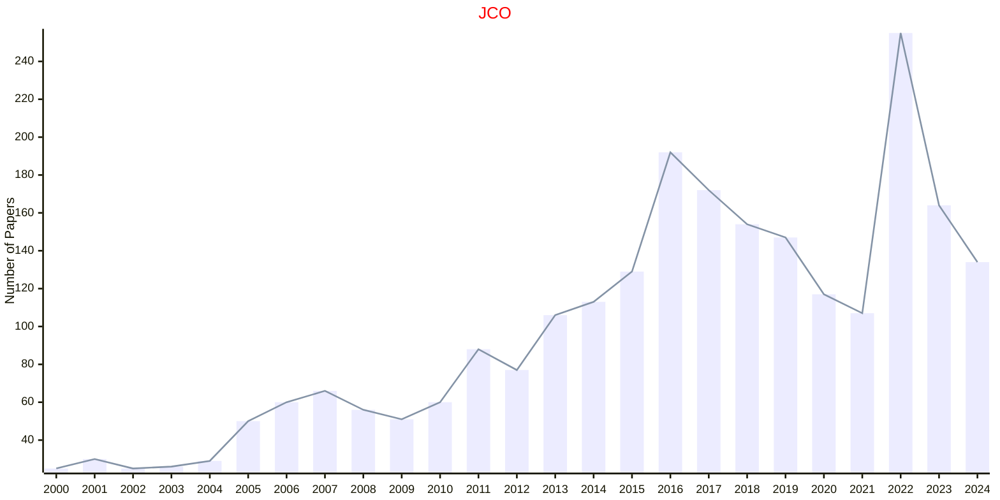

## JGO

|Publishers|Full/Homepage|Abbr/About|Acronym/Issues|Period/DBLP|Top/Early|CCF|CAS|JCR|IF|Keywords/Google|
|-         |-            |-         |-             |-          |-        |-  |-  |-  |- |-              |
|[SPRINGER](https://www.springer.com/)|[Journal of Global Optimization](https://www.springer.com/journal/10898)|[J. Glob. Optim.](https://www.springer.com/journal/10898/aims-and-scope)|[JGO](https://link.springer.com/journal/10898/volumes-and-issues)|1991 -|False|B|4|Q2|2.1|[Optimization](https://www.google.com/search?q=Optimization)|

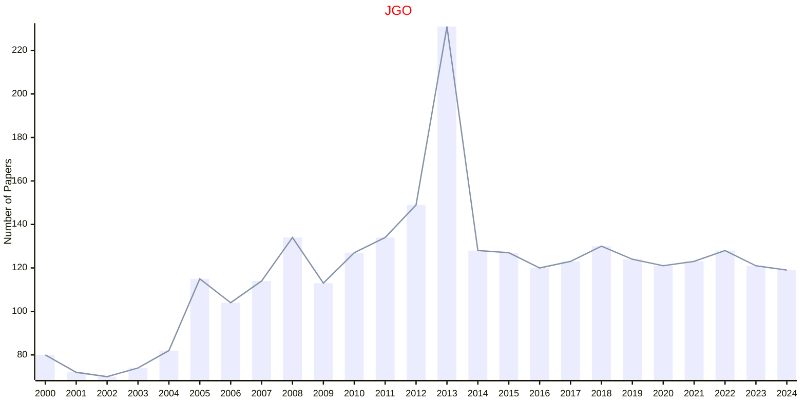

## ENGO

|Publishers|Full/Homepage|Abbr/About|Acronym/Issues|Period/DBLP|Top/Early|CCF|CAS|JCR|IF|Keywords/Google|
|-         |-            |-         |-             |-          |-        |-  |-  |-  |- |-              |
|[TAYLOR](https://www.tandfonline.com/)|[Engineering Optimization](https://www.tandfonline.com/journals/geno20)|[Eng. Optim.](https://www.tandfonline.com/journals/geno20/about-this-journal#aims-and-scope)|[ENGO](https://www.tandfonline.com/loi/geno20)|1974 -|False||4|Q2|2.5|[Quantitative Computational Methods](https://www.google.com/search?q=Quantitative+Computational+Methods)|

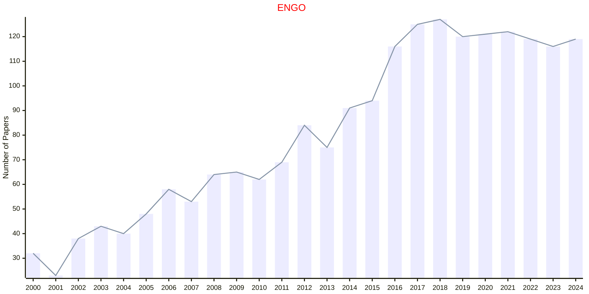

## OMS

|Publishers|Full/Homepage|Abbr/About|Acronym/Issues|Period/DBLP|Top/Early|CCF|CAS|JCR|IF|Keywords/Google|
|-         |-            |-         |-             |-          |-        |-  |-  |-  |- |-              |
|[TAYLOR](https://www.tandfonline.com/)|[Optimization Methods and Software](https://www.tandfonline.com/journals/goms20)|[Optim. Methods Softw.](https://www.tandfonline.com/journals/goms20/about-this-journal#aims-and-scope)|[OMS](https://www.tandfonline.com/loi/goms20)|1992 -|False||4|Q2|1.8|[Optimization Methods](https://www.google.com/search?q=Optimization+Methods)|

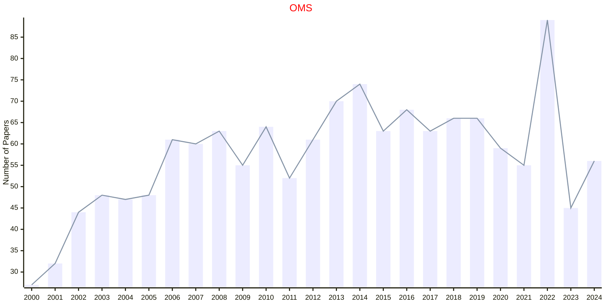

## OPTIM

|Publishers|Full/Homepage|Abbr/About|Acronym/Issues|Period/DBLP|Top/Early|CCF|CAS|JCR|IF|Keywords/Google|
|-         |-            |-         |-             |-          |-        |-  |-  |-  |- |-              |
|[TAYLOR](https://www.tandfonline.com/)|[Optimization](https://www.tandfonline.com/journals/gopt20)|[Optim.](https://www.tandfonline.com/journals/gopt20/about-this-journal#aims-and-scope)|[OPTIM](https://www.tandfonline.com/loi/gopt20)|1977 -|False||3|Q1|2.0|[Mathematical Programming](https://www.google.com/search?q=Mathematical+Programming); [Operations](https://www.google.com/search?q=Operations)|

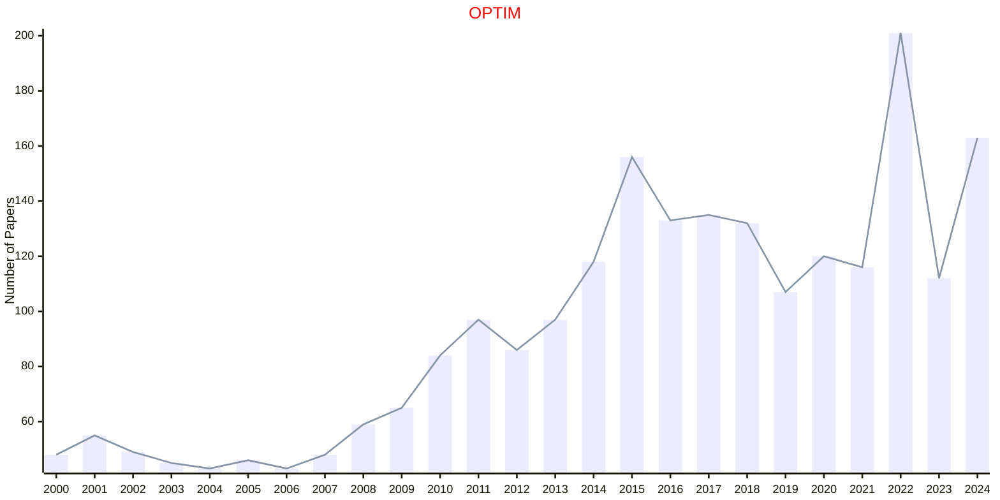

