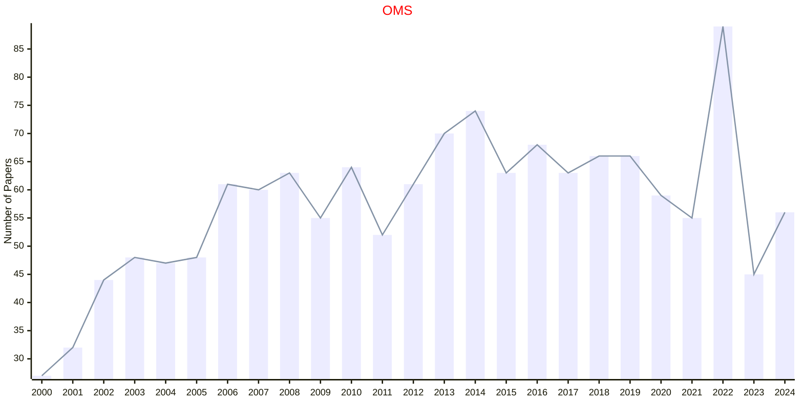

# Optimization Methods

## OMS

|Publishers|Full/Homepage|Abbr/About|Acronym/Issues|Period/DBLP|Top/Early|CCF|CAS|JCR|IF|Keywords/Google|
|-         |-            |-         |-             |-          |-        |-  |-  |-  |- |-              |
|[TAYLOR](https://www.tandfonline.com/)|[Optimization Methods and Software](https://www.tandfonline.com/journals/goms20)|[Optim. Methods Softw.](https://www.tandfonline.com/journals/goms20/about-this-journal#aims-and-scope)|[OMS](https://www.tandfonline.com/loi/goms20)|1992 -|False||4|Q2|1.8|[Optimization Methods](https://www.google.com/search?q=Optimization+Methods)|

