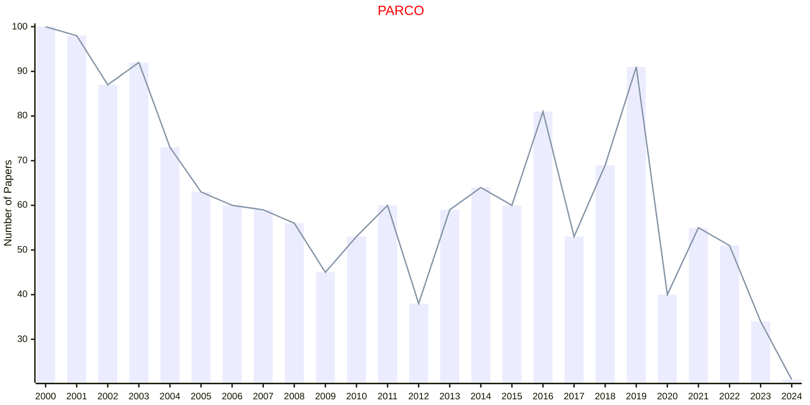

# Parallel Computing

## PARCO

|Publishers|Full/Homepage|Abbr/About|Acronym/Issues|Period/DBLP|Top/Early|CCF|CAS|JCR|IF|Keywords/Google|
|-         |-            |-         |-             |-          |-        |-  |-  |-  |- |-              |
|[ELSEVIER](https://www.sciencedirect.com/)|[Parallel Computing](https://www.sciencedirect.com/journal/parallel-computing)|[Parallel Comput.](https://www.sciencedirect.com/journal/parallel-computing/about/aims-and-scope)|[PARCO](https://www.sciencedirect.com/journal/parallel-computing/issues)|1984 -|False|B|3|Q2|1.5|[Parallel Computing](https://www.google.com/search?q=Parallel+Computing)|

