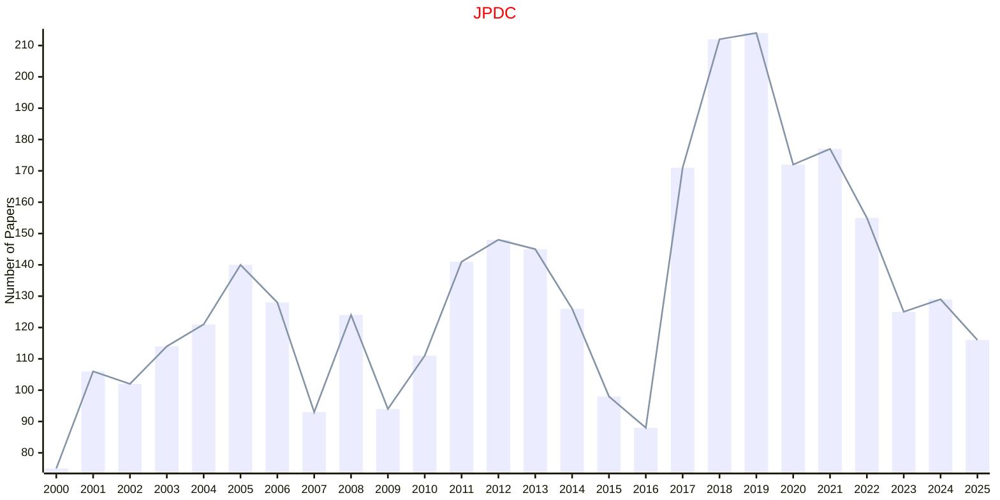
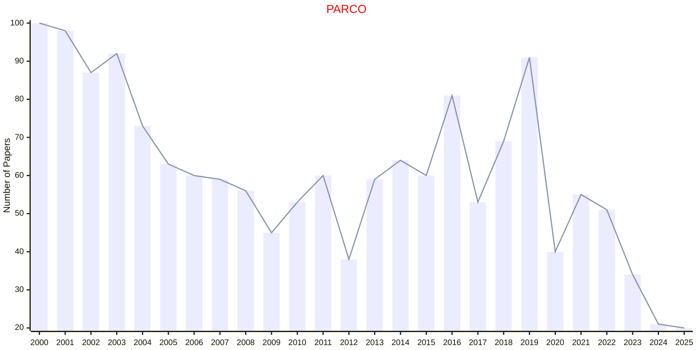
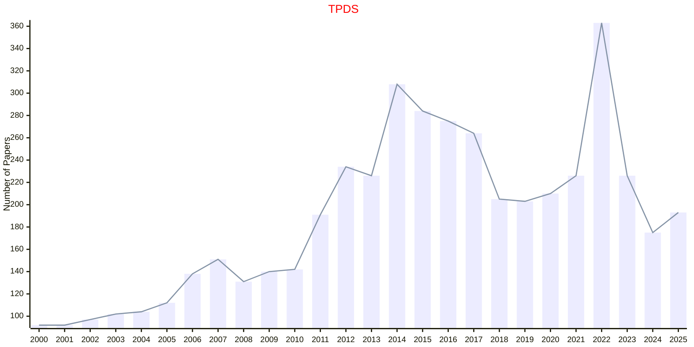
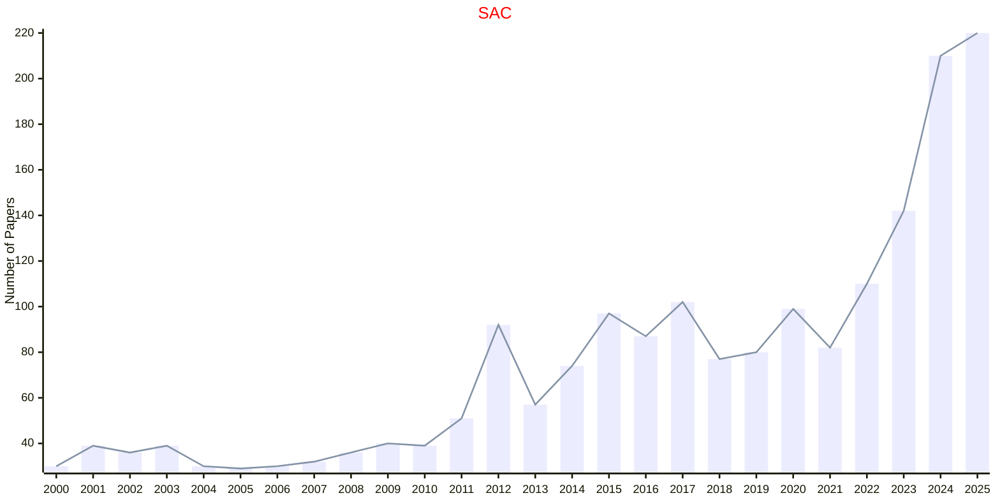

# Parallel and Distributed

## JPDC

|Publishers|Full/Homepage|Abbr/About|Acronym/Issues|Period/DBLP|Top/Early|CCF|CAS|JCR|IF|Keywords/Google|
|-         |-            |-         |-             |-          |-        |-  |-  |-  |- |-              |
|[ELSEVIER](https://www.sciencedirect.com/)|[Journal of Parallel and Distributed Computing](https://www.sciencedirect.com/journal/journal-of-parallel-and-distributed-computing)|[J. Parallel Distrib. Comput.](https://www.sciencedirect.com/journal/journal-of-parallel-and-distributed-computing/about/aims-and-scope)|[JPDC](https://www.sciencedirect.com/journal/journal-of-parallel-and-distributed-computing/issues)|1984 -|False|B|3|Q1|3.6|[Parallel and Distributed](https://www.google.com/search?q=Parallel+and+Distributed)|

## PARCO

|Publishers|Full/Homepage|Abbr/About|Acronym/Issues|Period/DBLP|Top/Early|CCF|CAS|JCR|IF|Keywords/Google|
|-         |-            |-         |-             |-          |-        |-  |-  |-  |- |-              |
|[ELSEVIER](https://www.sciencedirect.com/)|[Parallel Computing](https://www.sciencedirect.com/journal/parallel-computing)|[Parallel Comput.](https://www.sciencedirect.com/journal/parallel-computing/about/aims-and-scope)|[PARCO](https://www.sciencedirect.com/journal/parallel-computing/issues)|1984 -|False|B|3|Q2|1.5|[Parallel Computing](https://www.google.com/search?q=Parallel+Computing)|

## TPDS

|Publishers|Full/Homepage|Abbr/About|Acronym/Issues|Period/DBLP|Top/Early|CCF|CAS|JCR|IF|Keywords/Google|
|-         |-            |-         |-             |-          |-        |-  |-  |-  |- |-              |
|[IEEE](https://ieeexplore.ieee.org/)|[IEEE Transactions on Parallel and Distributed Systems](https://ieeexplore.ieee.org/xpl/RecentIssue.jsp?punumber=71)|[IEEE Trans. Parallel Distrib. Syst.](https://ieeexplore.ieee.org/xpl/aboutJournal.jsp?punumber=71)|[TPDS](https://ieeexplore.ieee.org/xpl/issues?punumber=71&isnumber=10201356)|1990 -|[True](https://ieeexplore.ieee.org/xpl/tocresult.jsp?isnumber=4359390)|A|2|Q1|5.6|[Parallel and Distributed](https://www.google.com/search?q=Parallel+and+Distributed)|

## SAC

|Publishers|Full/Homepage|Abbr/About|Acronym/Issues|Period/DBLP|Top/Early|CCF|CAS|JCR|IF|Keywords/Google|
|-         |-            |-         |-             |-          |-        |-  |-  |-  |- |-              |
|[SPRINGER](https://www.springer.com/)|[Statistics and Computing](https://www.springer.com/journal/11222)|[Stat. Comput.](https://www.springer.com/journal/11222/aims-and-scope)|[SAC](https://link.springer.com/journal/11222/volumes-and-issues)|1991 -|False||2|Q2|2.2|[Statistics and Computing](https://www.google.com/search?q=Statistics+and+Computing)|

