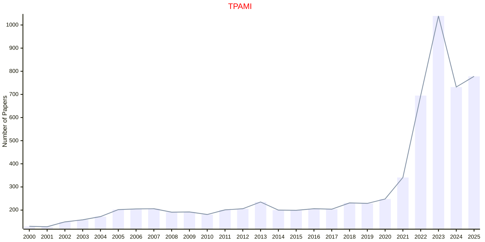

# Pattern Analysis

## TPAMI

|Publishers|Full/Homepage|Abbr/About|Acronym/Issues|Period/DBLP|Top/Early|CCF|CAS|JCR|IF|Keywords/Google|
|-         |-            |-         |-             |-          |-        |-  |-  |-  |- |-              |
|[IEEE](https://ieeexplore.ieee.org/)|[IEEE Transactions on Pattern Analysis and Machine Intelligence](https://ieeexplore.ieee.org/xpl/RecentIssue.jsp?punumber=34)|[IEEE Trans. Pattern Anal. Mach. Intell.](https://ieeexplore.ieee.org/xpl/aboutJournal.jsp?punumber=34)|[TPAMI](https://ieeexplore.ieee.org/xpl/issues?punumber=34&isnumber=10241246)|1979 -|[True](https://ieeexplore.ieee.org/xpl/tocresult.jsp?isnumber=4359286)|A|1|Q1|20.4|[Machine Intelligence](https://www.google.com/search?q=Machine+Intelligence); [Pattern Analysis](https://www.google.com/search?q=Pattern+Analysis)|

