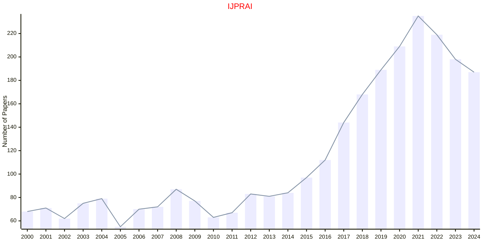

# Pattern Recognition

## IJPRAI

|Publishers|Full/Homepage|Abbr/About|Acronym/Issues|Period/DBLP|Top/Early|CCF|CAS|JCR|IF|Keywords/Google|
|-         |-            |-         |-             |-          |-        |-  |-  |-  |- |-              |
|[WS](https://worldscientific.com/)|[International Journal of Pattern Recognition and Artificial Intelligence](https://worldscientific.com/worldscinet/ijprai)|[Int. J. Pattern Recognit. Artif. Intell.](https://worldscientific.com/page/ijprai/aims-scope)|[IJPRAI](https://worldscientific.com/loi/ijprai)|1987 -|False|C|4|Q4|0.9|[Pattern Recognition](https://www.google.com/search?q=Pattern+Recognition)|

