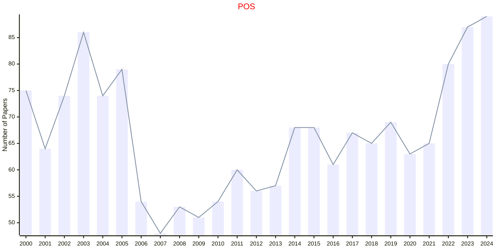

# Philosophy

## POS

|Publishers|Full/Homepage|Abbr/About|Acronym/Issues|Period/DBLP|Top/Early|CCF|CAS|JCR|IF|Keywords/Google|
|-         |-            |-         |-             |-          |-        |-  |-  |-  |- |-              |
|[CAMBRIDGE](https://www.cambridge.org/universitypress)|[Philosophy of Science](https://www.cambridge.org/core/journals/philosophy-of-science)|[Philos. Sci.](https://www.cambridge.org/core/journals/philosophy-of-science/information/about-this-journal)|[POS](https://www.cambridge.org/core/journals/philosophy-of-science/all-issues)|1934 -|False||2|Q1|1.5|[Philosophy](https://www.google.com/search?q=Philosophy)|

