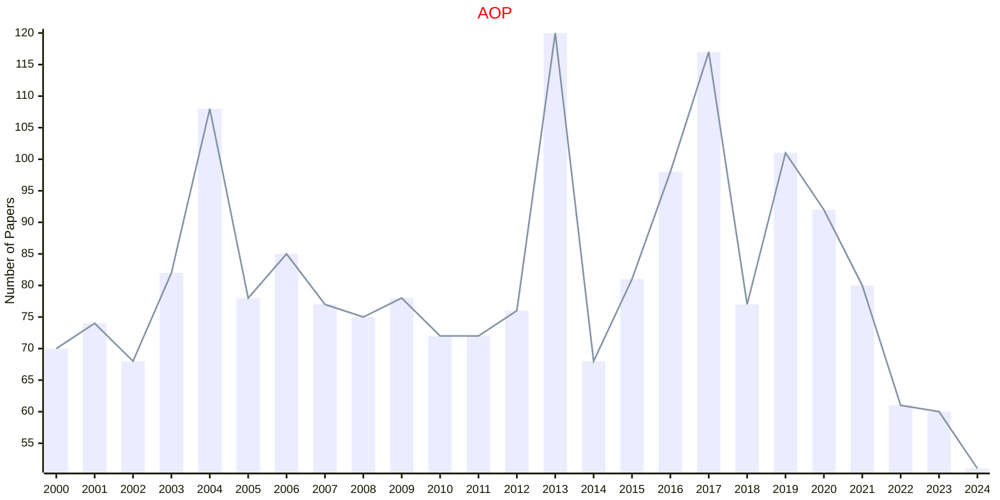

# Probability

## AOP

|Publishers|Full/Homepage|Abbr/About|Acronym/Issues|Period/DBLP|Top/Early|CCF|CAS|JCR|IF|Keywords/Google|
|-         |-            |-         |-             |-          |-        |-  |-  |-  |- |-              |
|[EUCLID](https://projecteuclid.org)|[Annals of Probability](https://imstat.org/journals-and-publications/annals-of-probability)|[Ann. Probab.](https://imstat.org/journals-and-publications/annals-of-probability/)|[AOP](https://projecteuclid.org/journals/annals-of-probability/issues)|1973 -|True||1|Q1|2.6|[Probability](https://www.google.com/search?q=Probability)|

## PSURV

|Publishers|Full/Homepage|Abbr/About|Acronym/Issues|Period/DBLP|Top/Early|CCF|CAS|JCR|IF|Keywords/Google|
|-         |-            |-         |-             |-          |-        |-  |-  |-  |- |-              |
|[EUCLID](https://projecteuclid.org)|[Probability Surveys](https://imstat.org/journals-and-publications/probability-surveys/)|[Probab. Surv.](https://imstat.org/journals-and-publications/probability-surveys/)|[PSURV](https://projecteuclid.org/journals/probability-surveys/issues)|2004 -|False||2||2.0|[Probability](https://www.google.com/search?q=Probability); [Probability and Statistics](https://www.google.com/search?q=Probability+and+Statistics)|

