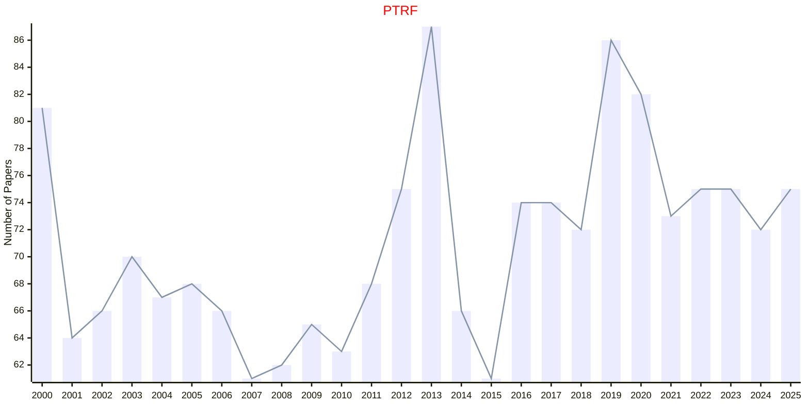

# Probability Theory

## PTRF

|Publishers|Full/Homepage|Abbr/About|Acronym/Issues|Period/DBLP|Top/Early|CCF|CAS|JCR|IF|Keywords/Google|
|-         |-            |-         |-             |-          |-        |-  |-  |-  |- |-              |
|[SPRINGER](https://www.springer.com/)|[Probability Theory and Related Fields](https://link.springer.com/journal/440)|[Probab. Theory Relat. Fields](https://link.springer.com/journal/440/aims-and-scope)|[PTRF](https://link.springer.com/journal/440/volumes-and-issues)|1962 -|True||2|Q2|2.1|[Probability Theory](https://www.google.com/search?q=Probability+Theory)|

