# Probability and Statistics

## AAP

|Publishers|Full/Homepage|Abbr/About|Acronym/Issues|Period/DBLP|Top/Early|CCF|CAS|JCR|IF|Keywords/Google|
|-         |-            |-         |-             |-          |-        |-  |-  |-  |- |-              |
|[CAMBRIDGE](https://www.cambridge.org/universitypress)|[Advances in Applied Probability](https://www.cambridge.org/core/journals/advances-in-applied-probability)|[Adv. Appl. Probab.](https://www.cambridge.org/core/journals/advances-in-applied-probability/information/about-this-journal)|[AAP](https://www.cambridge.org/core/journals/advances-in-applied-probability/all-issues)|1969 -|False||3|Q2|1.2|[Applied Probability](https://www.google.com/search?q=Applied+Probability)|

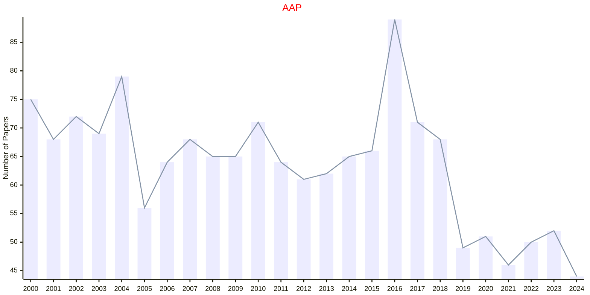

## CPC

|Publishers|Full/Homepage|Abbr/About|Acronym/Issues|Period/DBLP|Top/Early|CCF|CAS|JCR|IF|Keywords/Google|
|-         |-            |-         |-             |-          |-        |-  |-  |-  |- |-              |
|[CAMBRIDGE](https://www.cambridge.org/universitypress)|[Combinatorics, Probability & Computing](https://www.cambridge.org/core/journals/combinatorics-probability-and-computing)|[Comb. Probab. Comput.](https://www.cambridge.org/core/journals/combinatorics-probability-and-computing/information/about-this-journal)|[CPC](https://www.cambridge.org/core/journals/combinatorics-probability-and-computing/all-issues)|1992 -|False||3|Q2|0.9|[Probability and Statistics](https://www.google.com/search?q=Probability+and+Statistics)|

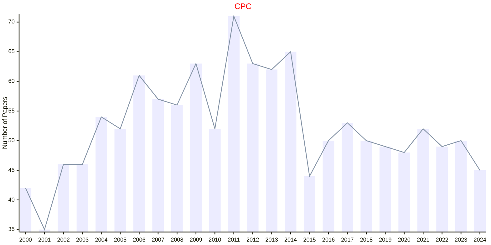

## CSDA

|Publishers|Full/Homepage|Abbr/About|Acronym/Issues|Period/DBLP|Top/Early|CCF|CAS|JCR|IF|Keywords/Google|
|-         |-            |-         |-             |-          |-        |-  |-  |-  |- |-              |
|[ELSEVIER](https://www.sciencedirect.com/)|[Computational Statistics & Data Analysis](https://www.sciencedirect.com/journal/computational-statistics-and-data-analysis)|[Comput. Stat. Data Anal.](https://www.sciencedirect.com/journal/computational-statistics-and-data-analysis/about/aims-and-scope)|[CSDA](https://www.sciencedirect.com/journal/computational-statistics-and-data-analysis/issues)|1983 -|False||3|Q2|1.9|[Computational Statistics](https://www.google.com/search?q=Computational+Statistics); [Data Analysis](https://www.google.com/search?q=Data+Analysis)|

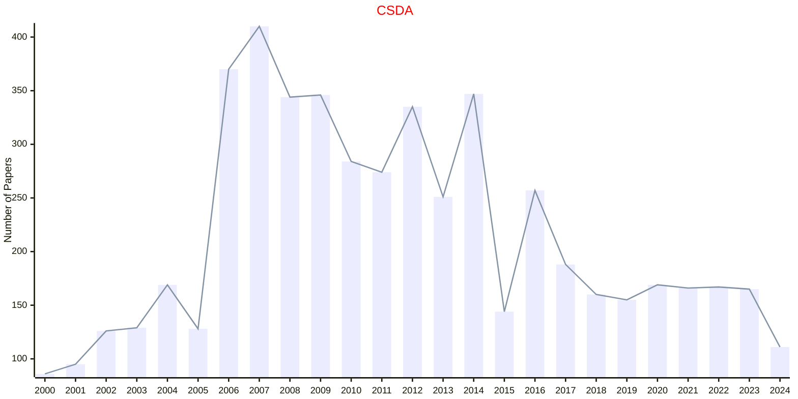

## SPA

|Publishers|Full/Homepage|Abbr/About|Acronym/Issues|Period/DBLP|Top/Early|CCF|CAS|JCR|IF|Keywords/Google|
|-         |-            |-         |-             |-          |-        |-  |-  |-  |- |-              |
|[ELSEVIER](https://www.sciencedirect.com/)|[Stochastic Processes and their Applications](https://www.sciencedirect.com/journal/stochastic-processes-and-their-applications)|[Stoch. Proc. Appl.](https://www.sciencedirect.com/journal/stochastic-processes-and-their-applications/about/aims-and-scope)|[SPA](https://www.sciencedirect.com/journal/stochastic-processes-and-their-applications/issues)|1973 -|False||3|Q2|1.4|[Stochastic Processes](https://www.google.com/search?q=Stochastic+Processes)|

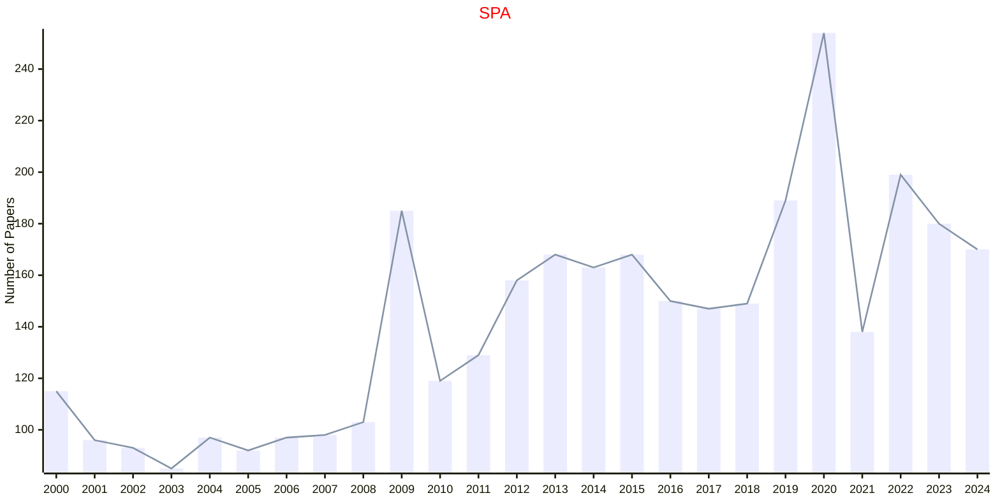

## BA

|Publishers|Full/Homepage|Abbr/About|Acronym/Issues|Period/DBLP|Top/Early|CCF|CAS|JCR|IF|Keywords/Google|
|-         |-            |-         |-             |-          |-        |-  |-  |-  |- |-              |
|[EUCLID](https://projecteuclid.org)|[Bayesian Analysis](https://projecteuclid.org/journals/bayesian-analysis)|[Bayesian Anal.](https://projecteuclid.org/journals/bayesian-analysis)|[BA](https://projecteuclid.org/journals/bayesian-analysis/issues)|2006 -|False|||||[Inference](https://www.google.com/search?q=Inference); [Sampling](https://www.google.com/search?q=Sampling)|

## BERNOULLI

|Publishers|Full/Homepage|Abbr/About|Acronym/Issues|Period/DBLP|Top/Early|CCF|CAS|JCR|IF|Keywords/Google|
|-         |-            |-         |-             |-          |-        |-  |-  |-  |- |-              |
|[EUCLID](https://projecteuclid.org)|[Bernoulli](https://www.bernoullisociety.org/publications/bernoulli-journal)|[Bernoulli](https://www.bernoullisociety.org/index.php/publications/bernoulli-journal/bernoulli-journal-aims-and-scope)|[BERNOULLI](https://projecteuclid.org/journals/bernoulli/issues)|1995 -|False||2|Q2|1.9|[Probability and Statistics](https://www.google.com/search?q=Probability+and+Statistics)|

## ECP

|Publishers|Full/Homepage|Abbr/About|Acronym/Issues|Period/DBLP|Top/Early|CCF|CAS|JCR|IF|Keywords/Google|
|-         |-            |-         |-             |-          |-        |-  |-  |-  |- |-              |
|[EUCLID](https://projecteuclid.org)|[Electronic Communications in Probability](https://imstat.org/journals-and-publications/electronic-communications-in-probability/)|[Elec. Commun. Probab.](https://imstat.org/journals-and-publications/electronic-communications-in-probability/)|[ECP](https://projecteuclid.org/journals/electronic-communications-in-probability/issues)|1996 -|False||4|Q4|0.7|[Probability and Statistics](https://www.google.com/search?q=Probability+and+Statistics)|

## EJP

|Publishers|Full/Homepage|Abbr/About|Acronym/Issues|Period/DBLP|Top/Early|CCF|CAS|JCR|IF|Keywords/Google|
|-         |-            |-         |-             |-          |-        |-  |-  |-  |- |-              |
|[EUCLID](https://projecteuclid.org)|[Electronic Journal of Probability](https://imstat.org/journals-and-publications/electronic-journal-of-probability/)|[Elec. J. Probab.](https://imstat.org/journals-and-publications/electronic-journal-of-probability/)|[EJP](https://projecteuclid.org/journals/electronic-journal-of-probability/issues)|1996 -|False||2|Q3|1.3|[Probability and Statistics](https://www.google.com/search?q=Probability+and+Statistics)|

## EJS

|Publishers|Full/Homepage|Abbr/About|Acronym/Issues|Period/DBLP|Top/Early|CCF|CAS|JCR|IF|Keywords/Google|
|-         |-            |-         |-             |-          |-        |-  |-  |-  |- |-              |
|[EUCLID](https://projecteuclid.org)|[Electronic Journal of Statistics](https://imstat.org/journals-and-publications/electronic-journal-of-statistics/)|[Elec. J. Stat.](https://imstat.org/journals-and-publications/electronic-journal-of-statistics/)|[EJS](https://projecteuclid.org/journals/electronic-journal-of-statistics/issues)|2007 -|False||4|Q2|1.5|[Probability and Statistics](https://www.google.com/search?q=Probability+and+Statistics)|

## PS

|Publishers|Full/Homepage|Abbr/About|Acronym/Issues|Period/DBLP|Top/Early|CCF|CAS|JCR|IF|Keywords/Google|
|-         |-            |-         |-             |-          |-        |-  |-  |-  |- |-              |
|[EUCLID](https://projecteuclid.org)|[Probability Surveys](https://imstat.org/journals-and-publications/probability-surveys/)|[Probab. Surv.](https://imstat.org/journals-and-publications/probability-surveys/)|[PS](https://projecteuclid.org/journals/probability-surveys/issues)|2004 -|False||2||2.0|[Probability](https://www.google.com/search?q=Probability); [Probability and Statistics](https://www.google.com/search?q=Probability+and+Statistics)|

## SS

|Publishers|Full/Homepage|Abbr/About|Acronym/Issues|Period/DBLP|Top/Early|CCF|CAS|JCR|IF|Keywords/Google|
|-         |-            |-         |-             |-          |-        |-  |-  |-  |- |-              |
|[EUCLID](https://projecteuclid.org)|[Statistics Surveys](https://imstat.org/journals-and-publications/statistics-surveys/)|[Stat. Surv.](https://imstat.org/journals-and-publications/statistics-surveys/)|[SS](https://projecteuclid.org/journals/statistics-surveys/issues)|2007 -|False||2||9.4|[Probability and Statistics](https://www.google.com/search?q=Probability+and+Statistics); [Statistics](https://www.google.com/search?q=Statistics)|

## AOAP

|Publishers|Full/Homepage|Abbr/About|Acronym/Issues|Period/DBLP|Top/Early|CCF|CAS|JCR|IF|Keywords/Google|
|-         |-            |-         |-             |-          |-        |-  |-  |-  |- |-              |
|[IMS](https://imstat.org/)|[Annals of Applied Probability](https://imstat.org/journals-and-publications/annals-of-applied-probability)|[Ann. Appl. Probab.](https://imstat.org/journals-and-publications/annals-of-applied-probability)|[AOAP](https://projecteuclid.org/journals/annals-of-applied-probability/issues)|1991 -|False||2|Q1|2.1|[Applied Probability](https://www.google.com/search?q=Applied+Probability); [MCMC](https://www.google.com/search?q=MCMC); [Variational Inference](https://www.google.com/search?q=Variational+Inference)|

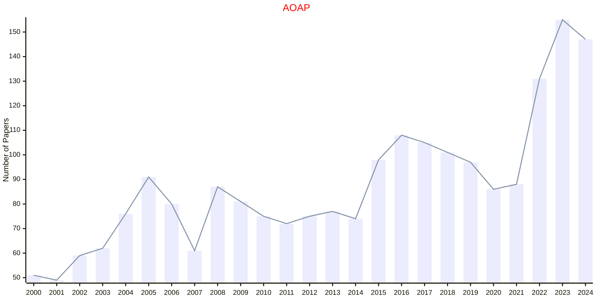

## AOAS

|Publishers|Full/Homepage|Abbr/About|Acronym/Issues|Period/DBLP|Top/Early|CCF|CAS|JCR|IF|Keywords/Google|
|-         |-            |-         |-             |-          |-        |-  |-  |-  |- |-              |
|[IMS](https://imstat.org/)|[Annals of Applied Statistics](https://imstat.org/journals-and-publications/annals-of-applied-statistics)|[Ann. Appl. Stat.](https://imstat.org/journals-and-publications/annals-of-applied-statistics)|[AOAS](https://projecteuclid.org/journals/annals-of-applied-statistics/issues)|2007 -|False||4|Q2|1.8|[Applied Statistics](https://www.google.com/search?q=Applied+Statistics)|

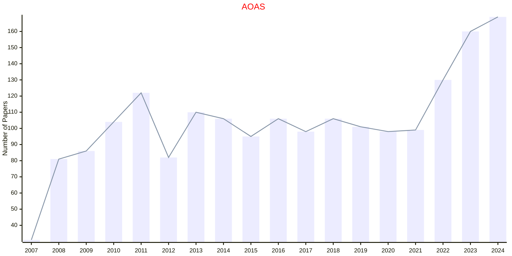

## AOP

|Publishers|Full/Homepage|Abbr/About|Acronym/Issues|Period/DBLP|Top/Early|CCF|CAS|JCR|IF|Keywords/Google|
|-         |-            |-         |-             |-          |-        |-  |-  |-  |- |-              |
|[IMS](https://imstat.org/)|[Annals of Probability](https://imstat.org/journals-and-publications/annals-of-probability)|[Ann. Probab.](https://imstat.org/journals-and-publications/annals-of-probability/)|[AOP](https://projecteuclid.org/journals/annals-of-probability/issues)|1973 -|True||1|Q1|2.6|[Probability](https://www.google.com/search?q=Probability)|

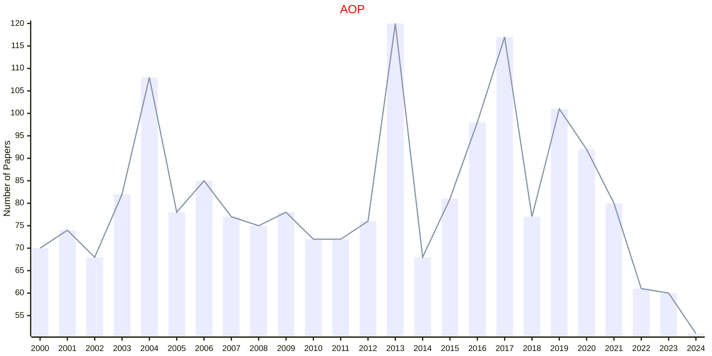

## AOS

|Publishers|Full/Homepage|Abbr/About|Acronym/Issues|Period/DBLP|Top/Early|CCF|CAS|JCR|IF|Keywords/Google|
|-         |-            |-         |-             |-          |-        |-  |-  |-  |- |-              |
|[IMS](https://imstat.org/)|[Annals of Statistics](https://imstat.org/journals-and-publications/annals-of-statistics)|[Ann. Stat.](https://imstat.org/journals-and-publications/annals-of-statistics)|[AOS](https://projecteuclid.org/journals/annals-of-statistics/issues)|1973 -|True||1|Q1|5.9|[Statistics](https://www.google.com/search?q=Statistics)|

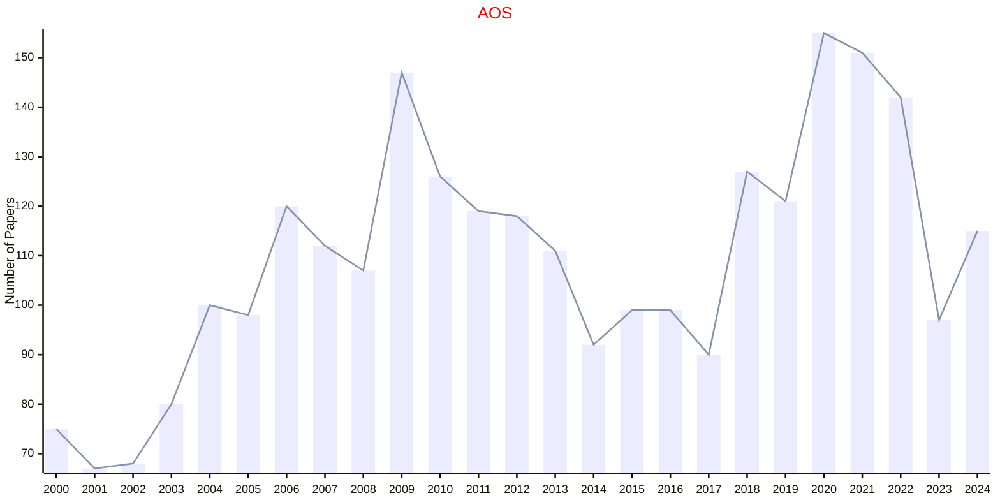

## BULLETIN

|Publishers|Full/Homepage|Abbr/About|Acronym/Issues|Period/DBLP|Top/Early|CCF|CAS|JCR|IF|Keywords/Google|
|-         |-            |-         |-             |-          |-        |-  |-  |-  |- |-              |
|[IMS](https://imstat.org/)|[IMS Bulletin](https://imstat.org/journals-and-publications/ims-bulletin/)|[IMS Bull.](https://imstat.org/journals-and-publications/ims-bulletin/)|[BULLETIN](https://imstat.org/ims-bulletin-archive/)|2002 -|False|||||[Probability and Statistics](https://www.google.com/search?q=Probability+and+Statistics)|

## STATSCI

|Publishers|Full/Homepage|Abbr/About|Acronym/Issues|Period/DBLP|Top/Early|CCF|CAS|JCR|IF|Keywords/Google|
|-         |-            |-         |-             |-          |-        |-  |-  |-  |- |-              |
|[IMS](https://imstat.org/)|[Statistical Science](https://imstat.org/journals-and-publications/statistical-science/)|[Stat. Sci.](https://imstat.org/journals-and-publications/statistical-science/)|[STATSCI](https://projecteuclid.org/journals/statistical-science/issues)|1986 -|True||1|Q1|5.2|[Probability and Statistics](https://www.google.com/search?q=Probability+and+Statistics)|

## STSY

|Publishers|Full/Homepage|Abbr/About|Acronym/Issues|Period/DBLP|Top/Early|CCF|CAS|JCR|IF|Keywords/Google|
|-         |-            |-         |-             |-          |-        |-  |-  |-  |- |-              |
|[INFORMS](https://pubsonline.informs.org/)|[Stochastic Systems](https://pubsonline.informs.org/journal/stsy)|[Stoch. Syst.](https://pubsonline.informs.org/page/stsy/editorial-statement)|[STSY](https://pubsonline.informs.org/loi/stsy)|2011 -|False|||||[Stochastic Systems](https://www.google.com/search?q=Stochastic+Systems)|

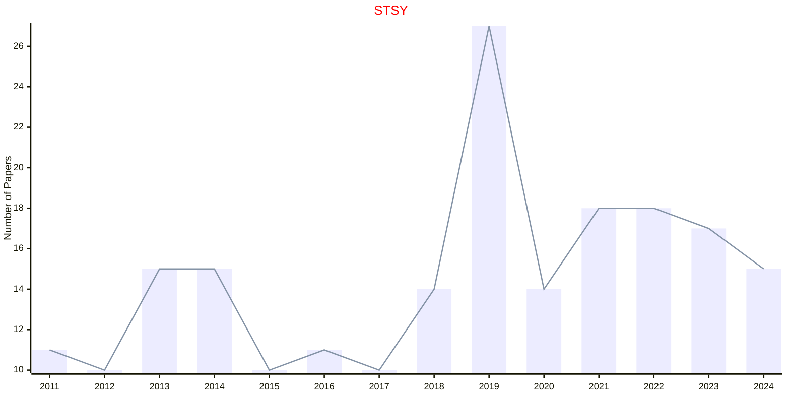

## BIOMET

|Publishers|Full/Homepage|Abbr/About|Acronym/Issues|Period/DBLP|Top/Early|CCF|CAS|JCR|IF|Keywords/Google|
|-         |-            |-         |-             |-          |-        |-  |-  |-  |- |-              |
|[OXFORD](https://academic.oup.com/)|[Biometrika](https://academic.oup.com/biomet)|[Biometrika](https://academic.oup.com/biomet/pages/about)|[BIOMET](https://academic.oup.com/biomet/issue)|1901 -|True||1|Q1|3.9|[Probability and Statistics](https://www.google.com/search?q=Probability+and+Statistics)|

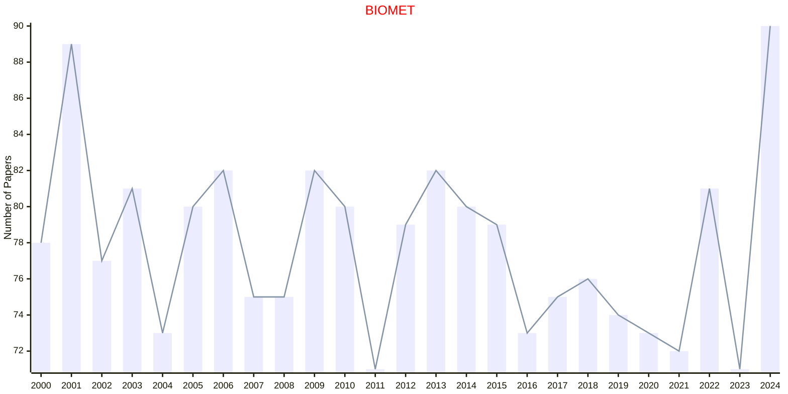

## BIOMTC

|Publishers|Full/Homepage|Abbr/About|Acronym/Issues|Period/DBLP|Top/Early|CCF|CAS|JCR|IF|Keywords/Google|
|-         |-            |-         |-             |-          |-        |-  |-  |-  |- |-              |
|[OXFORD](https://academic.oup.com/)|[Biometrics](https://academic.oup.com/biometrics)|[Biometrics](https://academic.oup.com/biometrics/pages/about)|[BIOMTC](https://academic.oup.com/biometrics/issue)|1999 -|False||3|Q2|2.3|[Statistics in Biosciences](https://www.google.com/search?q=Statistics+in+Biosciences)|

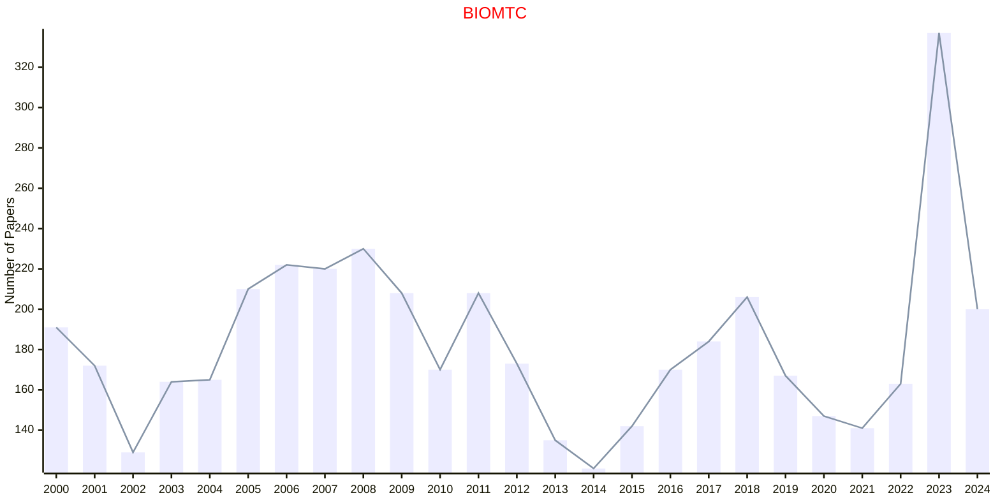

## BIOSTAT

|Publishers|Full/Homepage|Abbr/About|Acronym/Issues|Period/DBLP|Top/Early|CCF|CAS|JCR|IF|Keywords/Google|
|-         |-            |-         |-             |-          |-        |-  |-  |-  |- |-              |
|[OXFORD](https://academic.oup.com/)|[Biostatistics](https://academic.oup.com/biostatistics)|[Biostatistics](https://academic.oup.com/biostatistics/pages/about)|[BIOSTAT](https://academic.oup.com/biostatistics/issue)|2000 -|False||3|Q1|2.9|[Statistical Reasoning](https://www.google.com/search?q=Statistical+Reasoning)|

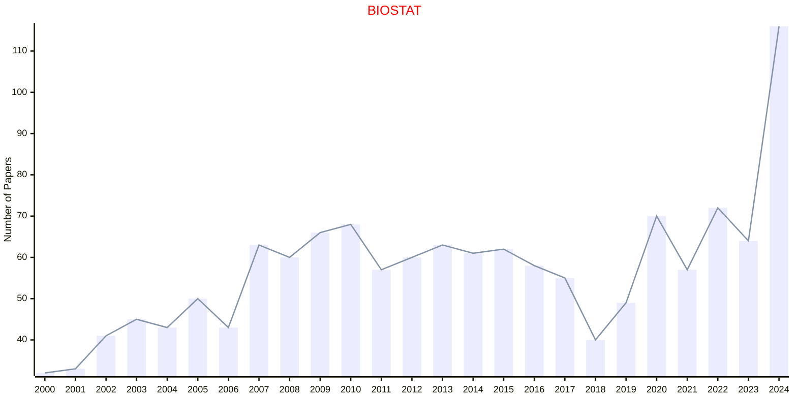

## JRSSIG

|Publishers|Full/Homepage|Abbr/About|Acronym/Issues|Period/DBLP|Top/Early|CCF|CAS|JCR|IF|Keywords/Google|
|-         |-            |-         |-             |-          |-        |-  |-  |-  |- |-              |
|[OXFORD](https://academic.oup.com/)|[Significance](https://academic.oup.com/jrssig)|[Significance](https://academic.oup.com/jrssig/pages/about)|[JRSSIG](https://academic.oup.com/jrssig/issue)|2004 -|False|||||[Data Analysis](https://www.google.com/search?q=Data+Analysis)|

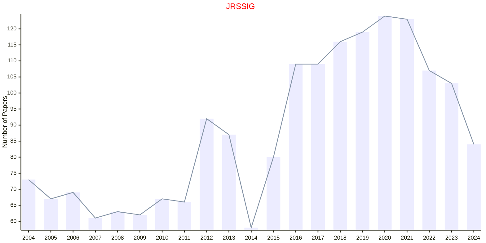

## JRSSSA

|Publishers|Full/Homepage|Abbr/About|Acronym/Issues|Period/DBLP|Top/Early|CCF|CAS|JCR|IF|Keywords/Google|
|-         |-            |-         |-             |-          |-        |-  |-  |-  |- |-              |
|[OXFORD](https://academic.oup.com/)|[Journal of the Royal Statistical Society Series A: Statistics in Society](https://academic.oup.com/jrsssa)|[J. R. Stat. Soc. Ser. A](https://academic.oup.com/jrsssa/pages/about)|[JRSSSA](https://academic.oup.com/jrsssa/issue)|1835 -|False||4|Q2|2.3|[Statistics in Society](https://www.google.com/search?q=Statistics+in+Society)|

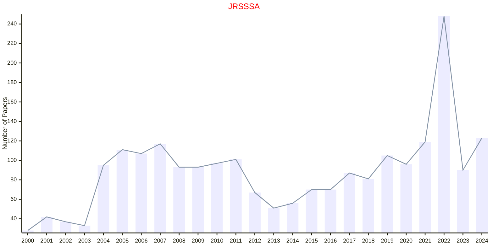

## JRSSSB

|Publishers|Full/Homepage|Abbr/About|Acronym/Issues|Period/DBLP|Top/Early|CCF|CAS|JCR|IF|Keywords/Google|
|-         |-            |-         |-             |-          |-        |-  |-  |-  |- |-              |
|[OXFORD](https://academic.oup.com/)|[Journal of the Royal Statistical Society Series B: Statistical Methodology](https://academic.oup.com/jrsssb)|[J. R. Stat. Soc. Ser. B](https://academic.oup.com/jrsssb/pages/about)|[JRSSSB](https://academic.oup.com/jrsssb/issue)|1934 -|True||1|Q1|6.7|[Statistical Methodology](https://www.google.com/search?q=Statistical+Methodology)|

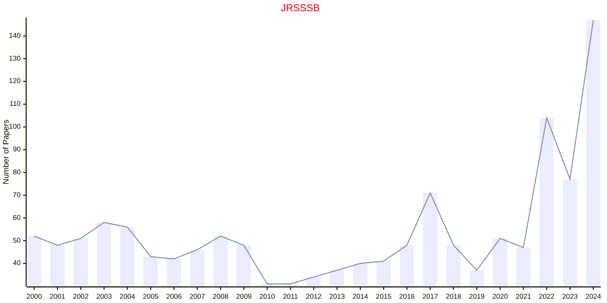

## JRSSSC

|Publishers|Full/Homepage|Abbr/About|Acronym/Issues|Period/DBLP|Top/Early|CCF|CAS|JCR|IF|Keywords/Google|
|-         |-            |-         |-             |-          |-        |-  |-  |-  |- |-              |
|[OXFORD](https://academic.oup.com/)|[Journal of the Royal Statistical Society Series C: Applied Statistics](https://academic.oup.com/jrsssc)|[J. R. Stat. Soc. Ser. C](https://academic.oup.com/jrsssc/pages/about)|[JRSSSC](https://academic.oup.com/jrsssc/issue)|1952 -|False||4|Q2|1.5|[Applied Statistics](https://www.google.com/search?q=Applied+Statistics)|

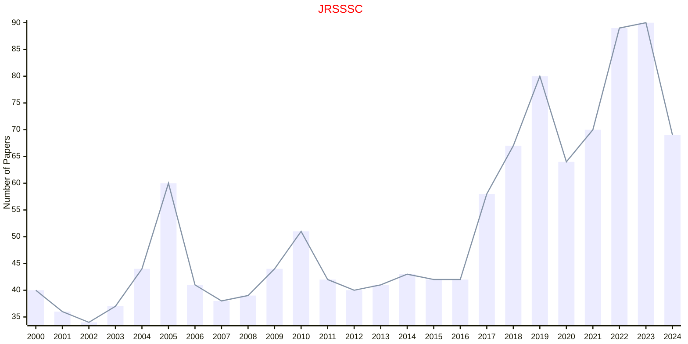

## TVP

|Publishers|Full/Homepage|Abbr/About|Acronym/Issues|Period/DBLP|Top/Early|CCF|CAS|JCR|IF|Keywords/Google|
|-         |-            |-         |-             |-          |-        |-  |-  |-  |- |-              |
|[SIAM](https://epubs.siam.org)|[Theory of Probability and Its Applications](https://epubs.siam.org/journal/tprbau)|[Theory Probab. Appl.](https://epubs.siam.org/journal/tvp/about)|[TVP](https://epubs.siam.org/loi/tprbau)|1956 -|False||4|Q4|0.5|[Applied Probability](https://www.google.com/search?q=Applied+Probability)|

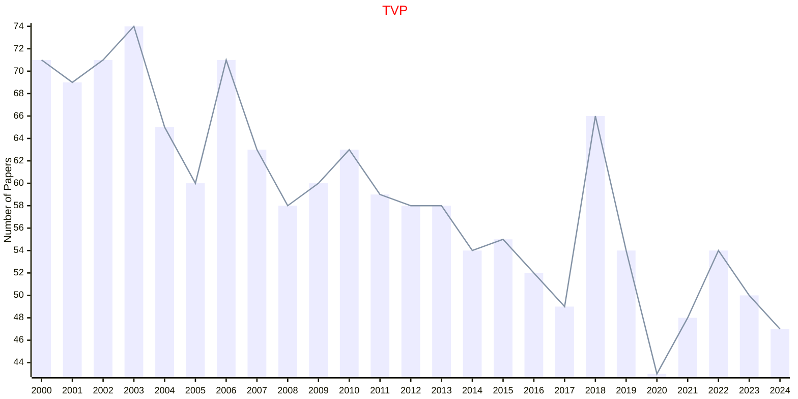

## AISM

|Publishers|Full/Homepage|Abbr/About|Acronym/Issues|Period/DBLP|Top/Early|CCF|CAS|JCR|IF|Keywords/Google|
|-         |-            |-         |-             |-          |-        |-  |-  |-  |- |-              |
|[SPRINGER](https://www.springer.com/)|[Annals of the Institute of Statistical Mathematics](https://www.springer.com/journal/10463)|[Ann. Inst. Stat. Math.](https://www.springer.com/journal/10463/aims-and-scope)|[AISM](https://link.springer.com/journal/10463/volumes-and-issues)|1949 -|False||4|Q4|1.0|[Statistics](https://www.google.com/search?q=Statistics)|

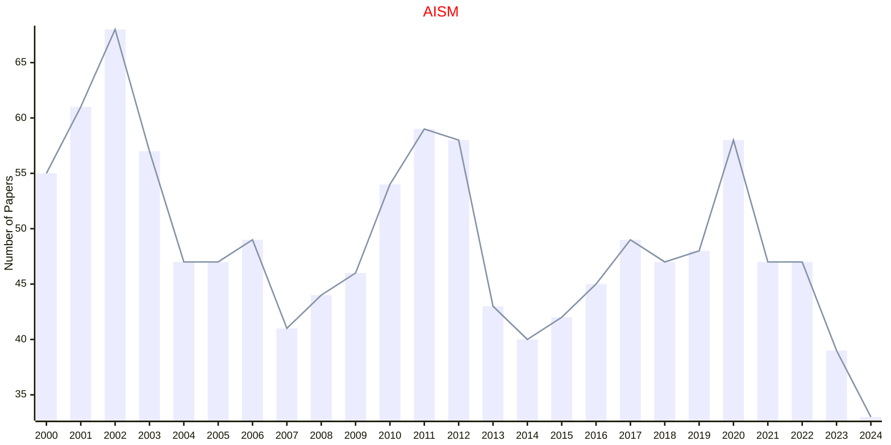

## CMS

|Publishers|Full/Homepage|Abbr/About|Acronym/Issues|Period/DBLP|Top/Early|CCF|CAS|JCR|IF|Keywords/Google|
|-         |-            |-         |-             |-          |-        |-  |-  |-  |- |-              |
|[SPRINGER](https://www.springer.com/)|[Communications in Mathematics and Statistics](https://link.springer.com/journal/40304)|[Commun. Math. Stat.](https://link.springer.com/journal/40304/aims-and-scope)|[CMS](https://link.springer.com/journal/40304/volumes-and-issues)|2013 -|False||3|Q2|1.0|[Statistics](https://www.google.com/search?q=Statistics)|

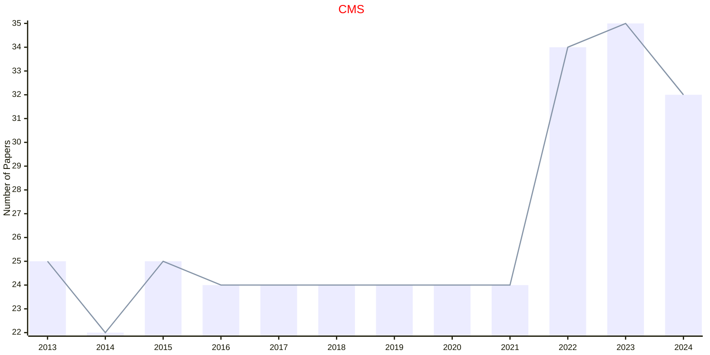

## CSTAT

|Publishers|Full/Homepage|Abbr/About|Acronym/Issues|Period/DBLP|Top/Early|CCF|CAS|JCR|IF|Keywords/Google|
|-         |-            |-         |-             |-          |-        |-  |-  |-  |- |-              |
|[SPRINGER](https://www.springer.com/)|[Computational Statistics](https://link.springer.com/journal/180)|[Comput. Stat.](https://www.springer.com/journal/180/aims-and-scope)|[CSTAT](https://link.springer.com/journal/180/volumes-and-issues)|1999 -|False|||||[Computational Statistics](https://www.google.com/search?q=Computational+Statistics)|

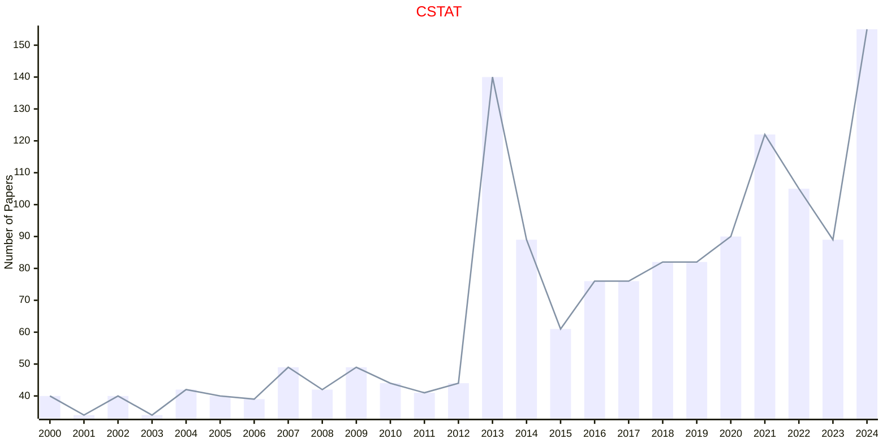

## MCAP

|Publishers|Full/Homepage|Abbr/About|Acronym/Issues|Period/DBLP|Top/Early|CCF|CAS|JCR|IF|Keywords/Google|
|-         |-            |-         |-             |-          |-        |-  |-  |-  |- |-              |
|[SPRINGER](https://www.springer.com/)|[Methodology and Computing in Applied Probability](https://link.springer.com/journal/11009)|[Meth. Comput. Appl. Prob.](https://www.springer.com/journal/11009/aims-and-scope)|[MCAP](https://link.springer.com/journal/11009/volumes-and-issues)|1999 -|False|||||[Applied Probability](https://www.google.com/search?q=Applied+Probability)|

```mermaid
---
config:
    xyChart:
        width: 1200
        height: 600
    themeVariables:
        xyChart:
            titleColor: "#ff0000"
---
xychart-beta
    title "MCAP"
    x-axis [2000, 2001, 2002, 2003, 2004, 2005, 2006, 2007, 2008, 2009, 2010, 2011, 2012, 2013, 2014, 2015, 2016, 2017, 2018, 2019, 2020, 2021, 2022, 2023, 2024]
    y-axis "Number of Papers"
    bar [23, 24, 24, 24, 25, 27, 29, 33, 29, 37, 45, 42, 60, 48, 57, 62, 63, 61, 72, 74, 73, 75, 138, 94, 58]
    line [23, 24, 24, 24, 25, 27, 29, 33, 29, 37, 45, 42, 60, 48, 57, 62, 63, 61, 72, 74, 73, 75, 138, 94, 58]
```

## PTRF

|Publishers|Full/Homepage|Abbr/About|Acronym/Issues|Period/DBLP|Top/Early|CCF|CAS|JCR|IF|Keywords/Google|
|-         |-            |-         |-             |-          |-        |-  |-  |-  |- |-              |
|[SPRINGER](https://www.springer.com/)|[Probability Theory and Related Fields](https://link.springer.com/journal/440)|[Probab. Theory Relat. Fields](https://link.springer.com/journal/440/aims-and-scope)|[PTRF](https://link.springer.com/journal/440/volumes-and-issues)|1962 -|True||2|Q2|2.1|[Probability Theory](https://www.google.com/search?q=Probability+Theory)|

```mermaid
---
config:
    xyChart:
        width: 1200
        height: 600
    themeVariables:
        xyChart:
            titleColor: "#ff0000"
---
xychart-beta
    title "PTRF"
    x-axis [2000, 2001, 2002, 2003, 2004, 2005, 2006, 2007, 2008, 2009, 2010, 2011, 2012, 2013, 2014, 2015, 2016, 2017, 2018, 2019, 2020, 2021, 2022, 2023, 2024]
    y-axis "Number of Papers"
    bar [81, 64, 66, 70, 67, 68, 66, 61, 62, 65, 63, 68, 75, 87, 66, 61, 74, 74, 72, 86, 82, 73, 75, 75, 72]
    line [81, 64, 66, 70, 67, 68, 66, 61, 62, 65, 63, 68, 75, 87, 66, 61, 74, 74, 72, 86, 82, 73, 75, 75, 72]
```

## JASA

|Publishers|Full/Homepage|Abbr/About|Acronym/Issues|Period/DBLP|Top/Early|CCF|CAS|JCR|IF|Keywords/Google|
|-         |-            |-         |-             |-          |-        |-  |-  |-  |- |-              |
|[TAYLOR](https://www.tandfonline.com/)|[Journal of the American Statistical Association](https://www.tandfonline.com/journals/uasa20)|[J. Am. Stat. Assoc.](https://www.tandfonline.com/journals/uasa20/about-this-journal#aims-and-scope)|[JASA](https://www.tandfonline.com/loi/uasa20)|1888 -|True||2|Q1|4.8|[Probability and Statistics](https://www.google.com/search?q=Probability+and+Statistics)|

```mermaid
---
config:
    xyChart:
        width: 1200
        height: 600
    themeVariables:
        xyChart:
            titleColor: "#ff0000"
---
xychart-beta
    title "JASA"
    x-axis [2000, 2001, 2002, 2003, 2004, 2005, 2006, 2007, 2008, 2009, 2010, 2011, 2012, 2013, 2014, 2015, 2016, 2017, 2018, 2019, 2020, 2021, 2022, 2023, 2024]
    y-axis "Number of Papers"
    bar [191, 185, 177, 167, 174, 200, 254, 214, 212, 158, 150, 148, 145, 132, 142, 158, 166, 155, 153, 172, 179, 178, 182, 116, 267]
    line [191, 185, 177, 167, 174, 200, 254, 214, 212, 158, 150, 148, 145, 132, 142, 158, 166, 155, 153, 172, 179, 178, 182, 116, 267]
```

## JBES

|Publishers|Full/Homepage|Abbr/About|Acronym/Issues|Period/DBLP|Top/Early|CCF|CAS|JCR|IF|Keywords/Google|
|-         |-            |-         |-             |-          |-        |-  |-  |-  |- |-              |
|[TAYLOR](https://www.tandfonline.com/)|[Journal of Business & Economic Statistics](https://www.tandfonline.com/journals/ubes20)|[J. Busin. Econ. Stat.](https://www.tandfonline.com/journals/ubes20/about-this-journal#aims-and-scope)|[JBES](https://www.tandfonline.com/loi/ubes20)|1983 -|False||2|Q1|5.1|[Applied Statistics](https://www.google.com/search?q=Applied+Statistics); [Business and Economic](https://www.google.com/search?q=Business+and+Economic)|

```mermaid
---
config:
    xyChart:
        width: 1200
        height: 600
    themeVariables:
        xyChart:
            titleColor: "#ff0000"
---
xychart-beta
    title "JBES"
    x-axis [2000, 2001, 2002, 2003, 2004, 2005, 2006, 2007, 2008, 2009, 2010, 2011, 2012, 2013, 2014, 2015, 2016, 2017, 2018, 2019, 2020, 2021, 2022, 2023, 2024]
    y-axis "Number of Papers"
    bar [49, 46, 44, 47, 42, 48, 44, 45, 50, 48, 43, 51, 50, 46, 58, 49, 51, 44, 60, 59, 70, 76, 169, 87, 108]
    line [49, 46, 44, 47, 42, 48, 44, 45, 50, 48, 43, 51, 50, 46, 58, 49, 51, 44, 60, 59, 70, 76, 169, 87, 108]
```

## JCGS

|Publishers|Full/Homepage|Abbr/About|Acronym/Issues|Period/DBLP|Top/Early|CCF|CAS|JCR|IF|Keywords/Google|
|-         |-            |-         |-             |-          |-        |-  |-  |-  |- |-              |
|[TAYLOR](https://www.tandfonline.com/)|[Journal of Computational and Graphical Statistics](https://www.tandfonline.com/journals/ucgs20)|[J. Comput. Graph. Stat.](https://www.tandfonline.com/journals/ucgs20/about-this-journal#aims-and-scope)|[JCGS](https://www.tandfonline.com/loi/ucgs20)|1992 -|False|||||[Applied Statistics](https://www.google.com/search?q=Applied+Statistics); [Computational Statistics](https://www.google.com/search?q=Computational+Statistics); [Graphical Statistics](https://www.google.com/search?q=Graphical+Statistics)|

## JOAS

|Publishers|Full/Homepage|Abbr/About|Acronym/Issues|Period/DBLP|Top/Early|CCF|CAS|JCR|IF|Keywords/Google|
|-         |-            |-         |-             |-          |-        |-  |-  |-  |- |-              |
|[TAYLOR](https://www.tandfonline.com/)|[Journal of Applied Statistics](https://www.tandfonline.com/journals/cjas20)|[J. Appl. Stat.](https://www.tandfonline.com/journals/cjas20/about-this-journal#aims-and-scope)|[JOAS](https://www.tandfonline.com/loi/cjas20)|1974 -|False||4|Q3|1.5|[Applied Statistics](https://www.google.com/search?q=Applied+Statistics)|

```mermaid
---
config:
    xyChart:
        width: 1200
        height: 600
    themeVariables:
        xyChart:
            titleColor: "#ff0000"
---
xychart-beta
    title "JOAS"
    x-axis [2000, 2001, 2002, 2003, 2004, 2005, 2006, 2007, 2008, 2009, 2010, 2011, 2012, 2013, 2014, 2015, 2016, 2017, 2018, 2019, 2020, 2021, 2022, 2023, 2024]
    y-axis "Number of Papers"
    bar [86, 88, 91, 86, 77, 80, 87, 93, 112, 114, 158, 234, 212, 211, 195, 200, 191, 175, 178, 168, 162, 174, 215, 150, 169]
    line [86, 88, 91, 86, 77, 80, 87, 93, 112, 114, 158, 234, 212, 211, 195, 200, 191, 175, 178, 168, 162, 174, 215, 150, 169]
```

## TAS

|Publishers|Full/Homepage|Abbr/About|Acronym/Issues|Period/DBLP|Top/Early|CCF|CAS|JCR|IF|Keywords/Google|
|-         |-            |-         |-             |-          |-        |-  |-  |-  |- |-              |
|[TAYLOR](https://www.tandfonline.com/)|[The American Statistician](https://www.tandfonline.com/journals/utas20)|[Am. Stat.](https://www.tandfonline.com/journals/utas20/about-this-journal#aims-and-scope)|[TAS](https://www.tandfonline.com/loi/utas20)|1974 -|False|||||[Applied Statistics](https://www.google.com/search?q=Applied+Statistics)|

## BIMJ

|Publishers|Full/Homepage|Abbr/About|Acronym/Issues|Period/DBLP|Top/Early|CCF|CAS|JCR|IF|Keywords/Google|
|-         |-            |-         |-             |-          |-        |-  |-  |-  |- |-              |
|[WILEY](https://www.wiley.com/)|[Biometrical Journal](https://onlinelibrary.wiley.com/journal/15214036)|[Bio. J.](https://onlinelibrary.wiley.com/page/journal/15214036/homepage/productinformation.html)|[BIMJ](https://onlinelibrary.wiley.com/loi/15214036)|1959 -|False||3|Q1|2.0|[Life Sciences](https://www.google.com/search?q=Life+Sciences); [Statistical Methods](https://www.google.com/search?q=Statistical+Methods)|

```mermaid
---
config:
    xyChart:
        width: 1200
        height: 600
    themeVariables:
        xyChart:
            titleColor: "#ff0000"
---
xychart-beta
    title "BIMJ"
    x-axis [2000, 2001, 2002, 2003, 2004, 2005, 2006, 2007, 2008, 2009, 2010, 2011, 2012, 2013, 2014, 2015, 2016, 2017, 2018, 2019, 2020, 2021, 2022, 2023, 2024]
    y-axis "Number of Papers"
    bar [76, 74, 75, 75, 383, 95, 114, 108, 110, 95, 72, 85, 66, 85, 98, 95, 112, 108, 117, 124, 150, 118, 108, 120, 124]
    line [76, 74, 75, 75, 383, 95, 114, 108, 110, 95, 72, 85, 66, 85, 98, 95, 112, 108, 117, 124, 150, 118, 108, 120, 124]
```

## INSR

|Publishers|Full/Homepage|Abbr/About|Acronym/Issues|Period/DBLP|Top/Early|CCF|CAS|JCR|IF|Keywords/Google|
|-         |-            |-         |-             |-          |-        |-  |-  |-  |- |-              |
|[WILEY](https://www.wiley.com/)|[International Statistical Review](https://onlinelibrary.wiley.com/journal/17515823)|[Int. Stat. Rev.](https://onlinelibrary.wiley.com/page/journal/17515823/homepage/productinformation.html)|[INSR](https://onlinelibrary.wiley.com/loi/17515823)|1997 -|False||4|Q1|2.4|[Statistics](https://www.google.com/search?q=Statistics)|

```mermaid
---
config:
    xyChart:
        width: 1200
        height: 600
    themeVariables:
        xyChart:
            titleColor: "#ff0000"
---
xychart-beta
    title "INSR"
    x-axis [2000, 2001, 2002, 2003, 2004, 2005, 2006, 2007, 2008, 2009, 2010, 2011, 2012, 2013, 2014, 2015, 2016, 2017, 2018, 2019, 2020, 2021, 2022, 2023, 2024]
    y-axis "Number of Papers"
    bar [27, 29, 35, 41, 27, 59, 25, 90, 99, 97, 103, 111, 114, 106, 81, 64, 57, 48, 41, 57, 75, 48, 45, 29, 28]
    line [27, 29, 35, 41, 27, 59, 25, 90, 99, 97, 103, 111, 114, 106, 81, 64, 57, 48, 41, 57, 75, 48, 45, 29, 28]
```

## JTSA

|Publishers|Full/Homepage|Abbr/About|Acronym/Issues|Period/DBLP|Top/Early|CCF|CAS|JCR|IF|Keywords/Google|
|-         |-            |-         |-             |-          |-        |-  |-  |-  |- |-              |
|[WILEY](https://www.wiley.com/)|[Journal of Time Series Analysis](https://onlinelibrary.wiley.com/journal/14679892)|[J. Time Series Anal.](https://onlinelibrary.wiley.com/page/journal/14679892/homepage/productinformation.html)|[JTSA](https://onlinelibrary.wiley.com/loi/14679892)|1980 -|False||4|Q3|1.1|[Time Series](https://www.google.com/search?q=Time+Series)|

```mermaid
---
config:
    xyChart:
        width: 1200
        height: 600
    themeVariables:
        xyChart:
            titleColor: "#ff0000"
---
xychart-beta
    title "JTSA"
    x-axis [2000, 2001, 2002, 2003, 2004, 2005, 2006, 2007, 2008, 2009, 2010, 2011, 2012, 2013, 2014, 2015, 2016, 2017, 2018, 2019, 2020, 2021, 2022, 2023, 2024]
    y-axis "Number of Papers"
    bar [39, 44, 36, 43, 55, 58, 48, 43, 54, 37, 44, 56, 73, 55, 38, 51, 49, 50, 53, 52, 51, 39, 47, 34, 46]
    line [39, 44, 36, 43, 55, 58, 48, 43, 54, 37, 44, 56, 73, 55, 38, 51, 49, 50, 53, 52, 51, 39, 47, 34, 46]
```

## SADM

|Publishers|Full/Homepage|Abbr/About|Acronym/Issues|Period/DBLP|Top/Early|CCF|CAS|JCR|IF|Keywords/Google|
|-         |-            |-         |-             |-          |-        |-  |-  |-  |- |-              |
|[WILEY](https://www.wiley.com/)|[Statistical Analysis and Data Mining](https://onlinelibrary.wiley.com/journal/19321872)|[Stat. Anal. Data Mining](https://onlinelibrary.wiley.com/page/journal/19321872/homepage/productinformation.html)|[SADM](https://onlinelibrary.wiley.com/loi/19321872)|2008 -|False||4|||[Data Mining](https://www.google.com/search?q=Data+Mining); [Statistical Analysis](https://www.google.com/search?q=Statistical+Analysis)|

```mermaid
---
config:
    xyChart:
        width: 1200
        height: 600
    themeVariables:
        xyChart:
            titleColor: "#ff0000"
---
xychart-beta
    title "SADM"
    x-axis [2008, 2009, 2010, 2011, 2012, 2013, 2014, 2015, 2016, 2017, 2018, 2019, 2020, 2021, 2022, 2023, 2024]
    y-axis "Number of Papers"
    bar [18, 48, 33, 46, 40, 43, 33, 29, 30, 30, 20, 41, 38, 48, 51, 38, 69]
    line [18, 48, 33, 46, 40, 43, 33, 29, 30, 30, 20, 41, 38, 48, 51, 38, 69]
```

## SIM

|Publishers|Full/Homepage|Abbr/About|Acronym/Issues|Period/DBLP|Top/Early|CCF|CAS|JCR|IF|Keywords/Google|
|-         |-            |-         |-             |-          |-        |-  |-  |-  |- |-              |
|[WILEY](https://www.wiley.com/)|[Statistics in Medicine](https://onlinelibrary.wiley.com/journal/10970258)|[Stat. Med.](https://onlinelibrary.wiley.com/page/journal/10970258/homepage/productinformation.html)|[SIM](https://onlinelibrary.wiley.com/loi/10970258)|1982 -|False||3|Q1|2.6|[Medicine](https://www.google.com/search?q=Medicine); [Statistics](https://www.google.com/search?q=Statistics)|

```mermaid
---
config:
    xyChart:
        width: 1200
        height: 600
    themeVariables:
        xyChart:
            titleColor: "#ff0000"
---
xychart-beta
    title "SIM"
    x-axis [2000, 2001, 2002, 2003, 2004, 2005, 2006, 2007, 2008, 2009, 2010, 2011, 2012, 2013, 2014, 2015, 2016, 2017, 2018, 2019, 2020, 2021, 2022, 2023, 2024]
    y-axis "Number of Papers"
    bar [311, 340, 303, 296, 307, 324, 326, 396, 470, 283, 310, 319, 359, 404, 387, 289, 390, 343, 323, 389, 308, 426, 350, 310, 349]
    line [311, 340, 303, 296, 307, 324, 326, 396, 470, 283, 310, 319, 359, 404, 387, 289, 390, 343, 323, 389, 308, 426, 350, 310, 349]
```

## SJOS

|Publishers|Full/Homepage|Abbr/About|Acronym/Issues|Period/DBLP|Top/Early|CCF|CAS|JCR|IF|Keywords/Google|
|-         |-            |-         |-             |-          |-        |-  |-  |-  |- |-              |
|[WILEY](https://www.wiley.com/)|[Scandinavian Journal Of Statistics](https://onlinelibrary.wiley.com/journal/14679469)|[Scand. J. Stat.](https://onlinelibrary.wiley.com/page/journal/14679469/homepage/productinformation.html)|[SJOS](https://onlinelibrary.wiley.com/loi/14679469)|1997 -|False||4|Q3|1.2|[Statistics](https://www.google.com/search?q=Statistics)|

```mermaid
---
config:
    xyChart:
        width: 1200
        height: 600
    themeVariables:
        xyChart:
            titleColor: "#ff0000"
---
xychart-beta
    title "SJOS"
    x-axis [2000, 2001, 2002, 2003, 2004, 2005, 2006, 2007, 2008, 2009, 2010, 2011, 2012, 2013, 2014, 2015, 2016, 2017, 2018, 2019, 2020, 2021, 2022, 2023, 2024]
    y-axis "Number of Papers"
    bar [48, 45, 48, 52, 45, 43, 52, 48, 45, 46, 43, 48, 51, 48, 72, 69, 78, 47, 46, 56, 52, 55, 66, 79, 68]
    line [48, 45, 48, 52, 45, 43, 52, 48, 45, 46, 43, 48, 51, 48, 72, 69, 78, 47, 46, 56, 52, 55, 66, 79, 68]
```

