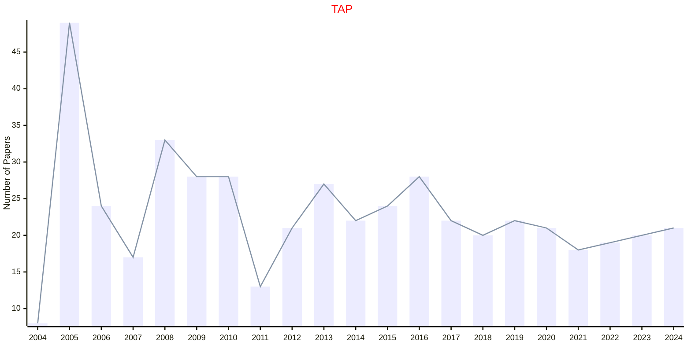

# Psychology

## TAP

|Publishers|Full/Homepage|Abbr/About|Acronym/Issues|Period/DBLP|Top/Early|CCF|CAS|JCR|IF|Keywords/Google|
|-         |-            |-         |-             |-          |-        |-  |-  |-  |- |-              |
|[ACM](https://www.acm.org/)|[ACM Transactions on Applied Perception](https://dl.acm.org/journal/tap)|[ACM Trans. Appl. Perc.](https://dl.acm.org/journal/tap/about)|[TAP](https://dl.acm.org/loi/tap)|[2004 -](https://dblp.org/db/journals/tap/index.html)|False|B|3|Q3|2.5|[Computer Science](https://www.google.com/search?q=Computer+Science); [Psychology](https://www.google.com/search?q=Psychology)|

