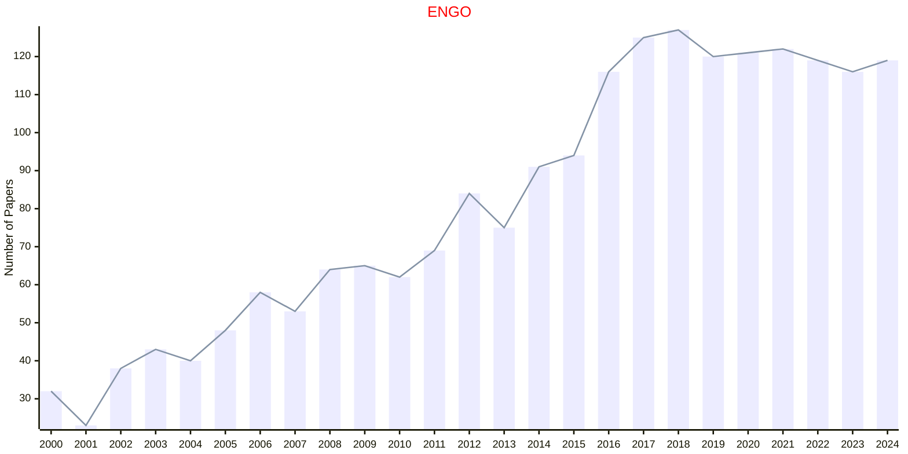

# Quantitative Computational Methods

## ENGO

|Publishers|Full/Homepage|Abbr/About|Acronym/Issues|Period/DBLP|Top/Early|CCF|CAS|JCR|IF|Keywords/Google|
|-         |-            |-         |-             |-          |-        |-  |-  |-  |- |-              |
|[TAYLOR](https://www.tandfonline.com/)|[Engineering Optimization](https://www.tandfonline.com/journals/geno20)|[Eng. Optim.](https://www.tandfonline.com/journals/geno20/about-this-journal#aims-and-scope)|[ENGO](https://www.tandfonline.com/loi/geno20)|1974 -|False||4|Q2|2.5|[Quantitative Computational Methods](https://www.google.com/search?q=Quantitative+Computational+Methods)|

