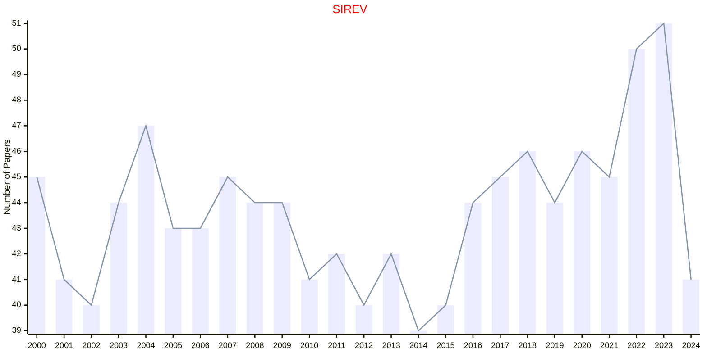
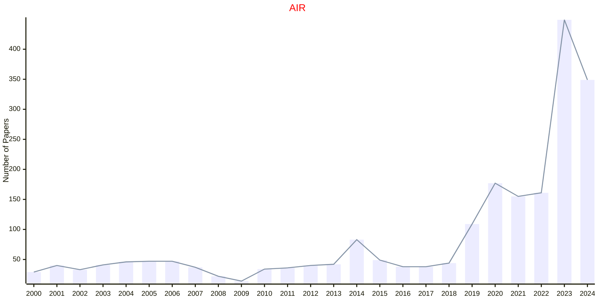

# Review

## SIREV

|Publishers|Full/Homepage|Abbr/About|Acronym/Issues|Period/DBLP|Top/Early|CCF|CAS|JCR|IF|Keywords/Google|
|-         |-            |-         |-             |-          |-        |-  |-  |-  |- |-              |
|[SIAM](https://epubs.siam.org)|[SIAM Review](https://epubs.siam.org/journal/siread)|[SIAM Rev.](https://epubs.siam.org/journal/sirev/about)|[SIREV](https://epubs.siam.org/loi/siread)|1959 -|True||1|Q1|11.1|[Mathematics](https://www.google.com/search?q=Mathematics); [Review](https://www.google.com/search?q=Review)|

## AIR

|Publishers|Full/Homepage|Abbr/About|Acronym/Issues|Period/DBLP|Top/Early|CCF|CAS|JCR|IF|Keywords/Google|
|-         |-            |-         |-             |-          |-        |-  |-  |-  |- |-              |
|[SPRINGER](https://www.springer.com/)|[Artificial Intelligence Review](https://www.springer.com/journal/10462)|[Artif. Intell. Rev.](https://www.springer.com/journal/10462/aims-and-scope)|[AIR](https://link.springer.com/journal/10462/volumes-and-issues)|1987 -|True||1|Q1|14.9|[Artificial Intelligence](https://www.google.com/search?q=Artificial+Intelligence); [Review](https://www.google.com/search?q=Review)|

